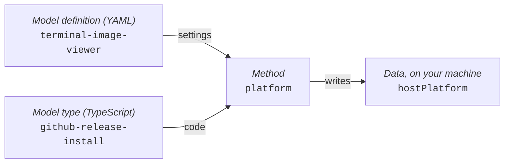
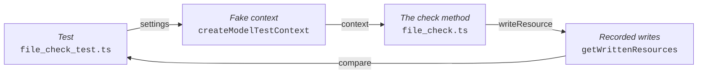
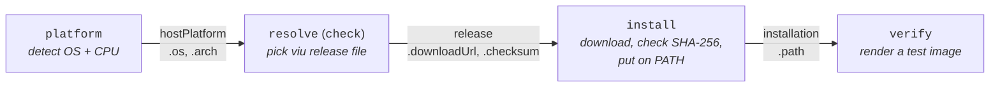
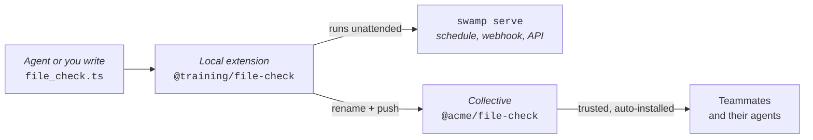
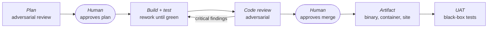
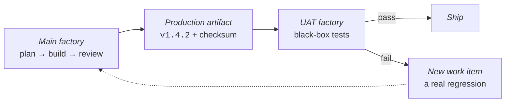

---
# You can also start simply with 'default'
theme: seriph
# random image from a curated Unsplash collection by Anthony
# like them? see https://unsplash.com/collections/94734566/slidev
background: https://cover.sli.dev
# some information about your slides (markdown enabled)
hideInToc: true
title: Swamp Training
author: Mischa Taylor
info: |
  ## Slidev Starter Template
  Presentation slides for developers.
# apply unocss classes to the current slide
class: text-center
# https://sli.dev/features/drawing
drawings:
  persist: false
# enable MDC Syntax: https://sli.dev/features/mdc
mdc: true
# open graph
# seoMeta:
#  ogImage: https://cover.sli.dev
themeConfig:
  paginationX: r
  paginationY: t
  paginationPagesDisabled: [1]
---

# Swamp Training

##### Mischa Taylor | 📧 <taylor@linux.com>

<div @click="$slidev.nav.next" class="mt-12 py-1" hover:bg="white op-10">
  Press Space for next page <carbon-arrow-right />
</div>

<div class="abs-br m-6 text-xl">
  <button @click="$slidev.nav.openInEditor()" title="Open in Editor" class="slidev-icon-btn">
    <carbon-edit />
  </button>
  <a href="https://github.com/slidevjs/slidev" target="_blank" class="slidev-icon-btn">
    <carbon-logo-github />
  </a>
</div>

<!--
The last comment block of each slide will be treated as slide notes. It will be visible and editable in Presenter Mode along with the slide. [Read more in the docs](https://sli.dev/guide/syntax.html#notes)
-->

---
hideInToc: true
routeAlias: toc
---

# Table of Contents

<Toc columns="2"/>

---
hideInToc: true
routeAlias: quick-check
class: compact-table
---

# Quick check: true or false?

Before anything about swamp, three statements about the AI agent you already use, for code or for anything else:

| | Statement | True or false? |
| --- | --- | --- |
| **1** | My agent got a task right last week, so the same request gets the same result this week | ? |
| **2** | A well-written instructions file (`CLAUDE.md`, `AGENTS.md`) or skill makes my agent follow my process | ? |
| **3** | When my agent says “done, I restarted the VM,” the VM restarted | ? |

Hold on to your answers. We'll come back to all three before the end of phase 1.

<!--
Show of hands for each statement. Don't give the answers yet.

This is a pre-test on purpose. If you explain swamp clearly to people who think they already
understand their agent, they nod along and learn nothing. If they first commit to an answer that
turns out to be wrong, they want to hear why. Most rooms say "true" to at least one.
-->

---
layout: section
routeAlias: journey
---

# The Swamp Journey

<!--
The framework for adopting swamp comes from keeb (Nick Stinemates) on the swamp Discord.
-->

---
hideInToc: true
---

# If your agent can already do the task, why add swamp?

- **Swamp is an automation framework built for AI agents:** your agent writes the automation,
  and swamp runs it, remembers what happened, and checks the agent's work.

<div class="text-sm opacity-70 mt-4">

Swamp will make your agent use better, more reliable and more cost effective. It's that simple. Until you need more complexity, if ever.

</div>

---
hideInToc: true
class: compact-table
---

# Three phases of adopting swamp

| Phase | What you do | What you get |
| --- | --- | --- |
| **1. Install swamp** | Install and configure swamp. Keep asking your agent for the same things | Each request builds automation you can repeat |
| **2. Connect your systems** | Tell your agent to build a swamp **extension** for each system you use | Commands your agent can run on those systems, with every result recorded |
| **3. Automate what you repeat** | Tell your agent to make a swamp **workflow** for each task you repeat | One command, or a schedule, that runs the task the same way every time |

Expect to spend a while in each phase before moving on. Each builds on the one before, and
many people stay in phase 1 or 2 for a long time.

<div class="text-sm opacity-70 mt-4">

The journey comes from keeb (Nick Stinemates), on the swamp Discord.

</div>

---
layout: section
---

# One Thing, End to End

<!--
Set the contract for the whole session: one task, carried all the way through.
-->

---
hideInToc: true
---

# You're going to automate one thing

- You're going to take one task all the way from “I want this” to a working automation.
- Then you're going to break the automation.
- Then you're going to see why the automation survives the kinds of things that happen in real systems.
- By the end, you'll have learned most of the important parts of Swamp along the way.

---
hideInToc: true
class: requirement-slide
---

# Make Swamp Do Something

Here's the requirement:

> **Make this terminal display a picture.**

That's all you're going to give Swamp to start with.

Just the outcome.

---
hideInToc: true
---

# What Does Success Look Like?

You'll want to start with an ordinary image:

```text
swamp.png
```

And eventually be able to type **one command** against that file and see the image inside the
terminal, on Ubuntu, macOS and Windows.

Which command? You don't know yet, and that's the point:

- You're not going to figure out how to do that.

- You're going to ask Swamp to figure out how to automate it.

---
hideInToc: true
---

# What you need

Two tools: Swamp and an AI agent that can run commands on your machine.

| | What it is | Why you need it |
| --- | --- | --- |
| **Swamp** | The thing that runs, remembers and verifies the automation | It is the subject of the training |
| **An AI agent** | Claude Code, Codex, Gemini CLI, Copilot CLI, Cursor, … | You ask in plain words; it builds and runs the automation |

**Any of those agents will do.** I'll use Claude Code for the worked example, and I'll call out
the few places where the agent you picked changes what you type.

---
layout: section
---

<div class="phase-badge">Phase 1 · Install swamp</div>

# Setting Up

<!--
Installation. Keep this brisk; the interesting part is after the repo exists.
-->

---
hideInToc: true
---

# Phase 1: nothing changes about how you work

You probably already ask an agent to do things: restart a VM, answer a question about your Home
Assistant setup, tidy up a git branch.

**Keep doing exactly that.** Install swamp, run `swamp repo init` in the directory where you work
with your agent, and ask for the same things, the same way.

What changes is what the agent does with your request. Swamp's instructions steer it to build an
**extension** for the system you asked about, so the next request is a repeatable, recorded
command instead of a one-off.

`repo init` adds the **instructions** (`CLAUDE.md` or `AGENTS.md`), **skills** the agent loads when
it needs them, and, for Claude Code, **guardrails**: what it may run without asking, and a log of
what it ran.

---
hideInToc: true
routeAlias: vocabulary
class: compact-table
---

# Swamp vocabulary at a glance

You'll see these words before the course explains them. Each links to its full explanation.

| Word | Meaning | More |
| --- | --- | --- |
| **Model** | Swamp's unit of work: a model type plus a model definition | <Link to="swamp-lingo" title="Swamp lingo"/> |
| **Model type** | TypeScript code: the methods and the settings they need | <Link to="swamp-lingo" title="Swamp lingo"/> |
| **Model definition** | YAML settings for one use of a model type | <Link to="swamp-lingo" title="Swamp lingo"/> |
| **Method** | One action a model type can run | <Link to="swamp-lingo" title="Swamp lingo"/> |
| **Extension** | A package of code that teaches swamp a new task | <Link to="extensions" title="Extensions"/> |
| **Data** | What a method saves: versioned, kept in `.swamp/` | <Link to="data" title="Data"/> |
| **Workflow** | A YAML file that runs methods as steps, in order | <Link to="workflows" title="Workflows"/> |
| **Vault** | Where swamp reads secrets from when a step runs | <Link to="keeping-secrets" title="Secrets"/> |
| **Collective** | A person's or team's account for publishing extensions | <Link to="collectives" title="Collectives"/> |

---
hideInToc: true
---

# Installing Swamp

| Use | Cost |
| --- | --- |
| Personal | Free |
| Work | 30-day free trial, then a paid plan ([pricing](https://swamp-club.com/pricing)) |

The `swamp` CLI is the same on every plan. A paid plan adds private <Link to="extensions" title="extensions"/> (code packages that teach swamp new tasks) and a <Link to="collectives" title="collective"/> (a shared account for publishing them to your organization).

Installing asks you to create a swamp-club.com account ([license](https://swamp-club.com/software-license-agreement), [registry terms](https://swamp-club.com/extension-registry-terms)).

The install script:
- Downloads the latest release from [GitHub](https://github.com/swamp-club/swamp/releases)
- Installs the binary to `~/.swamp/bin/swamp`
- Links `/usr/local/bin/swamp` to that binary, if you have permission

---
hideInToc: true
---

# Installing Swamp - Linux/macOS

```bash
# Install Swamp
curl -fsSL https://swamp-club.com/install.sh | sh

# Verify the Installation
swamp version
```

---
hideInToc: true
---

# Installing Swamp - Windows Powershell

Hit `Windows+R` and run `wt`. You should see a Windows Terminal command line prompt.

Grab the latest release instructions from https://github.com/swamp-club/swamp/releases

```powershell
# Request an elevated shell
Start-Process wt -Verb RunAs
New-Item -ItemType Directory -Path "C:\Program Files\swamp" -Force
Invoke-WebRequest `
  -Uri https://github.com/swamp-club/swamp/releases/download/v20260914.163154.0-sha.0bc3d215/swamp-windows-x86_64.zip `
  -OutFile swamp.zip
Expand-Archive swamp.zip -DestinationPath .; Move-Item swamp.exe 'C:\Program Files\swamp\'
# Add swamp to the Windows system PATH
$path = [Environment]::GetEnvironmentVariable("Path", "Machine")
[Environment]::SetEnvironmentVariable(
  "Path",
  $path + ";C:\Program Files\swamp",
  "Machine"
)
# Verify the installation (in a new shell)
swamp version
```

---
hideInToc: true
---

# Install an AI agent - Linux/macOS

Pick one. The rest of the deck works the same whichever you choose.

```bash
curl -fsSL https://claude.ai/install.sh | bash          # Claude Code
curl -fsSL https://chatgpt.com/codex/install.sh | sh    # Codex CLI
npm install -g @google/gemini-cli                       # Gemini CLI
curl -fsSL https://gh.io/copilot-install | bash         # Copilot CLI
curl https://cursor.com/install -fsS | bash             # Cursor CLI
```

Verify, using the name of the agent you installed:

```bash
claude --version        # or: codex, gemini, copilot, cursor-agent
```

If that command isn't found, add its directory to PATH and try again:

```bash
echo 'export PATH="$HOME/.local/bin:$PATH"' >> ~/.bashrc && source ~/.bashrc
```

<!--
Install commands drift. Point people at the vendor's install page if one fails.
Everything after these two slides is agent-neutral except the slash-command syntax.
-->

---
hideInToc: true
---

# Install an AI agent - Windows

Same five agents, from an ordinary PowerShell prompt:

```powershell
irm https://claude.ai/install.ps1 | iex                 # Claude Code
npm install -g @openai/codex                            # Codex CLI
npm install -g @google/gemini-cli                       # Gemini CLI
npm install -g @github/copilot                          # Copilot CLI
irm 'https://cursor.com/install?win32=true' | iex       # Cursor CLI
```

The `npm` installs need Node.js 22 or later.

Verify, using the name of the agent you installed:

```powershell
claude --version        # or: codex, gemini, copilot, cursor-agent
```

Whichever platform you're on, each agent prompts you to sign in the first time you run it.

---
hideInToc: true
---

# Create a swamp repo, or use the one you have

Use the directory where you already work with your agent. It doesn't need to be a git repo, and
it doesn't need to contain code. Create a new one only if you don't have one:

```bash
mkdir swamp-thing && cd swamp-thing   # only if you don't have a directory yet

swamp auth login    # once per machine: sign in with your swamp-club account
swamp repo init     # adds swamp's files next to yours
```

`repo init` adds `.swamp.yaml`, folders such as `models/` and `workflows/`, and swamp's own
sections in `CLAUDE.md` and `.gitignore`. Your files, and your own `CLAUDE.md` notes, stay as
they are.

The automation you build lives in those files, so consider keeping the directory in git: that's
how you share it and roll it back. <Link to="what-to-commit" title="What to commit, what to ignore"/>

---
hideInToc: true
---

# Can this terminal show `swamp.png` yet?

Put `swamp.png` in the repo and try:

```bash
cat swamp.png
```

<v-click>

No. A terminal shows text, so `cat` prints binary noise. Nothing about the terminal has changed
yet: `repo init` only taught your agent about swamp.

Next, look at what swamp told your agent. Then, in <Link to="ask-for-the-outcome" title="Ask for the outcome"/>,
hand the agent the requirement.

</v-click>

<!--
A-plot check-in during setup, so the room remembers what all this installing is for.
-->

---
hideInToc: true
---

# How does your agent know swamp before your first prompt?

`swamp repo init` doesn't just make directories. Swamp also writes files that steer your agent:

| File | What the file does |
| --- | --- |
| `CLAUDE.md` | Eleven rules for working in a swamp repo, plus a list of skills to load |
| `~/.claude/skills/swamp*` | Two skills, `swamp` and `swamp-getting-started`: how-to guides the agent loads on demand, installed once for your user |
| `.claude/settings.local.json` | Swamp commands the agent may run without asking, plus an audit hook |

Other agents get the same rules with `swamp repo init --tool <name>`: `AGENTS.md` for Codex,
Copilot, Amp and OpenCode; `.cursor/rules/` for Cursor; `.kiro/steering/` for Kiro. Gemini CLI
isn't built in: define it with `swamp agent setup`.

Whichever agent you use, **your agent already knows what swamp is** before giving a single prompt.

---
hideInToc: true
class: compact-table
---

# The rules swamp gives your agent

Swamp manages one section of `CLAUDE.md` and rewrites that section on `repo init`.

| Rule in `CLAUDE.md` | Where the rule shows up |
| --- | --- |
| 1. Search before you build | The agent reuses a community extension |
| 2. Extend, don't be clever | The agent adds methods, not a shell script |
| 3–4. Use the data model, with CEL | Steps read `data.latest(...)` |
| 7. Pin npm versions | Every `import` names a version |
| 10. Use swamp, don't bypass it | `swamp audit` flags commands run around swamp |
| Always load swamp skills | Tests, publishing, schedules |

On later slides, callouts like this one mark where swamp's instructions steered the agent:

>  **Swamp told the agent, via `CLAUDE.md` rule 1, "Search before you build":** search the registry before writing new code.

---
hideInToc: true
routeAlias: allowlist
---

# Can the agent run a workflow without asking you?

`.claude/settings.local.json` lists the swamp commands Claude Code may run without asking you.
Is `swamp workflow run` on the list?

<v-click>

| Allowed without asking | Not on the list, so Claude Code asks first |
| --- | --- |
| `swamp model get`, `create`, `edit`, `validate` | `swamp model method run` |
| `swamp workflow get`, `create`, `edit`, `validate` | `swamp workflow run` |
| `swamp data ...`, `swamp repo ...`, most `swamp vault ...` | `swamp extension pull`, `push`, `swamp vault read-secret` |

The agent can read and write automation freely. **Running automation still needs your OK.**

</v-click>

<!--
Rooms split both ways: some expect the agent to run anything, others expect a prompt for every
command. The answer is in between: writing automation is free, running automation asks.
-->

---
hideInToc: true
---

# Check what the agent ran with `swamp audit`

The same settings file adds a hook that logs every shell command Claude Code runs.
Read the log with:

```bash
swamp audit
```

```text
Audit timeline (last 24h): 2 swamp, 1 direct
Time         Source   Summary
19:28:29     swamp    swamp model type search github
19:28:30     direct   curl -sL https://github.com/atanunq/viu/releases/latest
19:28:30     swamp    swamp workflow run terminal-image-setup
```

`direct` lines show the agent working **around** swamp. Rule 10, “use swamp, don't bypass it,” says it shouldn't.

---
hideInToc: true
class: compact-table
---

# How the audit hook works

The audit hook is a plain Claude Code hook in `.claude/settings.local.json`:

```json
"PostToolUse": [{ "matcher": "Bash",
  "hooks": [{ "type": "command", "command": "swamp audit record --from-hook" }] }]
```

| Step | What happens |
| --- | --- |
| Trigger | After every `Bash` tool call, successful (`PostToolUse`) or failed (`PostToolUseFailure`) |
| Record | Claude Code pipes the hook's JSON to `swamp audit record`, which appends one line to `.swamp/audit/commands-<date>.jsonl` |
| Read | `swamp audit` labels each command `swamp` or `direct` and hides noise like `ls` (`--all` shows everything) |

---
hideInToc: true
routeAlias: audit-limits
class: compact-table
---

# Is `swamp audit` a security control?

`swamp audit` logs every shell command the agent runs. Could an agent hide what it did?

<v-click>

| Limit | Why the limit matters |
| --- | --- |
| Only the `Bash` tool | File edits, MCP calls and commands inside scripts or workflows aren't logged |
| No output or exit code | Each line holds only the time, command, directory and session ID |
| Not tamper-proof | The hook and the log are local files the agent could edit: a visibility tool, not a security control |
| Not every agent | Cursor, Copilot, Kiro and OpenCode get their own audit hook; Codex and Amp get none |

`swamp audit` is a **visibility** tool. Use the allowlist and a deny list to *stop* commands.

</v-click>

<!--
Misconception: "it logs everything, so it's a security control". The hook only sees Bash, and
the log is a local file the agent could edit.
-->

---
hideInToc: true
routeAlias: what-to-commit
---

# What to commit, what to ignore

`swamp repo init` already adds the right-hand column to `.gitignore`, in a section marked
`swamp managed section - DO NOT EDIT`.

| Commit: the automation | Ignore: specific to one machine |
| --- | --- |
| `models/`, `workflows/`, `extensions/`, `vaults/`, `grants/` | `.swamp/`: data, run history, secrets **and their key** |
| `.swamp.yaml`: repo settings | `.swamp-sources.yaml`: paths on your own disk |
| `CLAUDE.md` or `AGENTS.md`: the agent's rules | `.claude/settings.local.json`: each person's agent settings |

After cloning, run `swamp repo upgrade` to set up your own agent settings. Add your own lines **outside** the
managed section, such as `.env` if you keep tokens like `WEBHOOK_SECRET` in a file.

---
layout: section
---

<div class="phase-badge">Phase 1 · Install swamp</div>

# Who Does What

<!--
Before building, settle the division of labor. This is the slide people remember.
-->

---
hideInToc: true
---

# Swamp Runs the Automation

At its simplest, **Swamp runs automation code that you create.**

You can build that automation yourself...

...or delegate much of the work to your favorite AI agent.

```bash
swamp build me ...
```

---
hideInToc: true
---

# Not sure what to build yet?

Your request doesn't need to be precise. Try something vague:

```text
Build me something with swamp that keeps an eye on my servers.
```

In a repo with no models yet, the agent starts the `swamp-getting-started` walkthrough
instead of guessing. The walkthrough asks **what you want to automate, in your own words**, then
moves through five steps: **Goals → Create → Run → Inspect → Graduate**. Still unsure? The
walkthrough starts with a simple shell command model, so you see the whole loop before you commit
to anything.

**Describe the problem, not the swamp parts.** If your request uses swamp terms like
"create a model" or "set up a workflow", the agent assumes you already know swamp, skips the
questions and starts building. Plain words get you the guided version.

>  **Swamp told the agent, via the `swamp-getting-started` skill:** ask for the goal in the user's words, not by implementation type, and jump straight to the `swamp` skill only when the user already speaks swamp.

---
hideInToc: true
---

<div class="h-full flex flex-col items-center justify-center text-center gap-12">

<div class="text-4xl">
An agent is one way to build with Swamp.
</div>

<div class="text-6xl font-bold">
It isn't what makes Swamp, Swamp.
</div>

</div>

<!--
Swap "Claude" for whichever agent the room is using. The point survives the swap. That is the point.
-->

---
hideInToc: true
routeAlias: agent-fit
---

# So Where Does the Agent Fit?

| **Agent / Human** | **Swamp** |
| --- | --- |
| Reasons, investigates, creates | Executes and remembers |
| Makes judgments | Enforces gates |
| Proposes what to do | Verifies what happened |
| Tells you what it did | Measures what actually ran |

**The agent provides intelligence. Swamp provides structure around it.**
Swap the agent out and the right column doesn't change.

---
hideInToc: true
---

# Intelligence, Kept Honest

<div class="grid grid-cols-2 gap-20 mt-12">

<div>

<div class="flex items-center gap-5 mb-6">
  <ph-robot-duotone class="text-6xl" />
  <div class="text-3xl font-bold border-b-4 border-current pb-2">
    Agent / Human
  </div>
</div>

<div class="text-2xl leading-12 pl-2">

**Think** about the problem  
**Investigate** what is happening  
**Create** a solution  
**Decide** what should happen  
**Propose** actions

</div>

</div>

<div>

<div class="flex items-center gap-5 mb-6">
  
  <div class="text-3xl font-bold border-b-4 border-current pb-2">
    Swamp
  </div>
</div>

<div class="text-2xl leading-12 pl-2">

**Check** every claim against the machine  
**Refuse** the next step when one fails  
**Repeat** the run exactly, every time  
**Record** what happened, not what was claimed  
**Measure** every run, on every machine

</div>

</div>

</div>

<div class="text-center text-2xl mt-12 opacity-80">

**The agent makes things up. Swamp is the part that doesn't take its word.**

</div>

---
hideInToc: true
class: compact-table
---

# Back to the quick check: all three are false

| Statement | Why the statement is false | What swamp does instead |
| --- | --- | --- |
| **1.** Same request, same result | The agent's judgment varies from run to run | A method or workflow runs the same steps every time |
| **2.** A good skill makes the agent follow the process | A skill is context the model does its best to follow, and sometimes the model just doesn't | Swamp refuses the next step when a check fails |
| **3.** “Done” means the task got done | The agent reports what the agent believes happened | Swamp records what actually ran; `swamp audit` shows commands run around swamp |

Each answer is a row from the right-hand column on the last slide.
<Link to="quick-check" title="Back to the quick check"/>

<!--
Ask who changed their answer. The rest of the course is the right-hand column of this table,
built one piece at a time.
-->

---
hideInToc: true
---

# Where next: look for what you already repeat

Look back over what you've asked your agent (Claude or another one) in the last few weeks. Which
requests come up again and again?

For each repeated request, ask: **does the task need a creative decision every time?**

| Answer | What to ask for | How much AI each run uses |
| --- | --- | --- |
| **No**: the same steps every time | A swamp method or workflow you run with one command, or on a schedule | **None**: swamp runs the steps without the agent |
| **Partly**: fixed steps, then a judgment call | Swamp gathers and records the facts; the agent only makes the call | **Low**: the agent reads saved data instead of exploring |
| **Yes**: new thinking every time | Keep asking the agent, inside your swamp repo | **Full**, but the agent can call the methods you already built |

The agent's judgment is expensive and varies from run to run. Spend the agent's judgment on the
parts that need judgment, and let swamp repeat the rest the same way every time.

---
hideInToc: true
class: compact-table
---

# Where next: ideas to try

Pick one request you made more than twice this month. Some starting points:

| You keep asking the agent to... | Ask for this instead |
| --- | --- |
| Check disk space or certificate expiry | A scheduled check that records each result |
| Restart a VM or a stuck service | A one-command method, no agent needed |
| List pull requests waiting on your review | A saved list the agent only has to summarize |
| Clean up merged git branches | A workflow that deletes them after you approve |
| Find Home Assistant devices with low batteries | A weekly report built from saved data |
| Confirm last night's backup ran | A check that fails loudly when the backup is missing |
| Find untagged or idle cloud resources | An inventory you can compare week to week |

Start with the request in plain words, the way you always ask for the task. Swamp's instructions
steer the agent toward something repeatable.

---
layout: section
---

<div class="phase-badge">Phase 2 · Connect your systems</div>

# Create

<!--
Now hand the requirement to the agent and watch structure come out the other side.
-->

---
hideInToc: true
---

# Phase 2: connect your systems

Think about the systems you touch every week: GitHub, a cloud account, a database, an internal
API, a ticket tracker. For each one: what do you **read** from it, what do you **change** in it,
and what **credentials** does it need?

Then ask for the outcome:

```text
Build a swamp extension for our PagerDuty account that lists open
incidents and can acknowledge one.
```

Your agent searches the registry first, then reuses or extends a model type. Credentials go in a
**vault**, and a **collective** shares the extension with your team. You get methods you and your
agent can run, with every result saved as versioned data.

In this course, one prompt covers phases 2 and 3 together. The next sections take them apart.

---
hideInToc: true
routeAlias: ask-for-the-outcome
---

# Ask for the outcome, not the steps

Start your agent **inside the swamp repo**. Swamp's skills are installed for your user, but the
agent reads swamp's rules in `CLAUDE.md`, and Claude Code's allowlist, only from the directory
where the agent starts. Started anywhere else, the agent gets neither.

```bash
cd swamp-thing
claude          # or your agent's command: codex, gemini, ...
```

Then type this. Any agent works:

```
Build me an automation with swamp that makes this machine capable of
displaying an image directly in the terminal.
It needs to work on Ubuntu, macOS, and Windows.
```

Notice what isn't in there: no tool name, no package manager, no install path.
You stated the **outcome** and the **constraint**. The agent picks the rest.

>  **Swamp told the agent, via the Getting Started section of `CLAUDE.md`:** in a repo with no models yet, the agent starts the `swamp-getting-started` tutorial first. This prompt already states a clear goal, so tell the agent to skip the tutorial.

---
hideInToc: true
---

# Choose your own adventure

What you get back from this prompt will vary.

I asked for automation to show images in the terminal.

My agent picked **viu**: a single-file image viewer with builds for Linux, macOS and Windows.
viu shows real images in terminals that support them and colored text blocks everywhere else.
**You might get `chafa`, `timg`, or something else.** That's fine: the shape of what gets built
is the same. From here on the slides say `viu`; substitute whatever your agent picked.

>  **Swamp told the agent, via `CLAUDE.md` rule 1, "Search before you build":** the agent runs `swamp model type search` and `swamp extension search` before writing any code, and pulls a **community extension** when one fits.


---
hideInToc: true
---

# We let the agent run ahead, on purpose

In this course the agent builds the whole automation from **one prompt**, and you look at
the result afterwards. That's a deliberate shortcut: it's the fastest way to get something
working and to meet swamp's pieces.

In real work, **when a human steps in** is one of the biggest choices you make. Let the agent
write too much before you weigh in, and you end up steering a finished implementation instead
of shaping it.

The course comes back to this in <Link to="human-steps-in" title="When should a human step in?"/>.

---
hideInToc: true
routeAlias: extensions
---

# Extensions: where swamp code comes from

- **Extension:** a package of code that teaches swamp a new task, such as installing programs from
  GitHub.

- **Extension registry:** the public catalog of shared extensions at swamp-club.com.
  Search the catalog with `swamp extension search <words>`.

- **Community extension:** an extension someone else published to the registry.
  `swamp extension pull <name>` downloads a copy into your repo.

- **Local extension:** an extension you (or your agent) write inside your own repo, in
  `extensions/models/`. A local extension can add methods to a community extension's model type.

>  **Swamp told the agent, via `CLAUDE.md` rule 2, "Extend, don't be clever":** when a model type covers the job but lacks a method, the agent adds the method with `export const extension`, instead of a shell script, a CLI tool or a multi-step hack.

---
hideInToc: true
routeAlias: what-the-agent-built
---

# Did the agent write the installer from scratch?

The agent came back with a working viu installer for three operating systems. How much of the
code did the agent write?

<v-click>

The viu project publishes its binaries as GitHub releases. The agent found a **community extension**
built for exactly that: `@svendowideit/github-release-install`, in the **extension registry**.

The community extension's **model type** could already pick the right release file for this machine
and download the file with a checksum check. The model type could not install the file.

The agent wrote a **local extension** that gives the same model type three new **methods**:
- `platform`: detect the OS and CPU without `uname`, so the method works on native Windows
- `install`: put the viu binary in a bin directory and add that directory to PATH
- `verify`: run viu on a test image to prove the install worked

It then put the steps into a swamp **workflow**, `terminal-image-setup`: one command that runs
`platform`, `check`, `install` and `verify` in order, each step using the previous step's result.

</v-click>

<!--
Most people assume the agent wrote everything. It wrote three methods; the download and checksum
code came from the registry, because CLAUDE.md rule 1 says search before you build.
-->

---
hideInToc: true
class: compact-table
---

# The agent says “done.” Is the requirement met?

> Done. viu is installed, and `viu swamp.png` shows the picture.

You type `viu swamp.png`, and there's the picture, in this terminal.

<v-click>

Not yet. The requirement said Ubuntu, macOS **and** Windows. You've seen one machine, once,
on the agent's word:

| Still unproven | Where the course proves it |
| --- | --- |
| Another OS or CPU | <Link to="change-machine" title="Break the workflow: change the machine"/> |
| Next month, after someone deletes viu | <Link to="delete-binary" title="Break the workflow: delete the viu binary"/> |
| “Installed” means “works” | <Link to="broken-binary" title="A broken binary that installs fine"/> |

Statement 3 of the <Link to="quick-check" title="quick check"/>: “done” is a report. The rest of
the course turns the report into evidence.

</v-click>

<!--
A small payoff, early: the picture works here. Then the twist: one machine, once, as claimed.
The big payoff is "The payoff: run the whole thing", after the workflow is explained.
-->

---
hideInToc: true
routeAlias: swamp-lingo
---

# Swamp lingo: models, types and definitions

A **model** is swamp's unit of work. Every model has two halves, kept in separate places:

| Term | What it is | In my repo |
| --- | --- | --- |
| **Model type** | TypeScript code for one kind of task: its methods and the settings they need | `@svendowideit/github-release-install` |
| **Model definition** | A YAML file that fills in a type's settings for one particular use | `terminal-image-viewer`: the installer set up for viu |
| **Method** | One action a model type can run | `check`, `install`, `verify`, … |

A type is like a class; a definition is an object made from it. **Why keep them separate?**
One model type serves many definitions: the same installer code could install viu in one
definition and a different program in another. Only the settings change.

---
hideInToc: true
---

# Run a method, get data

The general shape of the command:

```text
swamp model method run <definition name> <method name>
```

**For example**, from my repo:

```text
swamp model method run  terminal-image-viewer  platform
                        └─ definition name ─┘  └method┘
```

- `terminal-image-viewer` is the **model definition** from <Link to="swamp-lingo" title="Swamp lingo"/>:
  viu's settings for the GitHub installer.
- `platform` is one of the three **methods** the agent added (see <Link to="what-the-agent-built" title="Did the agent write the installer?"/>).
  `platform` detects the OS and CPU.

You won't usually type this command. Installing viu takes four methods in a row: `platform`,
`check`, `install`, `verify`. So the agent put all four into one **workflow**,
`terminal-image-setup`, and one command runs them in order.
Your agent may have picked different names.

---
hideInToc: true
routeAlias: data
---

# Where does `platform` save its answer?



`platform` writes the answer as data named `hostPlatform`. Does the answer go to a swamp server?

```json
{ "os": "darwin", "arch": "arm64", "binDir": "~/.local/bin" }
```

<v-click>

No. Swamp saves the data as a file **on your machine**, inside the repo. Nothing goes to the cloud:

```text
.swamp/data/@svendowideit/github-release-install/<model id>/hostPlatform/1/raw
```

`.swamp/` stays out of git (<Link to="shared-data" title="sharing it with a team"/>). Secrets belong in <Link to="keeping-secrets" title="vaults"/>, never in data.

</v-click>

---
hideInToc: true
---

# How does `check` know the OS without running `platform` again?

`check` needs the OS and CPU to pick a release file. `check` reads what `platform` wrote:

| Who's reading | How |
| --- | --- |
| You, at the terminal | `swamp data query 'modelName == "terminal-image-viewer" && name == "hostPlatform"'` |
| A step in a workflow | `data.latest("terminal-image-viewer", "hostPlatform")` |

```text
data.latest("terminal-image-viewer", "hostPlatform").attributes.os
            └── definition name ──┘  └ data name ─┘ └ one field ─┘
```

- `latest`: the highest-numbered version folder (`.../hostPlatform/1/`, `2/`, ...).
- `.attributes`: the JSON the method wrote. `.attributes.os` is `"darwin"`.

That line is a **CEL** expression. In phase 3 you'll see where it goes: inside a workflow step.

---
layout: section
---

<div class="phase-badge">Phase 2 · Connect your systems</div>

# Writing a Model by Hand

<!--
So far the agent wrote every line of code. This section opens the hood: we write a small model
type ourselves, and learn just enough TypeScript and Zod to read what the agent writes.
-->

---
hideInToc: true
routeAlias: succeed-and-wrong
---

# Can a method succeed and still be wrong?

A model checks that a file is at least `minBytes` big. The settings say `minBytes: 5`, and the
file holds exactly 5 bytes.

```bash
swamp model method run hello-file check
```

No error. No warning. Swamp saved the report:

```json
{ "path": "hello.txt", "exists": true, "sizeBytes": 5, "bigEnough": false }
```

**A 5-byte file isn't big enough for `minBytes: 5`?** The method ran, the data matches its schema,
and the answer is wrong.

By the end of this section you'll have written that method yourself, and the test that catches
this bug.

<!--
Ask the room where the bug is before moving on. Most people guess swamp, the schema or the
settings. The bug is one character in the method: `>` where `>=` belongs. The payoff is
"Break the model: a test catches the bug", near the end of the section.
-->

---
hideInToc: true
---

# Why write a model yourself?

Your agent will keep writing most of your swamp code. You still need to:

- **Read** the code the agent wrote, before you trust a workflow that runs the code
- **Fix** a small mistake without starting a whole new conversation with the agent
- **Judge** whether the agent's model type is any good

Every swamp model type is a single TypeScript file that uses a library called **Zod**.
This section teaches enough of both to write one small model type from scratch.

No prior TypeScript needed. If you've written YAML, bash or Python, you have enough to start.

>  **Swamp told the agent, via the `swamp` skill:** when you ask for a model type, the agent loads this skill. The skill dictates the file shape you're about to write by hand: a snake_case file name, `import { z } from "npm:zod@4"`, and `export const model` or `export const extension`.

---
hideInToc: true
routeAlias: wrap-a-cli
---

# Why wrap a CLI that already has a good `--help`?

Swamp's built-in `command/shell` model runs any command. Your agent reads `--help` and runs curl:

```bash
swamp model method run fetch-status execute \
  --input run='curl -s https://swamp-club.com/does-not-exist -o /dev/null'
```

The server answers **404**. What does swamp save?

<v-click>

```json
{ "exitCode": 0, "durationMs": 368, "stdout": "", "stderr": "" }
```

The method **succeeded**, and the 404 is gone: curl only reports the status code when asked.
Next run, the agent may ask curl for the status code, or forget again.

</v-click>

<!--
From the swamp Discord. Question (maphew): with a CLI that has a decent --help, do you rely on
that or still build a swamp extension? keeb: "depends on what you want."

The 404 output is real (swamp 20261009.215038.0). Same shape as "Can a method succeed and still
be wrong?": a green run that lost the one fact you needed.
-->

---
hideInToc: true
class: compact-table
---

# What does a model type for the CLI add?

| | `command/shell` + `--help` | A model type for the CLI |
| --- | --- | --- |
| Inputs | Whatever string the agent writes | A Zod schema: valid, and called the same way, every time |
| Saved data | Exit code, output, duration | Every field you care about: status code, headers, timings |
| Learning the CLI | Every session reads `--help` again | Done once, in the model type |

> Later you can ask your agent: what was the response code of that curl that failed 7 minutes
> ago? — keeb, swamp team

A one-off command is fine in `command/shell`. Wrap the CLI once you run the command again, or
need to ask about a run later. The model type still runs the CLI underneath.

<!--
keeb's own curl model always saves headers, response code and timings as data: "the data is just
there. you don't have to go [mess] with your command/shell and try to make it happen again."
RavingSquirrels wrapped a CRUD CLI in a model type with a schema, so the CLI is always called
with valid data and in the same way: "it still ultimately runs the cli command but now it's
native swamp", and the "how do I use this" discovery is done once.
-->

---
hideInToc: true
---

# What we're building: `@training/file-check`

A tiny model type that answers one question about a file:

> **Does this file exist, and is the file at least `minBytes` big?**

Useful as the first step of `terminal-image-setup`: there's no point installing viu if `swamp.png`
is missing or empty.

| Part | For `@training/file-check` |
| --- | --- |
| Settings | `path` (required), `minBytes` (defaults to 1) |
| Method | `check` |
| Data saved | `report`: path, exists, size in bytes, big enough, when checked |

Create one file: `extensions/models/file_check.ts`.
Swamp loads every `.ts` file in `extensions/models/` automatically.

---
hideInToc: true
---

# TypeScript in one slide

**TypeScript** is JavaScript plus **types**: labels that say what kind of value a variable holds.
Swamp runs TypeScript with **Deno**, which is built into the swamp binary. Nothing to install.

```ts
const name = "viu";              // a string. const: the value never changes
let size = 0;                    // a number. let: the value can change later
size = 3207;

const ok: boolean = size > 0;    // ": boolean" is a type label. Optional when obvious

const tool = {                   // an object: keys and values, like a YAML mapping
  name: "viu",
  version: "1.6.1",
};
tool.name                        // "viu"
```

`//` starts a comment. Semicolons end statements. Curly braces `{ }` group things.


---
hideInToc: true
class: compact-table
---

# Why swamp runs on Deno

Deno is a runtime for TypeScript and JavaScript, like Node.js. What it gives swamp:

| Deno feature | What it means for you |
| --- | --- |
| **One self-contained binary** | Swamp installs as a single file: no Node.js, npm or `node_modules` |
| **TypeScript runs directly** | Extensions are plain `.ts` files; swamp bundles them itself, with no build step |
| **Dependencies are imports** | `import { z } from "npm:zod@4"` pins the version right in the code; nothing to install |
| **Tools built in** | `deno test`, `fmt` and `lint` come with swamp's own copy of Deno |
| **Permissions** | Code can't read files, use the network or run programs unless allowed, which matters when you run extensions other people wrote |

<div class="text-sm opacity-70 mt-4">

The swamp team hasn't published its reasons; this is our reading of what Deno gives swamp.

</div>

---
hideInToc: true
---

# TypeScript: functions

```ts
// A function that takes a number and returns a boolean
function isBigEnough(size: number): boolean {
  return size >= 1;
}

// The same function, written as an "arrow function". Swamp code uses this style a lot
const isBigEnough = (size: number) => size >= 1;
```

`(size: number)` is the input and its type; `: boolean` is the type of the result. In the arrow
version TypeScript works out the result type itself.

---
hideInToc: true
---

# TypeScript: a reading guide

Five pieces of syntax show up in every swamp model type:

| You see | It means | Python equivalent |
| --- | --- | --- |
| `import { z } from "npm:zod@4"` | Load `z` from zod, version 4 | `from zod import z` |
| `export const model = {...}` | Make `model` visible to swamp | A module-level name |
| `const { path } = obj` | Copy a field out of an object | `path = obj["path"]` |
| `` `size is ${size}` `` | A string with a value inserted | `f"size is {size}"` |
| `try {...} catch {...}` | Run code; on an error, run the backup | `try` / `except` |

With the earlier TypeScript slides, this table covers almost every line of `@training/file-check`.
The one piece left, `async`, gets a slide when the `check` method needs `async`.

---
hideInToc: true
---

# If `minBytes` is typed as a number, how does `"abc"` get in?

TypeScript checks types **while you write code**. When the code runs, the type labels are gone.

That's a problem for swamp, because the most important values come from **outside** the code:

- settings you type on the command line: `--global-arg minBytes=abc`
- a model's YAML file, edited by hand
- one workflow step's output, read by the next step

TypeScript never sees any of those values. Nothing stops `"abc"` from arriving where a number
should be.

**Zod closes the gap.** A Zod **schema** describes what valid data looks like, and Zod checks real
data against the schema **while the code runs**.

---
hideInToc: true
---

# Zod in one slide

```ts
import { z } from "npm:zod@4";

const Settings = z.object({
  path: z.string(),                          // must be text
  minBytes: z.number().int().min(0),         // whole number, zero or more
  retries: z.number().default(3),            // if missing, use 3
  label: z.string().optional(),              // allowed to be missing
  mode: z.enum(["fast", "safe"]),            // only these two strings
  tags: z.array(z.string()),                 // a list of strings
});

Settings.parse({ path: "swamp.png", minBytes: -5, mode: "safe", tags: [] });
// throws: minBytes: Too small: expected number to be >=0
```

You read a schema top to bottom like a form: each line names a field and the rules for that field.
`.describe("...")` adds help text that swamp shows to people and agents.

---
hideInToc: true
---

# Part 1: the schemas

```ts {1|3-6|8-14|all}
import { z } from "npm:zod@4";

const GlobalArgsSchema = z.object({
  path: z.string().describe("File to check"),
  minBytes: z.number().int().min(0).default(1),
});

const ReportSchema = z.object({
  path: z.string(),
  exists: z.boolean(),
  sizeBytes: z.number(),
  bigEnough: z.boolean(),
  checkedAt: z.string(),
});
```

- `GlobalArgsSchema`: the settings every `file-check` model must provide
- `ReportSchema`: the shape of the data the `check` method saves

Neither schema does anything yet. Both are just descriptions, stored in constants for the next step.

---
hideInToc: true
---

# What a model type file declares

A model type file uses Zod schemas to describe three things to swamp:

| Part | Question it answers | Zod schema? |
| --- | --- | --- |
| `globalArguments` | What settings does each model definition need? | Yes |
| `resources` | What data do methods save? | Yes, one schema per resource |
| `methods` | What actions can the model type run? | Yes, for each method's arguments |

Plus two labels: `type` (the model type's name, `@collective/name`) and `version` (a date-based
version, `YYYY.MM.DD.N`).

Swamp reads these declarations **before running any code**. That's how
`swamp model type describe` can show a model type's settings without running anything.

---
hideInToc: true
---

# Part 2: describe the model type

```ts {1|2-3|4|5-12|13-15|all}
export const model = {
  type: "@training/file-check",
  version: "2026.10.04.1",
  globalArguments: GlobalArgsSchema,
  resources: {
    report: {
      description: "What we found out about the file",
      schema: ReportSchema,
      lifetime: "infinite",
      garbageCollection: 10,
    },
  },
  methods: {
    check: { /* coming up */ },
  },
};
```

- `export const model`: a **new** model type. The agent's viu code used `export const extension`
  instead, which adds methods to someone else's model type.
- `lifetime: "infinite"`: keep the data forever. `garbageCollection: 10`: keep the last 10 versions.

---
hideInToc: true
---

# Why does `check` start with `async`?

The `check` method asks the operating system about a file, and the answer takes time. So does
downloading or running a program. A function doing that kind of work is **`async`**: it hands back a **Promise** right away, an IOU for a result that isn't ready yet.
**`await`** waits until the IOU is paid:

```ts
const readSize = async (path: string) => {
  const info = await Deno.stat(path);   // wait for the operating system to answer
  return info.size;
};

const size = await readSize("swamp.png");   // 3207
const oops = readSize("swamp.png");         // Promise { <pending> }, not 3207
```

Forgetting `await` rarely crashes. The code keeps going with the IOU instead of the number:
`oops >= 1` is `false`, and `` `size is ${oops}` `` prints `size is [object Promise]`.
It's the most common beginner bug. In Python terms, it's calling an `async def` without `await`.

---
hideInToc: true
---

# Part 3: the `check` method

```ts {2|3|4|5|7-14|16-23|all}{maxHeight:'380px'}
check: {
  description: "Check that the file exists and is big enough",
  arguments: z.object({}),
  execute: async (args, context) => {
    const { path, minBytes } = context.globalArgs;

    let sizeBytes = 0;
    let exists = true;
    try {
      const info = await Deno.stat(path);
      sizeBytes = info.size;
    } catch {
      exists = false;
    }

    const handle = await context.writeResource("report", "report", {
      path,
      exists,
      sizeBytes,
      bigEnough: sizeBytes >= minBytes,
      checkedAt: new Date().toISOString(),
    });
    return { dataHandles: [handle] };
  },
},
```

---
hideInToc: true
---

# Part 3, line by line: reading the file

| Code | What the code does |
| --- | --- |
| `arguments: z.object({})` | `check` takes no extra arguments. An empty schema still has to be there |
| `execute: async (args, context) =>` | The function swamp calls when someone runs `check` |
| `context.globalArgs` | The model definition's settings, **already checked against `GlobalArgsSchema`** |
| `Deno.stat(path)` | Ask the operating system about the file. Throws an error if the file is missing |

---
hideInToc: true
---

# Part 3, line by line: saving the report

| Code | What the code does |
| --- | --- |
| `try { } catch { }` | A missing file is an answer, not a crash: record `exists = false` |
| `{ path, exists, ... }` | Shorthand for `{ path: path, exists: exists, ... }` |
| `context.writeResource("report", "report", {...})` | Save data. First `"report"` picks the schema; second `"report"` names the data |
| `return { dataHandles: [handle] }` | Tell swamp which data this run produced |

The second name is the one workflows use: `data.latest("swamp-image", "report")`.

---
hideInToc: true
---

# Did swamp load the model type?

```bash
swamp model type describe @training/file-check
```

```text
Type: @training/file-check
Version: 2026.10.04.1
Global Arguments:
  path (string) *required
  minBytes (integer)
Data Outputs:
  report [resource] - What we found out about the file (infinite)
Methods:
  check - Check that the file exists and is big enough
```

Swamp turned the Zod schema into documentation: `.int()` became `(integer)`, and `minBytes`
isn't required because it has a `.default(1)`. No code ran. Swamp only read the declarations.

If the model type is missing, swamp couldn't load the file: check for a typo with
`swamp model type search`.

---
hideInToc: true
---

# Create a model definition, run the method

A **model type** is code. A **model definition** is settings for that code. Create one:

```bash
swamp model create @training/file-check swamp-image --global-arg path=swamp.png
```

Swamp writes a YAML file under `models/@training/file-check/`:

```yaml
type: '@training/file-check'
typeVersion: 2026.10.04.1
name: swamp-image
globalArguments:
  path: swamp.png
  minBytes: 1          # filled in from .default(1)
```

Then run the method, and look at the data:

```bash
swamp model method run swamp-image check
swamp data query 'modelName == "swamp-image" && name == "report"' --json
```

---
hideInToc: true
---

# The data the method saved

```json
{
  "name": "report",
  "version": 1,
  "isLatest": true,
  "modelName": "swamp-image",
  "modelType": "@training/file-check",
  "content": {
    "path": "swamp.png",
    "exists": true,
    "sizeBytes": 3207,
    "bigEnough": true,
    "checkedAt": "2026-10-04T22:54:27.801Z"
  }
}
```

This is the one entry in the query's `results` list, trimmed.
`content` has exactly the shape `ReportSchema` describes. The query shows only the newest
version: run `check` again and swamp saves `version: 2`. Version 1 stays, so you can compare runs.

---
hideInToc: true
routeAlias: bad-settings
---

# Break the model: bad settings

You wrote no error-handling code in `check`. What happens with a negative size, or no path?

```bash
swamp model create @training/file-check bad --global-arg path=swamp.png --global-arg minBytes=-5
```

<v-click>

```text
Invalid global arguments for type '@training/file-check':
  minBytes: Too small: expected number to be >=0
```

</v-click>

```bash
swamp model create @training/file-check bad --global-arg minBytes=3
```

<v-click>

```text
Invalid global arguments for type '@training/file-check':
  path: Invalid input: expected string, received undefined
```

**The schema is the error handling.**
`.min(0)` and the required `path` were enough to stop bad settings before the method ran.

</v-click>

<!--
Before each click, ask the room: does swamp create the model, or refuse?
-->


---
hideInToc: true
class: compact-table
---

# Break the model: bad output

Change one line in `check` so the size is saved as text instead of a number:

```ts
sizeBytes: String(sizeBytes),
```

The settings broke the rules last time, and swamp refused to run. This time the method's own
output breaks `ReportSchema`. Does swamp refuse again?

<v-click>

```text
Warning   Resource 'report' (instance 'report') data does not match schema:
          Invalid input: expected number, received string at "sizeBytes"
```

The method still finishes and the data is still saved. Swamp **warns** instead of failing.

| Where the data comes from | What swamp does with a schema mismatch |
| --- | --- |
| Settings and arguments going **into** a method | Refuses to run the method |
| Data a method writes **out** | Saves the data and logs a warning |

Read your warnings. A later workflow step reading `sizeBytes` will get `"3207"`, not `3207`.

</v-click>

<!--
Get a show of hands before the click. Most people expect a refusal, because the last slide
refused.
-->


---
hideInToc: true
---

# Where do the `_test.ts` files come from?

Ask your agent for a model type and you'll often get two files back:

```text
extensions/models/file_check.ts          the model type
extensions/models/file_check_test.ts     tests for the model type
```

Swamp doesn't have a test command, and swamp doesn't generate the tests itself.

>  **Swamp told the agent, via the `swamp` skill:** the skill tells the agent to review the code adversarially, smoke-test it, then write unit tests with `@swamp-club/swamp-testing`. `swamp extension push` asks for confirmation if the review is missing:

| Kind | What runs | What a failure catches |
| --- | --- | --- |
| **Unit test** | The method's code, with a fake swamp around it | Logic bugs: wrong comparison, wrong field |
| **Smoke test** | The real method, against the real system | Wrong URL, wrong permissions, an API that changed |

---
hideInToc: true
---

# A unit test calls `execute` directly

A unit test skips swamp entirely. No model YAML, no saved data, no workflow:



`createModelTestContext` comes from swamp's testing library, `@swamp-club/swamp-testing`.
The fake context behaves like the real `context`, but `writeResource` only **records** what the
method tried to save, so the test can check the data afterwards.

---
hideInToc: true
---

# A unit test for `check`

```ts {1-3|5-7|9-12|14-17|all}
import { assertEquals } from "jsr:@std/assert@1";
import { createModelTestContext } from "jsr:@swamp-club/swamp-testing";
import { model } from "./file_check.ts";

Deno.test("check reports a file that exists", async () => {
  const path = await Deno.makeTempFile();
  await Deno.writeTextFile(path, "hello");          // exactly 5 bytes

  const { context, getWrittenResources } = createModelTestContext({
    globalArgs: { path, minBytes: 5 },
  });
  await model.methods.check.execute({}, context);

  const report = getWrittenResources()[0].data;
  assertEquals(report.exists, true);
  assertEquals(report.sizeBytes, 5);
  assertEquals(report.bigEnough, true);
});
```

---
hideInToc: true
---

# Reading the test: setting up

| Code | What the code does |
| --- | --- |
| `Deno.test("...", async () => { })` | Declares one test. The text is the name printed in the results |
| `Deno.makeTempFile()` | Creates a throwaway file, so the test never depends on `swamp.png` |
| `createModelTestContext({ globalArgs })` | Builds the fake context, with the settings a model would have |

---
hideInToc: true
---

# Reading the test: running and checking

| Code | What the code does |
| --- | --- |
| `model.methods.check.execute({}, context)` | Runs `check`, exactly as swamp would |
| `getWrittenResources()[0].data` | The data `check` tried to save |
| `assertEquals(actual, expected)` | Fails the test when the two values differ |

`minBytes: 5` with a 5-byte file is deliberate: the test sits exactly on the boundary,
where a `>=` versus `>` mistake would show up.

---
hideInToc: true
---

# Run the tests

Swamp keeps its own copy of **Deno** at `~/.swamp/deno/deno`. Use that copy, or install Deno.

```bash
~/.swamp/deno/deno test --allow-read --allow-write extensions/models/
```

```text
running 2 tests from ./extensions/models/file_check_test.ts
check reports a file that exists ... ok (3ms)
check reports a missing file without crashing ... ok (0ms)

ok | 2 passed | 0 failed (6ms)
```

- `deno test` finds every file ending in `_test.ts` and runs every `Deno.test` inside.
- `--allow-read --allow-write`: Deno blocks file access unless you allow file access.
  The test needs both to create the temporary file.
- Milliseconds, not minutes: no network, no real install, nothing to clean up.

---
hideInToc: true
---

# One setup file: `deno.json`

The first `deno test` run fails before any test starts:

```text
TS7006 [ERROR]: Parameter 'args' implicitly has an 'any' type.
      execute: async (args, context) => {
```

Swamp runs model code **without** checking types. `deno test` **does** check types, and objects
to `args` and `context` having no type labels. Add a `deno.json` at the repo root:

```json
{
  "compilerOptions": { "noImplicitAny": false }
}
```

`noImplicitAny: false` tells TypeScript that parameters without labels are fine.
The model file stays exactly as swamp expects, and swamp still loads the model type normally.

---
hideInToc: true
routeAlias: test-catches-bug
---

# Break the model: a test catches the bug

Back to the bug from <Link to="succeed-and-wrong" title="the start of this section"/>. Change one character in `check`:

```ts
bigEnough: sizeBytes > minBytes,      // was >=
```

<v-click>

```text
check reports a file that exists ... FAILED (4ms)

error: AssertionError: Values are not equal.
    [Diff] Actual / Expected
-   false
+   true
    at file:///.../file_check_test.ts:17:3

FAILED | 1 passed | 1 failed (7ms)
```

Line 17 is `assertEquals(report.bigEnough, true)`. A 5-byte file with `minBytes: 5` should be big
enough, and the changed code says the file isn't.

Without the test, `swamp model method run` would succeed and save a wrong report. Nothing would
look broken.

</v-click>

---
hideInToc: true
---

# The unit tests pass. Why keep a `verify` step?

<v-click>

| Layer | When the layer runs | What the layer proves |
| --- | --- | --- |
| **Unit test** (`_test.ts`) | Before you commit, in milliseconds | The method's logic is right, for inputs you chose |
| **Smoke test** (`swamp model method run`) | Before you publish, against the real system | The method works with real files, APIs and permissions |
| **`verify` step** (in the workflow) | On every run, on every machine | This run, on this machine, actually worked |

Each layer catches what the layer before cannot. Unit tests never touch the real system.
Smoke tests only run when someone remembers to run them. `verify` runs every time, but only
after the work is done.

When your agent hands you a model type, read the test names first. The names list what the
agent thought could go wrong.

</v-click>

<!--
Misconception: good unit tests make a runtime check redundant. Unit tests never touch the real
system; the broken-binary slide in phase 3 is the case only verify catches.
-->

---
hideInToc: true
---

# Your turn: extend `@training/file-check`

Extend `@training/file-check`. Write the code yourself first, add a `Deno.test` for each change,
then ask your agent to review both.

1. Add a `maxBytes` setting with `.optional()`, and report `tooBig` when the file exceeds it.
2. Add a method argument instead of a setting: `check` takes `{ path }`, so one model can check
   any file. (Hint: method arguments arrive in `args`, not `context.globalArgs`.)
3. Make `check` **fail** when the file is missing: `throw new Error(...)` **before** calling
   `writeResource`, so no misleading data gets saved.
4. After phase 3: add a `swamp-image` `check` step to `terminal-image-setup`, and make `platform`
   depend on the new step.

Before publishing your own model type with `swamp extension push`, replace `@training` with your
collective's name: `swamp auth whoami` lists them.

---
layout: section
routeAlias: keeping-secrets
---

<div class="phase-badge">Phase 2 · Connect your systems</div>

# Keeping Secrets

<!--
Tokens, passwords and API keys. Where swamp keeps them, how a workflow reads them without the
value landing in git, and how to point swamp at the password manager the team already uses.
-->


---
hideInToc: true
---

# Why does `terminal-image-setup` stop working after an hour of testing?

You re-run `terminal-image-setup` again and again while you test it. Then `check` fails with 403.
Ask the installer how it talks to GitHub:

```bash
swamp model method run terminal-image-viewer authStatus --input checkRemaining=true
```

<v-click>

```text
GitHub authentication: none — requests are anonymous (60/hour)
Rate limit:           59/60 remaining (resets 2026-10-10T16:40:44.000Z)
```

Every run asks GitHub's releases API which file to download, and anonymous callers get 60
requests an hour. A GitHub token raises the limit, and the installer has a setting for one:
`githubToken`. So where does the token go?

</v-click>

<!--
The A plot needs a secret: the viu installer hits GitHub's anonymous rate limit. The authStatus
output is real (2026-10-10). On a rate-limited request the installer's error ends with "GitHub's
unauthenticated API limit is 60 requests/hour" plus how to authenticate.
-->

---
hideInToc: true
routeAlias: paste-token
---

# What happens if you paste the token into the setting?

```bash
swamp model create @svendowideit/github-release-install viu-installer \
  --global-arg repo=atanunq/viu --global-arg githubToken=ghp_abc123
```

<v-click>

```text
Error: Global argument 'githubToken' is marked sensitive and cannot be set to a literal value
… — it would be stored in cleartext in the definition YAML.
```

Swamp refuses, because the model type marks `githubToken` sensitive. A setting the model type
**doesn't** mark gets no such check: the token lands in the YAML, and in git history, forever.

</v-click>

<v-click>

A **vault** holds the secret; the YAML holds only a reference, read **when a step runs**:

| Vault type | Where the secrets live | How you get it |
| --- | --- | --- |
| `local_encryption` | Encrypted files in `.swamp/secrets/` | Built in |
| `@swamp/1password` | Your team's 1Password | Registry, installed automatically |
| AWS, Azure, others | Your cloud's secret manager | `swamp extension search vault` |

</v-click>

<!--
Ask the room what goes wrong before the first click. Most people say "nothing, the repo is
private". The real answer has two halves: swamp refuses a literal value for a setting marked
sensitive (tested 2026-10-10), and for an unmarked setting the YAML is committed, so the token
outlives every rotation.
-->

---
hideInToc: true
class: compact-table
---

# Vaults: a separate path for secrets

Tokens, passwords and API keys never travel with your other data. Swamp keeps them on a
**separate path**:

| A secret is… | So it never… |
| --- | --- |
| Referenced by name: `vault.get(dev-secrets, GITHUB_TOKEN)` | Appears in a model definition or a workflow file |
| Read from the vault only when a step runs | Gets frozen into configuration, so rotating it just works |
| Never written to `.swamp/data` or cached between runs | Lands in versioned data, run history or a shared datastore |

One gap remains. <Link to="following-the-secret" title="Following the secret"/> finds the gap.

> secrets are never frozen into YAML files, never written to .swamp data, and never cached
> between runs. — [the swamp manual](https://swamp-club.com/manual/explanation/how-swamp-works)

---
hideInToc: true
---

# Store a secret

```bash
swamp vault create local_encryption dev-secrets
op read "op://Private/GitHub/token" | swamp vault put dev-secrets GITHUB_TOKEN   # piped
swamp vault put dev-secrets GITHUB_TOKEN                                          # prompts, hidden
swamp vault list-keys dev-secrets                                                 # names only
```

Pipe the value or let swamp prompt for the value. `swamp vault put dev-secrets KEY=value` also
works, but leaves the secret in your shell history.

>  **Swamp told the agent, via the `swamp` skill:** the agent must never ask you to paste a secret into the chat. The agent tells you to run `swamp vault put` in your own terminal, so the value never enters the agent's context.

---
hideInToc: true
---

# Use a secret

The installer takes `githubToken: '${{ vault.get(dev-secrets, GITHUB_TOKEN) }}'`. To follow a
secret you can see, the next slides use `@training/file-check`. Reference the secret with a CEL
expression, in single quotes so your shell leaves the `$` alone:

```bash
swamp model create @training/file-check secret-image \
  --global-arg 'path=${{ vault.get(dev-secrets, IMAGE_PATH) }}'
```

The model definition's YAML file stores the expression, not the value:

```yaml
globalArguments:
  path: '${{ vault.get(dev-secrets, IMAGE_PATH) }}'
```

Swamp reads the vault fresh for **each step**, so a rotated secret takes effect on the next run
with no edits.

>  **Swamp told the agent, via the `swamp` skill:** never read a secret and paste the value into a setting. A copied value is frozen: rotation and refresh stop working.

---
hideInToc: true
routeAlias: following-the-secret
---

# Following the secret

After a run with `vault.get(dev-secrets, IMAGE_PATH)`, can the secret's value show up anywhere
outside the vault?

<v-click>

| Place | What's stored | Git? |
| --- | --- | --- |
| `models/.../secret-image.yaml` | The expression | Yes |
| `vaults/local_encryption/<id>.yaml` | The vault's settings, no secrets | Yes |
| The run's method summary report | Only the setting's name, `path` | No |
| `.swamp/secrets/.../dev-secrets/` | The encrypted value and its `.key` | No |
| Data the method saves | `***` if saved as-is; **the plain text** if the method changed it | No |

Swamp only recognizes the exact value: `path.toUpperCase()` saves `"SWAMP.PNG"`. That's the leak,
and the next slide shows how to close it.

</v-click>

<!--
Most people answer "no, swamp masks secrets". Swamp masks the exact value, so a method that
changes the value before saving it leaks the changed copy.
-->

---
hideInToc: true
---

# Sensitive output fields

Mark the field sensitive in the model type's Zod schema:

```ts
const ReportSchema = z.object({
  path: z.string().meta({ sensitive: true }),
  // ...
});
```

Run the method again. Swamp moves the value into the vault and saves a reference instead:

```json
{
  "path": "${{ vault.get('dev-secrets', 'training-file-check-ebd3ddec-...-check-report-report-path') }}",
  "exists": true,
  "sizeBytes": 3207
}
```

Mark a whole resource with `sensitiveOutput: true`, and pick the vault with `vaultName`.
Versions saved **before** the change still hold the plain value.

---
hideInToc: true
---

# Use 1Password

Set up once per machine:

1. Install the 1Password CLI, `op`.
2. Sign `op` in. On a laptop, turn on **CLI integration** in the 1Password app. For `swamp serve`
   or CI, set `OP_SERVICE_ACCOUNT_TOKEN` for a 1Password service account.

```bash
swamp vault create @swamp/1password team-1p --config '{"op_vault": "Private"}'
```

`@swamp` is a trusted collective, so swamp downloads `@swamp/1password` the first time a vault
uses the type. Every `vault.get(team-1p, ...)` expression now reads from 1Password's `Private` vault.

---
hideInToc: true
---

# Name 1Password items in expressions

| Key in `vault.get(team-1p, ...)` | Reads from 1Password |
| --- | --- |
| `github` | The `password` field of the item `github` |
| `github/token` | The `token` field of the item `github` |
| `op://Private/github/token` | That exact 1Password reference |

Already using `dev-secrets`? Move the secrets to 1Password and keep the vault's name:

```bash
swamp vault migrate dev-secrets --to-type @swamp/1password --config '{"op_vault": "Private"}' --dry-run
```

---
hideInToc: true
---

# Can your agent read your secrets?

**Only if you say yes.** Swamp has one command that prints a secret:

| Command | Shows |
| --- | --- |
| `swamp vault list-keys dev-secrets` | Secret names only |
| `swamp vault read-secret dev-secrets GITHUB_TOKEN` | The value: after a confirmation prompt, or at once with `--json` or `--yes` |

Swamp's allowlist leaves out `read-secret`, so Claude Code asks you first. (Repos set up before
October 10, 2026: run `swamp repo upgrade`.) To block reads outright, add to `~/.claude/settings.json`:

```json
{ "permissions": { "deny": ["Bash(swamp vault read-secret:*)"] } }
```

Reads are logged only if the vault's file in `vaults/` sets `auditReads: true`; then
`swamp vault audit-trail` lists them. `local_encryption` keeps its `.key` next to the secrets,
so beyond a laptop experiment, use 1Password or a cloud secret manager.
---
layout: section
routeAlias: collectives
---

<div class="phase-badge">Phase 2 · Connect your systems</div>

# Sharing Through a Collective

<!--
A-plot: a teammate wants the same check before viu draws their logo. @training/file-check works
on one laptop. A collective is how a team shares the model type, proves who wrote it, and lets
swamp install it automatically.
-->

---
hideInToc: true
---

# The `@` in every model type name

Every extension name starts with a **collective**: the part between `@` and the first `/`.
A collective is an account on swamp-club.com, for one person or an organization.
Only a collective's members can publish under the collective's name.

| Name | Whose name |
| --- | --- |
| `@svendowideit/github-release-install` | The person who wrote the GitHub installer |
| `@swamp/...`, `@si/...` | The swamp team. Reserved for the swamp team |
| `@training/file-check` | Nobody. A placeholder that `swamp extension push` rejects |
| `@acme/file-check` | Your team, once your team publishes `file-check` |

>  **Swamp told the agent, via the `swamp` skill:** run `swamp auth whoami`, **ask you** which collective to use, and never use a placeholder like `@local/`.

---
hideInToc: true
---

# Why collectives matter

**Ownership.** `@acme/file-check` can only come from a member of `acme`. Nobody can publish a
look-alike under your name.

**Trust.** Swamp downloads extensions from trusted collectives automatically, the first time a
model or workflow uses one, at the version pinned in the repo's lockfile. Everything else needs a
deliberate `swamp extension pull`.

**Discovery.** `swamp extension search` finds published extensions. Your agent's
**search-before-build** rule (from `CLAUDE.md` / `AGENTS.md`) then finds your team's code before
writing new code.

Together: **the collective is where a team's automation lives**, the way a GitHub organization
is where a team's repositories live.

---
hideInToc: true
---

# Which collectives does swamp trust?

You're a member of `acme`. Will swamp install an `@acme/...` extension automatically?

<v-click>

```bash
swamp extension trust list
```

```text
Trusted Collectives

Explicit:
  swamp

Auto-trust membership collectives: disabled

Resolved (effective):
  swamp
```

- **Trusted by default:** only `swamp`
- **Membership:** collectives you belong to are **not** trusted until you add them, or turn on
  `swamp extension trust auto-trust on`
- **Added by hand:** `swamp extension trust add svendowideit`

</v-click>

<!--
Most people expect membership to mean trust. Membership is not trust: only `swamp` is trusted
until someone adds a collective.
-->

---
hideInToc: true
---

# Share trust settings through git

`swamp extension trust add` saves the trust list in the repo's `.swamp.yaml`.
Commit `.swamp.yaml`, and everyone who clones the repo trusts the same collectives:

```yaml
trustedCollectives:
  - swamp
  - svendowideit
```

`trustMemberCollectives` is `false` unless you set it. Set it to `true` to trust every
collective you belong to.

Pulled versions are pinned in `extensions/models/upstream_extensions.json`. Commit that file too:
a trusted collective can't slip a new version onto a teammate's machine.

---
hideInToc: true
---

# Join a collective

```bash
swamp auth login     # sign in to swamp-club.com
swamp auth whoami    # shows your username and the collectives you belong to
```

Organization collectives and their members are managed on swamp-club.com. After joining a new
collective, run `swamp auth whoami` again to refresh the membership list swamp keeps.

Then rename the model type to use the collective, in `extensions/models/file_check.ts`:

```ts
export const model = {
  type: "@acme/file-check",       // was "@training/file-check"
  version: "2026.10.04.1",
  // ...
};
```

Renaming the type changes which code existing definitions point at: update `type:` in each definition's
YAML file under `models/` too.

---
hideInToc: true
---

# Publish `@acme/file-check`

A `manifest.yaml` at the repo root lists what to publish:

```yaml
manifestVersion: 1
name: "@acme/file-check"
version: "2026.10.04.1"
description: "Check that a file exists and is big enough"
models:
  - file_check.ts              # relative to extensions/models/
```

```bash
swamp extension version @acme/file-check     # what the next version should be
swamp extension fmt manifest.yaml            # format and lint the code
swamp extension push manifest.yaml --dry-run # check everything, upload nothing
swamp extension push manifest.yaml           # publish to the registry
```

>  **Swamp told the agent, via the `swamp` skill:** the agent works through eight gates in order (repo, login, manifest, collective, version, format, dry run, push), and the final push needs your explicit approval. `push` itself refuses a collective that isn't yours.

---
hideInToc: true
---

# What your teammates get

A teammate wants the same check before viu draws the team logo. On their machine, in their own
swamp repo:

```bash
swamp extension search file-check
swamp model create @acme/file-check team-logo --global-arg path=logo.png
swamp model method run team-logo check
```

- If the repo trusts `acme` (`swamp extension trust add acme`, committed in `.swamp.yaml`), swamp
  downloads `@acme/file-check` on first use. Being a member of `acme` isn't enough on its own.
- Otherwise, the teammate runs `swamp extension pull @acme/file-check` first.
- The teammate's agent finds `@acme/file-check` when the agent searches before building.

Fix a bug, bump the version, push again: teammates move to the fix with `swamp extension update`.
Ship a workflow too, and teammates can skip `swamp model create`: see <Link to="virtual-models" title="Virtual models"/>.

---
layout: section
routeAlias: workflows-section
---

<div class="phase-badge">Phase 3 · Automate what you repeat</div>

# Workflows

<!--
The agent's one prompt in phase 2 also produced a workflow, terminal-image-setup. This section
shows how that part works.
-->

---
hideInToc: true
---

# Phase 3: automate what you repeat

Think about the tasks you do more than twice: checking certificates, rotating keys, setting up a
laptop, cutting a release.

Then ask for the outcome:

```text
Make a swamp workflow that checks every domain's TLS certificate each
morning and opens a ticket for any that expire within 30 days.
```

A **workflow** chains the methods from phase 2: each step reads the previous step's data,
`dependsOn` stops the run on a failure, and a `verify` step proves the result. Run it with
`swamp workflow run`, or unattended on a schedule or a webhook with `swamp serve`.

---
hideInToc: true
routeAlias: workflows
---

# Workflow: chaining methods into one job

- **Workflow:** a YAML file in `workflows/` that lists steps. Each step runs one method on a model.
- **Inputs:** options you pass when running it (`version`, `binDir`, `addToPath`, `force`).
- **dependsOn:** a step runs only after the step it depends on succeeds.
- **`data.latest(...)`:** a step reads the data the previous step just saved. Nothing is hard-coded.

`terminal-image-setup` runs four methods on the `terminal-image-viewer` model:

| Step | Method | Reads | Saves |
| --- | --- | --- | --- |
| `platform` | `platform` | (nothing) | `hostPlatform`: OS, CPU type, bin directory |
| `resolve` | `check` | `hostPlatform` | `release`: download URL and SHA-256 |
| `install` | `install` | `release` | `installation`: installed path |
| `verify` | `verify` | `installation` | `verification`: version and test-image render |

---
hideInToc: true
---

# How does `install` know which file to download?



Nobody told `install` the URL. `install` reads what `resolve` saved:

```yaml
downloadUrl: ${{ data.latest("terminal-image-viewer", "release").attributes.platform.downloadUrl }}
checksum:    ${{ data.latest("terminal-image-viewer", "release").attributes.checksum }}
```

No OS name, no URL, no version is written into the workflow. Every value is produced by a step.

---
hideInToc: true
---

# CEL: the expressions in workflow YAML

```yaml
checksum: ${{ data.latest("terminal-image-viewer", "release").attributes.checksum }}
```

Inside the double braces is a **CEL** expression (Common Expression Language), evaluated when the step runs.

| Piece of the expression | What the piece reads |
| --- | --- |
| `data.latest(…, "release")` | The newest saved `release` data |
| `.attributes.checksum` | One field inside that data |
| `inputs.version` | A workflow input: `--input version=1.6.1` |

CEL can compare and combine values, but can't run commands, read files or loop: no hidden scripts.

>  **Swamp told the agent, via `CLAUDE.md` rules 3 and 4:** wire steps together with CEL, reuse data instead of fetching it again, and prefer `data.latest(...)`.

---
hideInToc: true
routeAlias: virtual-models
---

# Does a workflow step need a model you created first?

`terminal-image-setup` names `terminal-image-viewer`, a model definition saved with `swamp model create`.
Could a step run `@training/file-check` without anyone running `swamp model create`?

<v-click>

Yes. Name the **model type** instead of a definition, and give the definition a name:

```yaml
task:
  type: model_method
  modelType: "@training/file-check"   # instead of modelIdOrName
  modelName: swamp-image-check        # swamp creates this definition
  methodName: check
  globalArgs:
    path: swamp.png
```

Swamp creates a **virtual model** at run time, in `.swamp/auto-definitions/`. Virtual models stay
out of `swamp model list`, but `swamp model get swamp-image-check` shows them.

**Why use a virtual model:** an extension can ship a model type *and* a workflow that uses the model type. A
teammate pulls the extension and runs the workflow with no `swamp model create`.

</v-click>

<!--
Misconception: every model needs a definition you created and committed. The definition still
exists; swamp writes the definition for you.

`modelIdOrName` and `modelType` can't both appear in one step. Inside a `forEach`, a templated
`modelName` (`checker-${{ self.file }}`) gives one virtual model per item.
-->

---
hideInToc: true
routeAlias: stale-data
---

# Is every CEL expression evaluated when the step runs?

Step `src` checks a file and saves a report. Step `dst` runs next, as a **virtual model**:

```yaml
modelType: "@training/file-check"
modelName: dst-check
globalArgs:
  path: ${{ data.latest("src-check", "report").attributes.path }}
```

Last run, `src` saved `other.png`. This run, `src` saves `swamp.png`. Which file does `dst` check?

<v-click>

| `dst` is… | `dst` checks |
| --- | --- |
| A virtual model (`modelType`) | **`other.png`**: last run's value, and the run is green |
| A definition you created (`modelIdOrName`) | `swamp.png`: this run's value |

A virtual model's settings are resolved **once, when the workflow starts**. A `vault.get(...)`
setting is still read fresh at each run. **Rule:** to read an earlier step's data, create the model.

</v-click>

<!--
Most people say swamp.png, because the CEL slide said expressions are evaluated when the step
runs. That's true for definitions you created, and for vault refs everywhere. A data ref in a
virtual model's globalArgs is frozen at workflow start: the auto-definition YAML holds the
literal value. With no earlier data at all, the workflow fails before src runs
("No such key: attributes").

Tested with swamp 20261009.215038.0. Same failure shape as "Can a method succeed and still be
wrong?": a green run is not a correct run.
-->

---
hideInToc: true
---

# The payoff: run the whole thing

```bash
swamp workflow run terminal-image-setup
```

```text
✔ platform   darwin/arm64, binDir=~/.local/bin
✔ resolve    viu 1.6.1 → viu-aarch64-apple-darwin  (sha256 9f3c…a21e)
✔ install    ~/.local/bin/viu
✔ verify     viu 1.6.1, test image rendered
```

Then the thing you actually asked for, back at the start, with the tool the agent chose:

```bash
viu swamp.png
```

One requirement, *“make this terminal display a picture”*, is now **one command**, on three
operating systems, with a record of how it got there.

>  **Swamp told Claude Code, via `settings.local.json`:** `swamp workflow run` isn't on the allowlist, so Claude Code asks you before running the workflow. The agent writes automation freely; running automation needs your OK.

---
hideInToc: true
---

# Look at what happened

The run left evidence behind. Ask swamp about it:

```bash
swamp data list terminal-image-viewer          # what data got produced
swamp workflow get terminal-image-setup        # what the workflow does
swamp model get terminal-image-viewer --json   # what settings I saved
swamp model search --json                      # which models exist
swamp audit                                    # every command the agent ran
```

Or read the code itself:

```text
extensions/models/github_release_binary_install.ts              yours
.swamp/pulled-extensions/@svendowideit/github-release-install/  community
workflows/workflow-terminal-image-setup.yaml                    workflow
```

**`terminal-image-setup` works. Now find out whether the workflow only works once.**

---
layout: section
---

<div class="phase-badge">Phase 3 · Automate what you repeat</div>

# Breaking the Workflow

<!--
This is the part that separates a demo from an automation. Do these live.

Every slide in this section asks a question before showing the result. Get a guess from the room
before each click: a wrong guess is what makes the answer stick.
-->

---
hideInToc: true
routeAlias: delete-binary
---

# Break the workflow: delete the viu binary

```bash
rm "$(command -v viu)"   # delete the binary the workflow installed
viu swamp.png
# command not found
```

To fix the machine, do you need to remember which steps the workflow ran, and redo only the
missing one?

<v-click>

No. Re-run the same command you ran before. No flags, no edits:

```bash
swamp workflow run terminal-image-setup
viu swamp.png
# the picture is back
```

**What that proves:** the workflow is the source of truth, not the state of the machine.
Nothing you did by hand had to be remembered or redone.

And when nothing is broken, re-running is cheap: `install` skips the download whenever the
installed file already matches its checksum.

</v-click>

---
hideInToc: true
routeAlias: change-machine
---

# Break the workflow: change the machine

Which of these changes means someone has to edit `terminal-image-setup`?

<v-click>

| What you change | What happens | Why |
| --- | --- | --- |
| Run the workflow on a different OS | Correct binary installs | `platform` re-detects; nothing is hard-coded |
| Run the workflow on arm64 instead of x86_64 | Correct binary installs | `resolve` picks the file from `hostPlatform` |
| Run the workflow twice in a row | Second run is near-instant | `install` sees a matching checksum and skips |
| Run the workflow on a machine without `uname` | Correct binary installs | `platform` detects the OS without `uname` |

The workflow never names an operating system, a CPU, a URL or a path.
Every one of those is **data a step produced**, not a constant someone typed.

</v-click>

<!--
The answer is none of them. People usually pick Windows, or the machine without `uname`.
-->

---
hideInToc: true
routeAlias: impossible-version
---

# Break the workflow: ask for a viu version that doesn't exist

```bash
swamp workflow run terminal-image-setup --input version=0.0.0
```

viu 0.0.0 was never released. Does swamp fall back to the latest version?

<v-click>

```text
✔ platform   darwin/arm64
✘ resolve    no release asset matches viu 0.0.0
– install    skipped (dependsOn: resolve)
– verify     skipped (dependsOn: resolve)
```

The run **stopped**. Swamp did not download a different file, guess a version, or leave a
half-installed binary on PATH.

`dependsOn` is a gate, not a suggestion. A step that can't trust its input doesn't run.

</v-click>

---
hideInToc: true
routeAlias: broken-binary
---

# Break the workflow: a broken binary that installs fine

Imagine the `install` step succeeds and the viu binary is **broken**: wrong architecture, truncated
download, missing shared library.

Every step before `install` passed, and `install` copied the file into place. Is viu installed?

<v-click>

Without `verify`, the run is green and the automation is wrong. You find out later, from a human.

```text
✔ install    ~/.local/bin/viu
✘ verify     viu exited 126: cannot execute binary file
```

`verify` is the step that turns **“the install ran”** into **“viu works.”**
`verify` is also the step people skip first, because every run looks fine without a `verify` step.

</v-click>

<!--
Most people say yes. A green run feels like proof. The misconception to break here: a step
that completed is not a step that worked.
-->

---
layout: section
---

<div class="phase-badge">Phase 3 · Automate what you repeat</div>

# Automation That Lasts

---
hideInToc: true
---

# Why `terminal-image-setup` kept working

| Threat | What handled the threat |
| --- | --- |
| Binary deleted or machine rebuilt | The workflow is re-runnable, start to finish |
| Wrong file for this machine | `platform` detects, `resolve` chooses |
| Corrupted or tampered download | SHA-256 checksum compared before install |
| Installed but not working | `verify` renders a real test image |
| Half-finished run | `dependsOn` stops the chain at the first failure |
| “Worked on my machine” | Versioned **data** records every run's inputs and outputs |

Your agent didn't invent any of these safeguards on the fly.
They come from the **structure** swamp gave the agent's code.

---
hideInToc: true
---

# The shape to reuse

Every durable automation you build in swamp has the same four beats:

1. **Detect** what you're actually on. Don't assume.
2. **Resolve** the right artifact from that detection. Don't hard-code.
3. **Act**, guarded by a check you can't fake: checksum, signature, version.
4. **Verify** the outcome the way a user would experience it.

Chain them with `dependsOn` so a failure anywhere stops everything after it.

**Your agent writes the code for these four steps. Swamp is what makes the four steps a thing that
still works next month.**

---
hideInToc: true
routeAlias: workflow-size
---

# How big should a workflow be?

A question from the swamp Discord. A housekeeping workflow that:

- syncs the local worktree with `main`, and deletes stale worktrees and branches
- checks CI for errors, and files issues when needed
- writes a report, and starts agents to fix what the report found

One big workflow? Or one workflow per job, plus a wrapper workflow that calls the others?

<v-click>

> Start with the workflow you need, then refactor as you need to. — keeb, swamp team

- **Split when a part earns a separate run:** a wrapper step with `type: workflow` calls the part.
- **Need a one-off change?** Don't edit the workflow. The agent strings the same model methods
  into a one-off workflow, on the spot. Even a cheap model like Haiku can do that.

</v-click>

<!--
Misconception: workflow boundaries have to be designed up front, like a module layout. The
methods are the reusable unit; a workflow is one arrangement of them, and cheap to change.

keeb, in full: "you give it a bunch of behaviors/actions it can do to accomplish your task, and
it makes a JIT workflow to accomplish it ... it requires basically minimal intelligence (aka
haiku, aka extremely cheap models) to do that."

A wrapper calling a part appears later: web-fleet calls web-node once per host, in "Bringing Your
Config Management". The cheap-model point returns in "Does every task need your most expensive
model?"
-->

---
hideInToc: true
---

# What building the workflow taught you

| While building the workflow, you | You learned |
| --- | --- |
| Installed swamp, ran `repo init` | Repos, auth, `CLAUDE.md` rules, skills, allowlist, audit |
| Asked for an outcome in plain English | Agent-driven authoring, search-before-build |
| Reused `@svendowideit/github-release-install` | Extensions and the registry |
| Added three methods in your own repo | Local extensions, extending a model type |
| Saved viu's settings as `terminal-image-viewer` | Model types vs. model definitions |
| Ran `platform` on its own | Methods and versioned data |
| Ran `terminal-image-setup` | Workflows, `dependsOn`, `data.latest(...)` |

---
hideInToc: true
---

# What breaking the workflow taught you

| While breaking the workflow, you | You learned |
| --- | --- |
| Deleted the binary and re-ran | Idempotency |
| Ran the workflow on another OS or CPU | Detection over hard-coding |
| Asked for version `0.0.0` | Gates and failure semantics |
| Installed a broken binary | Verification vs. completion |

One picture in a terminal taught you most of swamp.

---
layout: section
---

<div class="phase-badge">Phase 3 · Automate what you repeat</div>

# Running Swamp as a Server

<!--
Everything so far started with a person typing a command. swamp serve removes the person:
workflows run on a clock, on a webhook, or when another program asks.
-->

---
hideInToc: true
routeAlias: three-am
---

# Who types the command at 3 a.m.?

Every workflow so far ran because **you** typed `swamp workflow run`. Real automation often has
no person at the keyboard:

- Check every five minutes that `swamp.png` is still there
- Re-run `terminal-image-setup` whenever someone pushes to the GitHub repo
- Let a dashboard or a chat bot start a workflow with a button

`swamp serve` starts a long-running swamp process that runs workflows for you, with no one at the
keyboard.

>  **Swamp told the agent, via the `swamp` skill:** ask the agent to *“run image-check every five minutes”* and the skill tells the agent to add `trigger.schedule` to the workflow, and that `swamp serve` must be running for the schedule to fire.

---
hideInToc: true
---

# Three ways to trigger a workflow

`swamp serve` starts workflows in response to three kinds of trigger:

| Trigger | Who starts the workflow | Set up with |
| --- | --- | --- |
| **Schedule** | A clock | `trigger.schedule` in the workflow YAML |
| **Webhook** | Another service, such as GitHub, sending an HTTP request | `--webhook` flag on `swamp serve` |
| **WebSocket API** | Your own program, sending a JSON message | Nothing; always on |

Same workflows, same models, same versioned data. Only the trigger changes.

---
hideInToc: true
---

# The example workflow: `image-check`

A one-step workflow running `check` from `@training/file-check`. Run
`swamp workflow create image-check`, then edit the YAML file it creates under `workflows/`:

```yaml
name: image-check
description: Check that swamp.png is still there
trigger:
  schedule: "*/5 * * * *"      # every five minutes
jobs:
  - name: main
    steps:
      - name: check
        task:
          type: model_method
          modelIdOrName: swamp-image
          methodName: check
```

`trigger.schedule` uses **cron** syntax: minute, hour, day of month, month, day of week.
Without `swamp serve` running, `trigger` does nothing. `swamp workflow run image-check` still works.

---
hideInToc: true
---

# Start the server

```bash
swamp serve
```

```text
 system │ Registered schedule for workflow "image-check": "*/5 * * * *"
 system │ Scheduled execution service started with 1 schedules
 system │ WebSocket API server listening on "ws://127.0.0.1:9090"
 system │ Startup complete — /ready is now serving 200
```

Ask the server what the server is doing:

```bash
curl -s localhost:9090/health
```

```json
{"status":"ok","scheduling":{"schedules":[{"workflowName":"image-check","nextRun":"2026-10-04T23:00:00.000Z", ...}]}}
```

The server is down at 3:00, when `image-check` is due. Does the run happen when the server
comes back?

<v-click>

- Server down at a scheduled time: that run is skipped. **No catch-up on restart.**
- A run that's still going when the next one is due: the next one is skipped.
- Edit or add a schedule while the server runs: the server picks up the change without a restart.

</v-click>

---
hideInToc: true
---

# Trigger from a webhook

Give the server a route, a workflow and a shared secret. Keep the secret in a vault:

```bash
openssl rand -hex 32 | swamp vault put dev-secrets WEBHOOK_SECRET
swamp serve --webhook "/hooks/image:image-check:@vault=dev-secrets:WEBHOOK_SECRET"
```

`@vault=` reads the secret when the server starts, so it never appears in your shell history or
the process list. `@env=WEBHOOK_SECRET` and `@file=/path` work too.

Point a GitHub repo's webhook at the route, with the same secret, and every push runs the
workflow. Other senders have their own schemes: Jira, Linear, Stripe, Slack, or generic.

---
hideInToc: true
---

# Send a signed webhook request

The caller signs the request body with the secret, the same way GitHub signs webhooks:

```bash
body='{"ref":"main"}'
secret=$(swamp vault read-secret dev-secrets WEBHOOK_SECRET --yes)
sig=$(printf '%s' "$body" | openssl dgst -sha256 -hmac "$secret" | awk '{print $2}')
curl -X POST localhost:9090/hooks/image -H "X-Hub-Signature-256: sha256=$sig" -d "$body"
```

| Request | Response |
| --- | --- |
| No signature | `401 {"error":"Missing x-hub-signature-256 header"}` |
| Wrong signature | `401 {"error":"Invalid signature"}` |
| Correct signature | `200 {"status":"queued","workflow":"image-check"}` |

---
hideInToc: true
---

# Trigger from your own program: the WebSocket API

Connect to `ws://127.0.0.1:9090` with any WebSocket client and send one JSON message:

```json
{ "type": "workflow.run", "id": "run-1", "payload": { "workflowIdOrName": "image-check" } }
```

The server streams back one event per line as the workflow runs:

```json
{"type":"event","id":"run-1","event":{"kind":"started","workflowName":"image-check", ...}}
{"type":"event","id":"run-1","event":{"kind":"step_started","jobId":"main","stepId":"check"}}
{"type":"event","id":"run-1","event":{"kind":"step_completed","jobId":"main","stepId":"check", ...}}
{"type":"event","id":"run-1","event":{"kind":"completed","run":{"status":"succeeded", ...}}}
```

Run work with `workflow.run` or `model.method.run`, and stop it with `cancel`. The `id` is yours to
choose; every event for that run carries the same `id`. The API also covers most other swamp commands.

The swamp CLI speaks the same API: `swamp workflow run image-check --server ws://127.0.0.1:9090`.

---
hideInToc: true
---

# The API is a Zod schema

Swamp checks every WebSocket message against a Zod schema, written just like the schemas in
`@training/file-check`:

```ts
const WorkflowRunRequestSchema = z.object({
  type: z.literal("workflow.run"),
  id: z.string().min(1),
  payload: z.object({
    workflowIdOrName: z.string(),
    inputs: z.record(z.string(), z.unknown()).optional(),
  }),
});
```

Reading the schema tells you the whole request format:

- `z.literal("workflow.run")`: the `type` must be exactly that string
- `z.string().min(1)`: the `id` can't be empty
- `inputs` is optional: a map of workflow inputs, the same `--input` values as on the command line

**Knowing Zod lets you read swamp's own code, not just your models.**

---
hideInToc: true
---

# Is `swamp serve` safe to put on your network as it is?

You want a teammate's laptop to trigger `image-check`. Can you just open the port?

<v-click>

| Fact | What to do about it |
| --- | --- |
| `swamp serve` listens on `127.0.0.1` by default | Only programs on the same machine can connect. Keep the default unless you need more |
| The default, `--auth-mode none`, has no login, and is deprecated | Use `--auth-mode token` or `oauth`, so only people you allow can run workflows |
| Off this machine, traffic travels in the clear | Bind beyond `127.0.0.1` only with TLS (`--cert-file`, `--key-file`) and auth |
| The server runs as the user who started it | Every workflow gets that user's files and credentials |

Webhook secrets belong in a vault (<Link to="keeping-secrets" title="Keeping Secrets"/>), never in git.

</v-click>

<!--
The surprise is the second row: by default there is no login at all. Anyone who can reach the
port can run any workflow as you.
-->

---
hideInToc: true
routeAlias: shared-data
---

# Does your laptop see the 3 a.m. runs?

The server ran `image-check` all night. You open your laptop and run `swamp data list swamp-image`.

<v-click>

**No.** Every scheduled run saves data in `.swamp/` on the **server's** disk. Your laptop has its
own `.swamp/`, and never sees the 3 a.m. runs.

```bash
swamp datastore status
```

```text
Datastore Status
  Type:    filesystem
  Path:    /home/you/swamp-thing/.swamp
  Health:  ● healthy (0ms)
  Dirs:    data, outputs, workflow-runs, audit, telemetry, logs, ...
```

A **datastore** is where swamp keeps runtime data: every data version, run history and audit log.
The default is the local `.swamp/` directory. Point the server, your laptop and CI at one
**shared** datastore, and everyone sees every run.

The models, workflows and extensions themselves stay in git. Only runtime data moves.

</v-click>

---
hideInToc: true
---

# Move the data to S3

```bash
swamp datastore setup extension @swamp/s3-datastore \
  --config '{"bucket":"acme-swamp","prefix":"swamp-thing","region":"us-east-1"}'
```

The setup command:

1. checks that swamp can reach the bucket,
2. copies the existing `.swamp/` data into the bucket, and
3. records the datastore in `.swamp.yaml`. Commit `.swamp.yaml`, and every clone uses the bucket.

After setup, each command pulls from the bucket before running and pushes after. Sync by hand
with `swamp datastore sync`, `--pull` or `--push`.

A shared network drive works the same way:

```bash
swamp datastore setup filesystem --path /mnt/shared/swamp-data
```

---
hideInToc: true
---

# Try a shared datastore without AWS

A directory both repos can reach stands in for the bucket:

```bash
# Laptop: move the data out of .swamp/
swamp datastore setup filesystem --path ~/swamp-shared
```

```text
Datastore Setup Complete
  Type:     filesystem
  Files:    72 copied (1.3MB)
```

```bash
# Second clone of the repo, same datastore: run the workflow there
swamp workflow run image-check

# Back on the laptop: the second clone's run is already here
swamp data query 'modelName == "swamp-image" && name == "report"' --json   # "workflowName": "image-check"
```

Provenance travels with the data: the record still names the workflow run and the step.

---
hideInToc: true
---

# The server and CI share the same store

Override the datastore with an environment variable, without editing `.swamp.yaml`:

```bash
SWAMP_DATASTORE=s3:acme-swamp/swamp-thing swamp serve
```

```yaml
# GitHub Actions
- name: Install swamp
  run: curl -fsSL https://swamp.club/install.sh | sh
- name: Run workflow
  env:
    SWAMP_DATASTORE: s3:acme-swamp/swamp-thing
    AWS_REGION: us-east-1
  run: swamp workflow run image-check
```

Commands that write (create, edit, delete, run) take a **lock** on the datastore, so two machines
never write at once. A crashed process's lock expires after 30 seconds. Check with
`swamp datastore lock status`.

>  **Swamp told the agent, via the `swamp` skill:** the only installer is `https://swamp.club/install.sh`, and there is no `setup-swamp` GitHub Action. The skill forbids the agent from inventing either one.

---
hideInToc: true
---

# Does a shared datastore share your secrets?

The server, CI and your laptop now share one datastore. Will the server's `image-check` read
`vault.get(dev-secrets, IMAGE_PATH)` from your laptop's vault?

<v-click>

No. `swamp datastore setup` moves run data to the shared store, but a `local_encryption` vault stays
in **this** repo's `.swamp/secrets/`, with its `.key`:

```text
shared/                                   data, outputs, workflow-runs, audit, ...
.swamp/secrets/local_encryption/dev-secrets/.key
.swamp/secrets/local_encryption/dev-secrets/IMAGE_PATH.enc
```

So the server and CI see every run, but **not** your laptop's secrets. A workflow that reads
`vault.get(dev-secrets, ...)` fails on any machine that doesn't have that vault.

Before sharing a datastore, move secrets to `@swamp/1password` or a cloud secret manager
(<Link to="keeping-secrets" title="Keeping Secrets"/>), so every machine reads the same secrets. And limit who can
read the bucket: the bucket holds every data version, run history and audit log.

</v-click>

---
hideInToc: true
---

# Your turn: put a server behind `image-check`

1. Add `trigger.schedule: "* * * * *"` to `image-check` and start `swamp serve`.
   Watch `swamp data list swamp-image` gain a new `report` version every minute.
2. Delete `swamp.png`. Wait a minute. Read the latest report: `exists` should now be `false`.
3. Restart the server with a webhook route and trigger the route with the signed `curl` command.
4. Send the request again with a different secret, and confirm the server refuses the request.
5. Run `image-check` through the server with `--server ws://127.0.0.1:9090`, then find the run
   in the server's log.
6. Copy the repo to a second directory, point both at one `filesystem` datastore, run `image-check`
   in one copy, and read the new report version from the other.

---
hideInToc: true
---

# The whole path, one more time



One model type, written once: running on a schedule on one machine, and installed on every
teammate's machine from the collective.

---
layout: section
---

<div class="phase-badge">Phase 3 · Automate what you repeat</div>

# Your Data

<!--
Three questions every security or compliance reviewer asks: where did this value come from,
where is it stored, and who else can see it. Swamp has a short answer to each. The slide titles
are those questions; ask the room for a guess before showing each answer.
-->

---
hideInToc: true
routeAlias: provenance
---

# Where did this report come from?

Run `image-check` as a workflow, then ask for the report:

```bash
swamp data query 'modelName == "swamp-image" && name == "report"' --json
```

```json
{
  "version": 9,
  "createdAt": "2026-10-04T23:56:55.855Z",
  "modelName": "swamp-image",
  "ownerType": "model-method",
  "workflowRunId": "6b292885-58ce-4f12-ab53-54571f242158",
  "workflowName": "image-check",
  "stepName": "check",
  "source": "step-output",
  "tags": { "initiatedBy": "user:taylor", ... }
}
```

This record is **provenance**: which model, which workflow run and which step produced the data,
who started the run, and when. `swamp data versions` adds a SHA-256 checksum of each version.

---
hideInToc: true
---

# Ask provenance questions

Every earlier version is still there:

```bash
swamp data versions swamp-image report      # every version, with time and checksum
```

Provenance fields are searchable with the same CEL you met in workflows:

```bash
swamp data query 'workflowName == "image-check" && stepName == "check"'
```

```text
│ name   │ modelName   │ specName │ dataType │ version │ size │
│ report │ swamp-image │ report   │ resource │ 9       │ 107B │
```

Questions you can now answer from the record instead of from memory:

- Which workflow run produced the checksum `install` trusted?
- Did the 3 a.m. scheduled run or a person produce this report?
- Has this data changed since last week? Compare checksums across versions.

---
hideInToc: true
---

# Where is your data stored?

Everything swamp stores is on **your** machine, in your repo or your home directory:

| Path | What's there | Git? |
| --- | --- | --- |
| `models/`, `workflows/`, `extensions/` | Your settings and code | Yes |
| `.swamp/data/.../<name>/<version>/raw` | Every version of every piece of data | No |
| `.swamp/secrets/` | Vault secrets, encrypted with a local key | No |
| `.swamp/telemetry/` | Usage events, kept locally | No |
| `~/.config/swamp/identity.json` | A random ID for this machine's user | No |

`.swamp/` stays out of git, so data stays on the machine that ran the workflow, unless you
choose a shared datastore you own (<Link to="shared-data" title="Does your laptop see the 3 a.m. runs?"/>).

---
hideInToc: true
---

# Can the swamp team see your data?

<v-click>

**No.** Swamp runs on your machines, and your data never goes to the swamp team.

From the swamp team, answering SOC 2 questions:

> We don't receive or store any customer data in Swamp, and since Swamp Club is not a SaaS, we
> believe SOC 2 and similar compliance standards don't apply to our service. In short, we sell a
> software license, not a subscription to a service.

| What leaves your machine | Where to | When |
| --- | --- | --- |
| Usage data (telemetry) | Swamp Club | Every command, unless you opt out |
| Extension searches, pulls and pushes | The extension registry | Only when you run those commands |
| Your login | Swamp Club | `swamp auth login` |

One more path to remember: **your agent** sends what the agent reads to the agent's own
model provider. That's between you and your agent's provider, not swamp.

</v-click>

---
hideInToc: true
---

# What does usage data tell the swamp team?

You ran `swamp model create @training/file-check swamp-image --global-arg path=swamp.png`.
Which parts reach the swamp team: the type name, the definition name, or `path=swamp.png`?

<v-click>

Each command writes one event to `.swamp/telemetry/` before sending the event. A real event:

```json
{
  "invocation": { "command": "model", "subcommand": "create",
                  "args": ["@training/file-check", "<REDACTED>"], "optionKeys": ["--global-arg"] },
  "result": { "status": "success", "exitCode": 0 },
  "durationMs": 24, "swampVersion": "20260421.213501.0-sha.0432a31a", "platform": "darwin"
}
```

- **Sent:** which command, which flags, success or failure, how long, swamp version, OS.
  Model type names, such as `@training/file-check`, are included.
- **Not sent:** your model definition names (`<REDACTED>`), flag **values** such as `path=swamp.png`, data,
  secrets or file contents.

See a summary of your own usage data with `swamp telemetry stats`.

</v-click>

---
hideInToc: true
---

# Opt out of usage data

Pick the scope you need:

| Scope | How |
| --- | --- |
| One command | `swamp workflow run image-check --no-telemetry` |
| You, in every repo | `swamp config set telemetry.collection disabled` |
| A shell, a CI job or a whole machine | `SWAMP_NO_TELEMETRY=1` or `DO_NOT_TRACK=1` in the environment |
| Everyone using this repo | `telemetryDisabled: true` in `.swamp.yaml`, committed |

With any of these set, swamp records nothing in `.swamp/telemetry/` and sends nothing to
Swamp Club. Outside a swamp repo, swamp collects no usage data at all.

---
layout: section
---

<div class="phase-badge">Beyond the three phases</div>

# Next Steps

<!--
A pattern from the swamp community for using expensive and cheap models together.
-->

---
hideInToc: true
---

# Does every task need your most expensive model?

Blake Irvin (bixu), on the swamp Discord:

> Recommend building a Swamp harness (ie extension/models) with your god models first, then
> sticking the cheap models inside that constraint. Seems to be viable so far.

| | Who | Does what |
| --- | --- | --- |
| **Build** | Your strongest, most expensive model | Writes the model types, schemas, tests and workflows: the **harness** |
| **Run** | A cheaper, faster model | Creates models, runs workflows, reads data, **inside** the harness |

The expensive model's judgment is spent once, on the code that sets the rules.
Every day after that, a cheap model does routine work that the harness checks, including
assembling one-off workflows from your methods (<Link to="workflow-size" title="How big should a workflow be?"/>).

---
hideInToc: true
---

# Why can a small model be trusted inside the harness?

Everything this course built is a constraint the small model can't talk its way past:

| Constraint | What the constraint stops | Seen in |
| --- | --- | --- |
| Zod schemas | Bad settings, before any code runs | <Link to="bad-settings" title="Bad settings"/> |
| `dependsOn` | A step running on a failed step's output | <Link to="impossible-version" title="Impossible version"/> |
| `verify` step | “It ran” passing as “it works” | <Link to="broken-binary" title="Broken binary"/> |
| Unit tests | Logic changes that quietly break a method | <Link to="test-catches-bug" title="Test catches a bug"/> |
| Allowlist, `swamp audit` | Running workflows unasked, working around swamp | <Link to="allowlist" title="Can the agent run a workflow?"/> |

A small model makes more mistakes; inside the harness, they fail loudly instead of shipping.

---
hideInToc: true
---

# Step 1: build the harness with your strongest model

```bash
cd swamp-thing
claude --model opus
```

```text
Build a swamp model type, @acme/file-check, that checks a file exists and is at
least minBytes big. Use tight Zod schemas, write unit tests that cover the
boundary, and add a workflow image-check with a verify step. Don't publish yet.
```

Before you hand off, review what you got, the same way the course did:

- Read the **test names** first: the names list what the model thought could go wrong.
- Break the harness on purpose: bad settings, a missing file, an impossible input.
- Publish to your **collective**, so the small model's sessions get the same code.

---
hideInToc: true
class: compact-table
---

# Step 2: day-to-day work on a cheaper model

```bash
claude --model haiku
```

```text
Set this new laptop up to show swamp.png in the terminal.
Also check that logo.png is at least 1 KB, every hour.
```

Everything the small model needs is already in the harness:

| The small model runs | Allowed? |
| --- | --- |
| `swamp model type describe @acme/file-check` | Yes, on the allowlist |
| `swamp model create @acme/file-check team-logo` | Yes; the schema checks the settings |
| Adds `trigger.schedule` to the workflow | Yes; `workflow validate` checks it |
| `swamp workflow run terminal-image-setup` | Asks you first; `verify` proves viu rendered |
| `swamp workflow run image-check` | Asks you first |

No new TypeScript. The small model only fills in settings the harness already defines.

---
hideInToc: true
---

# Lock the harness while the small model works

Deny edits to the harness and publishing, for this session only:

```bash
claude --model haiku \
  --disallowedTools "Edit(extensions/**)" "Bash(swamp extension push:*)"
```

Then tell the small model what to do at the edge. Add a line to `CLAUDE.md`, **outside**
swamp's managed section:

```markdown
If a task needs a new method, a schema change or anything under extensions/,
stop and say so. Don't work around the harness with shell commands.
```

When the small model stops, that's the signal to go back to step 1: open a session with the
big model, extend the harness, and hand off again.

---
hideInToc: true
---

# Your turn

1. With your strongest model, build `@acme/file-check` (or extend `@training/file-check`) until
   the tests and the `verify` step cover what you care about.
2. Start a cheap-model session with the harness locked. Ask the session for three routine
   changes: a new file to check, a new schedule, a one-off run.
3. Ask the cheap-model session for something the harness can't do, such as checking a file's
   checksum. Does the session stop, or try to work around the harness?
4. Run `swamp audit`. Any `direct` lines are places the small model went around swamp.

**Keep learning:** the swamp manual at <https://swamp.club/manual>, the extension registry
(`swamp extension search`), and the source at <https://github.com/swamp-club/swamp>.

---
layout: section
routeAlias: software-factories
---

<div class="phase-badge">Beyond the three phases</div>

# Software Factories

<!--
Based on Adam Jacob's talk "How to build a software factory" (Swamp Club, 2026):
https://www.youtube.com/watch?v=BL561UDdeoA
Slides: https://swamp-club.com/slides/software-factory-2026/index.html

The section opens on the misconception (skills make agents follow a process), builds a factory
by hand, and cuts away to DDD and UAT only when the factory needs them.
-->

---
hideInToc: true
---

# Skills don't build trust. Software does.

Your `CLAUDE.md` says “always run the tests.” Did the agent run them? Statement 2 of the
<Link to="quick-check" title="quick check"/> said a good skill makes the agent follow your process.

From Adam Jacob's talk, *How to build a software factory*: skills add context, and a model does its best to follow them. But “did you run the
tests?” can't depend on a model's best effort.

> Using skills to describe processes you want followed is the most expensive for loop in history,
> and it sometimes will just… not run.

| Instead of | Do this |
| --- | --- |
| A skill that says “always run the tests” | **Software** that refuses to move on until the tests passed |
| A skill that describes your process | A **state machine** the agent has to step through |
| Trusting the agent's report | **Recorded evidence** the next step checks |

That's the idea behind this whole course: <Link to="agent-fit" title="the agent provides intelligence, swamp provides structure"/>.
A software factory applies the same idea to writing software itself.

---
hideInToc: true
routeAlias: freebsd
---

# Can the agent just add FreeBSD?

A new requirement for the same automation:

> **Make `terminal-image-setup` work on FreeBSD too.**

One more line in `resolve`?

<v-click>

The files viu 1.6.1 publishes:

```text
viu-aarch64-apple-darwin            viu-x86_64-apple-darwin
viu-aarch64-unknown-linux-musl      viu-x86_64-unknown-linux-musl
viu-arm-unknown-linux-musleabihf    viu-x86_64-pc-windows-msvc.exe
viu-armv7-unknown-linux-musleabihf
```

No FreeBSD build, so `resolve` has nothing to pick. Build from source? Use a package? Fail with a
clear message? Each choice changes `install`, the checksum check and `verify`.

That's a decision with trade-offs: a plan, a review, tests and a person's approval. This section
builds the factory that makes the change, as work item **ISSUE-1**.

</v-click>

<!--
The second A plot, for everything beyond the three phases. Asset list checked against the GitHub
releases API on 2026-10-10. Don't settle the design here: the plan stage does that.
-->

---
hideInToc: true
---

# What is a software factory?

Adam Jacob's definition, from *How to build a software factory*:

> The socio-technical system by which software is produced and shipped to users.

You already have one: your development process, plus CI/CD, from “idea” to “shipped.”

An **AI software factory** changes your job:

- **You stop writing the software.** Instead you build the system that writes it.
- You define the architecture, the standards, the tests, and how you ship.
- You iterate on the factory until you trust it.

How often can one developer ship with a factory? Guess for 30 days.

<v-click>

At Swamp Club, one developer, Paul Stack, shipped swamp **349 times in 30 days**, with an average
of 4 hours from a filed bug or feature to the fix.

</v-click>

<div class="text-sm opacity-70 mt-4">

Source: Adam Jacob, [How to build a software factory](https://www.youtube.com/watch?v=BL561UDdeoA), Swamp Club, 2026

</div>

---
hideInToc: true
---

# The parts of a factory



Humans approve the plan and the merge, and nowhere else. An outcome goes in the front;
production comes out the back.

---
hideInToc: true
---

# What you provide

| Part | What you provide |
| --- | --- |
| **Architecture skill** | One pattern (DDD, MVC, ...), its vocabulary, small examples in your language |
| **Adversarial skills** | Your standards: testing, security, accessibility, UX, observability |
| **Rework limits** | Each review loops back at most 5 times, then a human decides |
| **UAT** | Black-box acceptance tests run against the shipped artifact |

---
hideInToc: true
---

# Swamp's factory engine: `@swamp/software-factory`

A model type from the `@swamp` collective. The whole factory lives in the model's **settings**:

| Concept | What it is |
| --- | --- |
| **Stage** | A step, such as `planning` or `testing`, with work to do and artifacts to produce |
| **Transition** | A move from one stage to another, such as `submit` or `rework` |
| **Gate** | A rule a transition must pass: artifact recorded, findings clear, tests passed, human approved |
| **Work item** | One feature or bug moving through the stages, such as `ISSUE-42` |

One factory serves many work items at once. Every artifact, approval and stage change is saved as
versioned swamp **data**, with the same provenance as any other data.

The engine knows nothing about planning or testing. Your definition says what the stages mean.

---
hideInToc: true
---

# Part 1: install the engine and create a factory

```bash
swamp extension pull @swamp/software-factory
swamp model create @swamp/software-factory my-factory
swamp model type describe @swamp/software-factory     # every method and argument
```

`extension pull` also installs a skill, `.claude/skills/software-factory/`, that teaches your
agent how to **drive** a factory.

>  **Swamp told the agent, via the `software-factory` skill:** ask `status` what the factory needs next, never assume. And **never** approve a human gate without a human's explicit say-so.

---
hideInToc: true
---

# Part 2: define the smallest factory

`swamp model edit my-factory`, and put the stages under `globalArguments`:

```yaml
globalArguments:
  stages:
    - id: work
      initial: true
      work: { mode: interactive }        # the driving agent does this stage itself
      artifacts:
        - name: summary
          schema: { type: object, required: [text],
                    properties: { text: { type: string, minLength: 1 } } }
      transitions:
        - name: finish
          to: done
          gates: [{ type: artifact-exists, config: { artifact: summary } }]
    - id: done
      terminal: true
```

Then lint it: `swamp model method run my-factory validate`.

---
hideInToc: true
---

# Part 3: drive a work item

Every step is a method on the factory model. Your agent runs this loop; here it is by hand:

```bash
f() { swamp model method run my-factory "$@" --input workItem=ISSUE-1; }

f start              # enter the initial stage
f status             # what does this stage need?
f record_dispatch    # "I'm doing this stage's work now"
f record_artifact --input name=summary --input payload='{"text":"terminal-image-setup installs viu on FreeBSD"}'
f advance --input transition=finish
```

`status` saves a record that says exactly what is missing:

```json
"gates": [{ "type": "artifact-exists", "pass": false,
  "reasons": ["artifact 'summary' has not been recorded — record it with record_artifact"] }]
```

---
hideInToc: true
routeAlias: gates-refuse
---

# Gates refuse, even when the agent insists

The agent says the work is done and calls `advance` without recording `summary`. Does the
factory take the agent's word?

<v-click>

```text
Error: Pre-flight checks failed for "my-factory" → advance:
  gates-satisfied:
    - [artifact-exists] artifact 'summary' has not been recorded — record it with record_artifact
```

</v-click>

What if the agent records an empty `summary`, just to get past the gate?

<v-click>

```text
Artifact 'summary' payload is invalid:
  text: Too small: expected string to have >=1 characters
```

The same pattern as <Link to="bad-settings" title="Break the model: bad settings"/>: the rule is
enforced by software, so the agent can't talk its way past it.

</v-click>

---
hideInToc: true
---

# Part 4: read what happened

```bash
swamp model method run my-factory summary --input workItem=ISSUE-1
```

```text
# Work Item: ISSUE-1

Factory: my-factory · Definition: v1
Started: 2026-10-10 15:42:17 UTC · Completed: 2026-10-10 15:42:22 UTC (4s)
Outcome: 🏁 terminal at done
Path: work → done

## 1. work (cycle 1) — 4s
- 15:42:19 — Dispatched stage 'work' (attempt 1/2)
### 📄 Artifact: summary (v1)
text: terminal-image-setup installs viu on FreeBSD
→ finish to done (terminal)
```

The summary is built from recorded data, with no LLM involved. It shows what actually happened,
not what an agent remembers.

---
hideInToc: true
---

# Part 5: add an adversarial review stage

From the engine's `feature-factory.yaml` example, simplified:

```yaml
- id: plan-review
  work:
    mode: dispatch                         # one subagent per skill, in parallel
    skills: [architecture, accessibility]  # your adversarial skills
    systemPrompt: |
      You are an adversarial reviewer. Try to refute this plan.
      Record findings with severities; do not soften them.
  artifacts:
    - { name: plan-review, kind: findings, reviews: plan }
  transitions:
    - name: approve
      to: implementing
      gates:
        - { type: artifact-fresh, config: { artifact: plan-review, recordedThisCycle: true } }
        - { type: findings-clear, config: { artifact: plan-review, blocking: [critical, high] } }
        - { type: human-approval, config: { id: plan-approval } }
    - name: rework
      to: planning
```

For ISSUE-1: this stage blocks a FreeBSD plan that quietly drops the SHA-256 check.

---
hideInToc: true
routeAlias: architecture
---

# Pick an architecture before the agent does

Part 5's review stage lists an `architecture` skill. What goes in that skill?

From the talk: for most of us, architecture **emerged** from the code, bottom up. Agents do the
same, faster: they make up structure as they go, and the result is “insane emergent
architectures.”

Writing to a strict pattern was tedious for people. It isn't tedious for an agent. So decide the
architecture **up front**, and pick one:

| DDD | CRUD | DOD | Layered | MVC | OO | ECS |
| --- | --- | --- | --- | --- | --- | --- |

Then write an **architecture skill**: the pattern's vocabulary, plus small examples of each part
in your language. Keep the examples unrelated to your app, or the agent over-fits to them.

> The more consistent the codebase is in vocabulary, structure, and architecture, the more the
> agent adheres to that design.

Swamp itself picked **DDD**.


---
hideInToc: true
---

# Why pick one? A shared vocabulary

keeb, on the swamp Discord: there are many architecture patterns to pick from, and “the reason
to do it is so that you can have a shared vocabulary when you're talking about the architecture.”

The same word can mean different things in different patterns:

| When someone says “Factory” | They mean |
| --- | --- |
| Gang of Four (*Design Patterns*, 1994) | An object that decides which class to create |
| DDD (Evans, 2003) | Code that builds a complete aggregate, with its rules already satisfied |

Once a team has picked a pattern, “X is a Factory” needs no explaining, to a person or an agent.

> Every architecture pattern has tradeoffs. Picking one and sticking to it has all of
> communication *and* software composition benefits, reducing “slop”

---
hideInToc: true
class: compact-table
---

# Why DDD fits swamp

| Pattern | Best for |
| --- | --- |
| CRUD | Storing and editing records: to-do apps, admin panels |
| MVC | Apps built around a user interface |
| ECS, DOD | Games and performance-critical code |
| **DDD** | **Many concepts, with strict rules about how they interact** |

Swamp is that last kind, and DDD gives each of its rules a home, in names agents already know:

- A model definition must match its type's schema, or nothing runs.
- Only the definition that owns a piece of data can write it, and saved versions never change.
- A step never runs after a step it depends on has failed.

Why swamp actually chose it, from keeb on the swamp Discord: “You gotta pick 1, and this is the
one that Adam likes. So we decided we liked it.”


---
hideInToc: true
class: compact-table
---

# Why Adam likes DDD: words for relationships

DDD names **how two parts of a system relate**, not just what each part is:

| Relationship | The downstream part… |
| --- | --- |
| **Conformist** | Accepts whatever the upstream defines as authoritative; never builds its own model |
| **Customer-supplier** | States its needs; the upstream negotiates the contract between both sides |
| **Anti-corruption layer** | Refuses the upstream's model, and adds a layer that translates between the two |

> those 3 words were just annoying when we were writing code by hand, because largely most
> systems didn't need them, but using them with AI agents is great, because they know *exactly*
> what they mean.

Ask the agent for “the relationship between these two components in DDD terms,” answer “I want
an anti-corruption layer here,” and it knows what software to write. Gang of Four has adapter,
proxy and facade, but doesn't explain “the organizational or semantic nature of the dependency.”

<!--
Adam Jacob on the swamp Discord, replying to Mischa Taylor (2026-10-08). His fuller example
reply: "yikes, yeah, I want an anti-corruption layer here, because I don't want my internal
representation of a user to be the upstreams, and I don't care how they change it". He adds that
the Gang of Four terms (adapter, observer, proxy, facade) "don't quite map 1:1" and that Gang of
Four is "just giving you a pattern for OO design".
-->


---
hideInToc: true
class: compact-table
---

# Relationships, made concrete

Each word answers one question: **when the other side changes, which of your code changes?**

| Relationship | Traveling abroad | The viu workflow and GitHub Releases |
| --- | --- | --- |
| **Conformist** | Buy local appliances that fit the plug | Every step reads GitHub's raw release JSON. GitHub renames a field: every step breaks |
| **Anti-corruption layer** | Keep your devices, carry an adapter | `check` turns GitHub's format into swamp's `release` data. GitHub changes: only `check` changes |
| **Customer-supplier** | Agree with the electrician on the outlets | You own both sides, such as `@acme/file-check` and the team using it. Changes are negotiated |

With an agent, one sentence carries all of that: “put an anti-corruption layer between us and
GitHub” tells it to build a translating layer, and to keep GitHub's format out of everything else.

ISSUE-1 adds a second upstream for FreeBSD. Behind an anti-corruption layer, the new source gets
its own translation into `release` data, and `install` and `verify` don't change.

---
hideInToc: true
class: compact-table
---

# What is DDD, in plain words?

Paul Stack's plain-language version, “to risk the wrath of the purists”:

1. **Use the same words for things everywhere.**
2. **Split the system into clear areas.** Each area has its own clear meaning for those words.
3. **Keep the important code separate from the plumbing.** The important code just says what it
   needs, like “save this.” Separate code decides how (on disk, in the cloud), and you can swap
   that part out without touching the rest. Think of a lamp and a wall socket: the lamp doesn't
   care where the power comes from.

<div class="mt-8">

| Idea | Formal name (Evans, 2003) | In swamp |
| --- | --- | --- |
| 1 | Ubiquitous language | `model`, `workflow`, `vault`, `extension` |
| 2 | Bounded contexts | `src/domain/models/`, `workflows/`, `vaults/`, ... |
| 3 | Domain and infrastructure layers | `src/domain/` vs. `src/infrastructure/` |

</div>

<!--
Paul's closing caveat: "there's way more to it of course but these are the simple ways to think
about it." From the swamp Discord, replying to Mischa Taylor.
-->

---
hideInToc: true
class: compact-table
---

# DDD's building blocks

Formal DDD also names the shapes code takes. These names come from the DDD books, Eric Evans
(2003) and Vaughn Vernon (2013), so every DDD codebase, and every agent, shares them.

| Building block (as swamp's `ddd` skill uses it) | What it is |
| --- | --- |
| **Value object** | No identity, equal by value, immutable: money, dates, IDs |
| **Entity** | Has a unique ID and a lifecycle, tracked over time |
| **Aggregate** | A root entity that enforces the rules over its children |
| **Domain service** | An operation that spans several aggregates |
| **Repository** | Saves and loads aggregates, hiding the storage |
| **Application service** | Runs one use case by coordinating domain objects |

---
hideInToc: true
---

# A value object, from swamp's DDD skill (abridged)

```ts
export class Money {
  private constructor(
    readonly amount: number,
    readonly currency: string,
  ) {}

  static create(amount: number, currency: string): Money {
    if (amount < 0) throw new Error("Amount cannot be negative");
    return new Money(amount, currency);
  }
}
```

- **`private constructor`:** nobody can build a `Money` without going through `create`.
- **`static create`:** the one way in, and it enforces the rule: no negative amounts.
- **`readonly`:** once made, a `Money` never changes. A different amount is a different `Money`.

The same idea as a Zod schema: invalid values are refused at the door, so code inside never has
to check again.

---
hideInToc: true
---

# Swamp is built this way

The source tree is the DDD layers, and the folder names are swamp's ubiquitous language:

```text
src/domain/           models/  workflows/  data/  vaults/  secrets/  datastore/  repo/ ...
src/libswamp/         application services: one use case each
src/infrastructure/   persistence/  http/  vaults/  telemetry/ ...
src/cli/  src/presentation/  src/serve/
```

| You've seen | In the code | Building block |
| --- | --- | --- |
| A repo path | `RepoPath.create(path)` in `src/domain/repo/` | Value object |
| `models/*.yaml` | `yaml_definition_repository.ts` | Repository |
| `workflows/*.yaml` | `yaml_workflow_repository.ts` | Repository |
| `.swamp.yaml` | `repo_marker_repository.ts` | Repository |

The domain never knows the files are YAML. Only the repositories do, so the storage can change
without touching the domain: Paul's lamp and socket.

---
hideInToc: true
---

# Why bother with DDD if nobody reads the code?

The swamp team doesn't read most of the code its factory writes. Why a strict architecture?
Paul Stack:

> As we don't read the code, DDD gives us a ubiquitous way of being able to talk with the agents
> about the infrastructure and lets us enforce the boundaries of the system in reviews.

- **Talk, don't read.** You, the agent and every reviewer mean the same thing by “aggregate,” so
  prompts, plans and findings stay short and exact.
- **Boundaries you can review.** A DDD review lane checks aggregate boundaries and layer
  separation (<Link to="factory-metrics" title="Measuring the Factory"/>).
- **The old cost is gone.** DDD's classic objection is boilerplate. Paul: “all the boilerplate that
  you would get as part of writing this manually, is now basically nothing.”
- **Testable by block.** The skill requires property tests per building block, and names the
  anti-patterns: anemic models (Martin Fowler's term), god aggregates, leaking persistence.

DDD is how swamp structures its own code; even `@swamp/software-factory` isn't built with it.
Choose **one** pattern and write it down as a skill; swamp's `.claude/skills/ddd/` is a good
template.

---
hideInToc: true
---

# Part 6: test without an LLM

Back to `my-factory`. The review stage has its skills; now the factory needs tests that no agent
can skip:

```yaml
- id: testing
  work:
    mode: workflow                      # runs a swamp workflow, no agent involved
    workflow:
      name: "@acme/run-tests"
    resultEvidence: test-run
  transitions:
    - name: pass
      to: code-review
      gates:
        - { type: workflow-succeeded, config: { workflow: "@acme/run-tests" } }
    - name: fail
      to: implementing
```

`workflow-succeeded` checks **swamp's own record** of the workflow run, not the agent's report.

---
hideInToc: true
---

# Who does each stage's work

Every stage picks a `work.mode`:

| Work mode | Who does the stage's work |
| --- | --- |
| `interactive` | The driving agent, in your conversation |
| `dispatch` | One subagent per listed skill, in parallel |
| `workflow` / `method` | A swamp workflow or model method. No LLM |

Mix them: agents plan, implement and review; swamp workflows test, build and ship.

---
hideInToc: true
routeAlias: uat
---

# What is UAT?

**User acceptance testing (UAT):** check what you ship the way a user would, from the outside.

| | Unit tests | UAT |
| --- | --- | --- |
| **Sees** | The code, calling functions directly | Only the artifact: binary, container, site |
| **Runs** | Before the artifact exists | After the artifact is built |
| **Asks** | “Does the code do what it says?” | “Does the product do what users need?” |
| **Fails when** | The code changes shape | The product's behavior changes |

You've built one already: `verify` renders a test image with the installed viu
(<Link to="broken-binary" title="A broken binary that installs fine"/>).

---
hideInToc: true
---

# The factory already runs unit tests. Why add UAT?

From the talk: UAT is an old idea, QA engineers “with CDs and binders.” Before AI, no team would
keep it up for long: too slow, too tedious. A factory makes it cheap.

An agent refactors 15,000 lines and updates the unit tests to match. All green. Is the product
still right?

<v-click>

You don't know. A factory **needs** UAT, because agents refactor constantly:

- Unit tests change along with the code, so a refactor can rewrite the tests that should have
  caught it. UAT only sees the product, so it doesn't move.
- When a class of bug keeps coming back, that's a signal to refactor. UAT makes the refactor safe.

> Swamp has done many major refactorings, frequently 10k–20k lines, with zero regressions.
> UAT finds issues all the time. Invest in UAT!

</v-click>

<!--
Misconception: green unit tests mean the product works. A refactor rewrites the tests along with
the code; UAT only sees the artifact, so UAT doesn't move.
-->

---
hideInToc: true
---

# UAT is its own factory

Adam's pattern: a **second** factory, built the same way, triggered after every production
artifact. **Its only input is the artifact.**



When UAT fails, decide which of two things happened:

| Cause | Do |
| --- | --- |
| The acceptance test itself was wrong | Fix the UAT, then run it again |
| The product regressed | File a bug and let the main factory run the whole process again |

---
hideInToc: true
---

# Building good UAT

| Practice | Why |
| --- | --- |
| **Start from the artifact only** | Importing the source makes it a unit test |
| **Check what a user sees:** output, exit codes, pages | Internals are free to change |
| **A fresh environment every run** | Leftover state hides bugs and causes flakes |
| **Write tests from the ticket**, not the code | Tests from the code repeat its mistakes |
| **Every escaped bug becomes a UAT case** | The same regression never ships twice |
| **No retries:** quarantine flaky tests, then fix them | A retry turns a real failure into noise |

The first two come from the talk; the rest is standard acceptance-testing practice.

---
hideInToc: true
---

# UAT in swamp: a stage that runs a workflow

The UAT stage passes the artifact, and only the artifact, to a swamp workflow:

```yaml
- id: uat
  work:
    mode: workflow
    workflow:
      name: "@acme/uat"
      inputs:
        artifactUrl: '${{ data.latest(self.name, "evidence-release").payload.url }}'
        sha256: '${{ data.latest(self.name, "evidence-release").payload.sha256 }}'
    resultEvidence: uat-run
  transitions:
    - name: ship
      to: done
      gates:
        - { type: workflow-succeeded, config: { workflow: "@acme/uat" } }
    - name: regression
      to: implementing
```

`workflow-succeeded` checks swamp's own record of the UAT run, not an agent's summary of it.

---
hideInToc: true
---

# The UAT workflow: you've built one before

`terminal-image-setup` already has the shape of a UAT workflow. Swap installing viu for
installing your product:

| Step | In `terminal-image-setup` | In `@acme/uat` |
| --- | --- | --- |
| Get the artifact | `resolve`: pick the release file | `fetch`: download `artifactUrl` |
| Prove it's the right one | `install`: compare the SHA-256 | `fetch`: compare `sha256` |
| Start it clean | `install`: put viu on PATH | `start`: run it in a fresh container |
| Act like a user | `verify`: render a test image | `probe`: run the acceptance checks |
| Clean up | (nothing to clean) | `teardown`: delete the container |

Chain the steps with `dependsOn`, so a failed `fetch` never runs `probe` against the wrong
build. For <Link to="freebsd" title="ISSUE-1"/>, UAT is the requirement itself: on a fresh FreeBSD
machine, `probe` runs `viu swamp.png`.

---
hideInToc: true
---

# Grow UAT one outcome at a time

Prompt the factory the same way the talk prompts every phase: with outcomes.

```text
Build a UAT workflow for this project. Its only input is the production artifact
URL and checksum. Start the artifact in a fresh container and check, as a user
would, that [outcome 1], [outcome 2] and [outcome 3] still hold. Don't import
any source code. Then add a uat stage to the factory that runs the workflow after
every artifact, ships on success, and routes failures back to implementation.
```

- Start with the **three outcomes customers would notice first** if they broke.
- Add a UAT case for **every bug that reaches a user**, before the fix ships.
- Track UAT failures by cause: **test wrong** vs. **real regression**. Many “test wrong” failures
  mean the acceptance tests need the same retuning as review lanes
  (<Link to="factory-metrics" title="Measuring the Factory"/>).

---
hideInToc: true
---

# Or ask your agent to build the factory

From the talk: start with one outcome-shaped prompt, in a swamp repo.

> Make me a software factory using Swamp. Start with an initial prompt, then we discuss the
> feature. When I tell you, write a plan, then review it against my software architecture skill
> and [adversaries], surfacing only critical recommendations. Fold any critical feedback back into
> the plan and rework up to 5×, then show me the final plan for approval.

Then grow the factory one prompt at a time, each starting *“Improve the factory so that...”*:
**build + test** until green, **code review** against the same skills, **build the production
artifact**, then **UAT**. Each loop reworks at most 5 times.

Talk **outcomes**, not implementation. Build a small first slice, look at the result, and tweak
the skills until you trust the output.


---
hideInToc: true
routeAlias: human-steps-in
---

# When should a human step in?

Two factories on the swamp Discord, two answers. As keeb put it, “what works for us may not
work for you and vice versa.”

| | Draft first | Plan first |
| --- | --- | --- |
| **How** | The agent drafts each piece; you refine it | You approve a plan; then the agent builds |
| **Suits** | Exploring, disposable code | Malleable code, strong views on structure |
| **Cost** | Bending a finished draft to your standards | Slower to a first result |

The swamp team works plan first: they refactor constantly, so every plan fixes the code's
structure (DDD building blocks, layers) before any code exists. keeb explains why:

> doing that after an implementation and then trying to converge on best practices is harder
> than refining a plan and setting it off at the outset.

Paul Stack's rule for plans: “never auto-approve.” ([The Lifecycle of a Swamp Issue](https://stack72.dev/the-lifecycle-of-a-swamp-issue/))

<!--
Sources: mellens, keeb and Paul Stack (stack72) on the swamp Discord, 2026-10-06.
mellens's factory has the agent write a rough first draft of each piece; Paul advised caution
about letting agents do too much before a human steps in. mellens also routes requests
through "Jev-router", which first asks whether the request could be answered
deterministically, without an LLM: the same idea as "skills don't build trust, software does".
-->


---
hideInToc: true
---

# Plan first doesn't mean plan mode

The swamp team still plans before building, but stopped using their agent's built-in plan mode:

> I was a big user of plan mode when we first started building swamp in January. All of us, I
> think, have moved away from plan mode and into just having conversations with the agent…

The planning didn't go away. It moved out of the agent's harness and into the factory:

| | Plan mode in the agent | Plan as a factory stage |
| --- | --- | --- |
| **Lives in** | One chat session | A swamp model, as versioned data |
| **Happens when** | You remember to switch it on | Every work item, by a gate |
| **Review** | You read it in the chat | Adversarial review, then your approval |

<div class="text-sm opacity-70 mt-4">

Source: Adam Jacob, [Infrastructure Frontiers, episode 9](https://www.youtube.com/watch?v=ycWw3PpG1Qo&t=1926s), September 28, 2026

</div>

<!--
At 32:06, Adam Jacob introducing the story. A co-host adds: "we basically created the mod that does the plan mode for us."
Paul Stack adds that Claude Code's new mods let repeated workflows "happen deterministically"
instead of living in a skill or CLAUDE.md, which is the same idea as this section.
-->

---
hideInToc: true
---

# You write the skills the factory reviews against

The factory names skills; you write them, like any agent skill:

```text
.claude/skills/architecture/SKILL.md     one pattern, its vocabulary, small examples
.claude/skills/accessibility/SKILL.md    your standard, with examples in your language
.claude/skills/testing/SKILL.md          unit and functional testing strategy
```

Advice from the talk:

- **Architecture:** pick one pattern (swamp itself uses DDD) and keep the examples simple and
  unrelated to your app, or the agent over-fits to them.
- **Adversarial skills:** at minimum testing strategy, security posture and commit standards.
  You probably have more standards than you realize; you just don't apply them consistently.

---
hideInToc: true
---

# Where do you start a factory on an existing code base?

You have a working product and a backlog of features. What does the factory do first?

<v-click>

Adam's brown-field strategy, in order:

1. **UAT first:** a black-box safety net around the existing product, before touching anything.
2. **Architecture, planning, implementation and testing**, then refactor toward consistency.
   No new features.
3. **Adversarial skills**, then refactor again. Still no new features.
4. When the factory refactors safely, **start adding features**.

> Swamp has done many major refactorings, frequently 10k–20k lines, with zero regressions.
> UAT finds issues all the time. Invest in UAT!

</v-click>

<!--
Most people say "the first feature from the backlog". Features come last: safety net, then
consistency, then features.
-->

---
hideInToc: true
---

# Your turn: build a first factory

1. `swamp extension pull @swamp/software-factory`, create `my-factory`, paste the minimal
   definition, and drive `ISSUE-1` to `done` by hand.
2. Ask your agent to drive `ISSUE-2` through the same factory. Watch it call `status` first.
3. Copy `plan-review` from `.claude/skills/software-factory/references/examples/feature-factory.yaml`
   and write a one-page `architecture` skill for it to review against.
4. Give the factory <Link to="freebsd" title="ISSUE-1"/>, or a small real outcome of your own.
   Approve the plan yourself, and read the `summary`.

**Go further:** watch the talk, and bring questions to the swamp Discord, `discord.gg/swamp-club`.

---
layout: section
routeAlias: factory-metrics
---

<div class="phase-badge">Beyond the three phases</div>

# Measuring the Factory

<!--
Based on John Watson, "6 Learnings from 12,000 Agentic Code Reviews" (Aug 2026):
https://blog.watson-labs.co.uk/6-learnings-from-12000-agentic-code-reviews/

Open with the question on the first slide and get a show of hands. Most people say "loop until
clean". The payoff is the elbow slide: past round 4, extra rounds stop buying quality.
-->

---
hideInToc: true
---

# Should the review loop run until the review comes back clean?

A reviewer keeps finding problems. Should the factory keep looping until the review comes back
clean? Hold your answer; 12,000 reviews answer it in a few slides.

CI/CD teams track build times and flaky tests. A software factory needs the same discipline, aimed
at the review loop.

John Watson helped a swamp customer, Gymwasp, build a factory where no human reads the code. Swamp
recorded every review along the way:

| Issues | Months | Review rounds | Reviewer verdicts | Blocking fails |
| --- | --- | --- | --- | --- |
| 372 | 6 | 1,801 | 11,967 | 483 |

> Every number in this post came out of swamp's data plane as a byproduct of the work, not as
> archaeology performed afterwards.

<div class="text-sm opacity-70 mt-4">

Source: John Watson, [6 Learnings from 12,000 Agentic Code Reviews](https://blog.watson-labs.co.uk/6-learnings-from-12000-agentic-code-reviews/), 2026

</div>

---
hideInToc: true
---

# How that factory reviews code

At plan review and at code review, **seven reviewer lanes** run in parallel, each a separate agent
that can't see the others' findings:

| Lane | Looks for |
| --- | --- |
| Test coverage | Assumes the code is broken until an integration test proves otherwise |
| Clean code | Scope creep, dead code, premature abstraction, hardcoded values |
| Frontend · DDD | Components and design tokens · bounded contexts and layers |
| Security | Authn, authz, injection, IDOR. No skill file, purely adversarial |
| Accessibility · Observability | WCAG 2.1 AA · spans, events, error propagation |

Each lane returns **pass**, **warn** (follow up later) or **fail** (blocks shipping). The round's
verdict is the worst of the seven. Each lane gets a narrow brief **and an out-of-lane exclusion
list**: without one, you get the same finding seven times.

---
hideInToc: true
---

# The six learnings, part 1

| Learning | The number |
| --- | --- |
| 1. Most of the value lands in the first round | **65%** of issues merge-ready after one round, 98.9% by round 4 |
| 2. Past round 4, extra rounds add as much uncertainty as they remove | The chance of passing a round **halves** after round 2, then flatlines |
| 3. Shipping on warn is your risk tolerance | **29%** of issues never got a clean pass and shipped with warns |

In 218 cases, a fix triggered a **new** fail in a lane that had been clean. Each fix touches
adjacent concerns, so the loop oscillates instead of converging.

---
hideInToc: true
---

# The six learnings, part 2

| Learning | The number |
| --- | --- |
| 4. Naive averages lie | Counting only clean passes: **3.31** rounds. Counting every shipped issue: **5.99** |
| 5. A deterministic harness keeps cost flat | Shipping volume **tripled** in one month; the median stayed at **4** rounds |
| 6. Agents get code wrong far more than plans | **81%** of review rounds were on code, 19% on plans |

Learning 4 is about **survival analysis**: an issue that shipped on warn never “passed,” but it
still cost rounds. Leaving those issues out understates cost by 44%.


---
hideInToc: true
routeAlias: elbow
---

# When should the review loop stop?

Back to the question from the start of this section. Chart the share of work items that are merge-ready after each review round. The curve climbs
steeply, then flattens. The **elbow** is the bend: the round after which another round buys
almost nothing.

```text
merge-ready after round 1   ████████████████████████████████▌                  65%
merge-ready after round 3   ███████████████████████████████████████████████▎   94.5%
merge-ready after round 4   █████████████████████████████████████████████████▌ 98.9%   ← the elbow
rounds 5 and later          barely moves; fixes start causing new fails
```

> Round 4 is the elbow in this data, the point where extra rounds stop buying quality.

**Why it matters:** set the review stage's `maxCycles` at your elbow. Past it, rounds burn compute
and oscillate. **Why to keep measuring it:** if the elbow drifts from round 4 to round 6, the
review briefs have drifted too.

---
hideInToc: true
---

# Pass, warn and fail in a swamp factory

`@swamp/software-factory` records review results as **findings** with a severity. A
`findings-clear` gate decides which severities block:

```yaml
gates:
  - { type: findings-clear, config: { artifact: code-review, blocking: [critical, high] } }
```

| John's verdict | In the swamp factory |
| --- | --- |
| **fail** | An unresolved `critical` or `high` finding: the gate blocks |
| **warn** | Only `medium` or `low` findings: the gate passes, the work item ships |
| **pass** | No findings |

```text
Error: Pre-flight checks failed for "my-factory" → advance:
  gates-satisfied:
    - [findings-clear] 1 unresolved blocking finding(s) in 'code-review': S1 (high) — resolve them with resolve_findings or rework
```

---
hideInToc: true
---

# Measure: review rounds per work item

The factory counts every stage entry. Ask for the review stage's count across all work items:

```bash
swamp data query \
  'modelName == "my-factory" && name.startsWith("status-") && name != "status-_factory"' \
  --select '{"item": attributes.workItem, "rounds": attributes.cycles.review.entries,
             "stage": attributes.stage.id}' --json
```

```json
{ "item": "ISSUE-7", "rounds": 2, "stage": "done" }
```

Run `status` on each work item first, so the `status-<workItem>` records are current. Count
**every** work item, including those still looping and those that shipped on warn. That's
learning 4.

---
hideInToc: true
---

# Measure: which lane blocks most

Each finding carries a `category`: use the lane's name. Then ask for the blocking findings
from **every** review round, not just the latest one:

```bash
swamp data query \
  'modelName == "my-factory" && name.endsWith("-code-review") && (isLatest || !isLatest)' \
  --select 'attributes.payload.findings.filter(f, f.severity in ["critical", "high"]).map(f, f.category)' \
  --json
```

```json
[ ["security"], [] ]
```

Round 1 failed on security; round 2 was clean. Mentioning `isLatest` in the query returns every
version; without it, swamp returns only the newest.

For a full report, the community extension `@mgreten/software-factory-flow-metrics` computes
per-stage durations, loop exhaustion, human touches and approval waits from the same records.

---
hideInToc: true
---

# When the numbers drift, retune the factory

From the post's “how to adjust when it stops working”:

| Signal | Fix |
| --- | --- |
| Pass rate per round stops improving | Change the briefs: tighten exclusion lists, sharpen what “fail” means |
| One lane dominates the fails | Check whether the lane is right, or its brief is too aggressive |
| Lanes crash or go unassessed | **Fix the brief, don't kill the lane** |
| The elbow moves from round 4 to round 6 | Briefs drifted, exclusion lists are stale, anchors point at the wrong files |
| Chasing a clean pass on every change | Perfection is a fallacy: ship at merge-ready, batch the follow-ups |

The loop: **instrument, measure honestly, find the elbow, retune, measure again.**

---
hideInToc: true
---

# Apply it: tune your swamp factory

```yaml
- id: code-review
  maxCycles: 4                  # the elbow in John's data; past it, a human decides
  work:
    mode: dispatch              # one reviewer subagent per lane, in parallel
    skills: [test-coverage, clean-code, ddd, security, accessibility, observability]
  artifacts:
    - { name: code-review, kind: findings, reviews: change-summary }
  transitions:
    - name: accept
      to: done
      gates:
        - { type: findings-clear, config: { artifact: code-review, blocking: [critical, high] } }
    - name: rework
      to: implementing
```

- **`maxCycles: 4`:** when the limit is hit, the run parks for a human instead of oscillating.
- **Blocking only `critical` and `high`:** medium and low findings ship as warns. File them as
  new work items: “batch the follow-ups.”
- **Keep plan review:** it catches architecture mistakes before any code exists.

---
hideInToc: true
---

# Apply it: write each lane as a narrow skill

`.claude/skills/security/SKILL.md`, one per lane:

```markdown
---
name: security
description: Security review lane for the software factory. Adversarial; fail on doubt.
---

# Security lane

Fail (critical or high): missing authn or authz, injection, IDOR, races on auth checks.
Warn (medium or low): hardening that a later change can safely do.

Out of lane. Never report these, other lanes own them:
test coverage, code style, accessibility, observability, frontend structure.

Record every finding with `category: security`.
```

The **fail vocabulary** keeps the threshold steady between rounds. The **exclusion list**
stops seven lanes from reporting the same finding.

---
hideInToc: true
---

# Your turn: measure, then retune

1. Add `category` to every finding your review stages record, one category per lane.
2. After ten or more work items, run both queries: rounds per work item, and blocking
   findings per lane.
3. Find your <Link to="elbow" title="elbow"/>: the round after which the chance of passing stops
   improving. Set `maxCycles` there.
4. Pick the lane that blocks most. Read its brief and its last ten fails. Is it right, or tuned
   too aggressively? Tighten its exclusion list and measure again next month.

Read the full post for the charts: <https://blog.watson-labs.co.uk/6-learnings-from-12000-agentic-code-reviews/>

---
layout: section
routeAlias: stagecraft
---

<div class="phase-badge">Beyond the three phases</div>

# An Opinionated Factory: stagecraft

<!--
@swamp/stagecraft 2026.10.02.1. Content from its README, skill and bundled examples.

Misconception: a factory is for code, and someone has to hand-write the stage YAML. stagecraft's
skill writes the definition from an interview, and ships incident-review and content-review
examples. Payoff: saved scenarios test the factory itself.
-->

---
hideInToc: true
---

# `@swamp/stagecraft`: an opinionated factory

`@swamp/software-factory` is an engine. `@swamp/stagecraft` is the same idea packaged for
people: a guided setup, a web page to watch the work, and tickets.

> stagecraft builds factories. A factory describes your process as a set of stages: in each one,
> work makes an artifact or records evidence, and gates decide when a work item may move on.

| Model type | Job |
| --- | --- |
| `@swamp/stagecraft/factory` | Holds a factory definition; validates and describes it |
| `@swamp/stagecraft/work-item` | One work item, driven through stages, gates and human stops |
| `@swamp/stagecraft/studio` | A local web page showing every factory and its work items |
| `@swamp/stagecraft/tracker` | Built-in tickets, kept in swamp data |
| `@swamp/stagecraft/linear` | Publishes work items as Linear issues |

---
hideInToc: true
---

# Do you have to write the factory definition yourself?

```bash
swamp extension pull @swamp/stagecraft
```

Then ask your agent, in plain words:

```text
Set up a stagecraft factory for our post-incident reviews.
```

Post-incident reviews aren't code. Who writes the stages?

<v-click>

The `stagecraft` skill interviews you: your process in your own words, who takes part, where a
person decides, what done means. Then the skill picks the closest example, writes the factory,
runs `validate`, shows it in the studio, and starts your first work item.

Bundled examples: `minimal`, `starter` (plan to release), `build-swamp-extension`,
`openapi-models`, `content-review`, `incident-review`. Not only software.

</v-click>

<div class="text-sm opacity-70 mt-2">

Swamp builds from before October 2026 refuse the install with a safety error about `eval()` in
the studio's files. Run `swamp update` first.

</div>

---
hideInToc: true
---

# stagecraft: watch the factory in the studio

```bash
swamp model create @swamp/stagecraft/studio studio
swamp model method run studio serve        # prints an address such as http://127.0.0.1:38813/
```

| View | Shows |
| --- | --- |
| **Design** | The factory's stages, exits and gates. Gold marks where a person decides |
| **Simulate** | Saved scenarios, played through the factory |
| **Board** | Every work item in a column for its stage: how long, waiting on whom, parked |
| **Work item** | One item's path, timeline and ticket |

The studio is **read-only** and listens on your machine only. Your agent makes the changes; you
watch them land.

---
hideInToc: true
---

# stagecraft: work starts from a ticket

The built-in tracker needs no account. Tickets live in swamp data:

```bash
swamp model create @swamp/stagecraft/tracker board --global-arg prefix=eng
swamp model method run board create --input 'title=terminal-image-setup on FreeBSD' \
  --input 'body=viu publishes no FreeBSD build' --input 'type=feature'
swamp model method run board claim --input issue=eng-1 --input factory=team
```

`claim` reserves the work item `eng-1` and prints the `start` command to run.

For Linear, keep the API key in a vault, the way <Link to="keeping-secrets" title="Keeping Secrets"/> showed:

```yaml
globalArguments:
  apiToken: ${{ vault.get(secrets, linear-token) }}
  teamId: <the team new issues are filed in>
```

---
hideInToc: true
---

# stagecraft: driving a work item

Each work item is its own model instance, named by its key. Methods run by type:

```bash
swamp model @swamp/stagecraft/work-item method run status eng-1
```

The loop: `status`, `dispatch`, do the stage's work, `record_artifact` / `record_evidence`,
`advance`. Two safeguards the engine adds:

- **No stale writes.** `status` prints `expectedStage`, `expectedCycle` and `expectedEra`;
  every write passes them back, and a write against an outdated state is refused.
- **Named decisions.** A person's approval is recorded with `onBehalfOf`, so the journal says
  who decided.

>  **Swamp told the agent, via the `stagecraft` skill:** never decide for the person. Running swamp as the same user, “nothing but this rule stops you approving your own work.”

---
hideInToc: true
---

# Who tests the factory itself?

You change a gate in the factory. How do you know every path you meant to keep still works?

A scenario is a known path through the factory, saved beside its definition (abridged):

```yaml
scenarios:
  - scenario: plan-waits-for-approval
    description: A reviewed plan waits for a person's approval, then goes on to implement.
    steps:
      - record: { artifact: plan }
        payload: { summary: Add list, steps: [{ description: Add list, files: [x.ts] }],
                   testingStrategy: Unit tests }
      - move: submit
      - record: { artifact: plan-review }
        payload: { findings: [] }
      - move: approve
```

<v-click>

`validate` replays every scenario. Change the factory in a way that breaks a path you meant to
keep, and `validate` fails. It's black-box UAT, pointed at the factory instead of the product.

</v-click>

---
hideInToc: true
---

# software-factory vs. stagecraft

| | software-factory | stagecraft |
| --- | --- | --- |
| **Philosophy** | Generic engine, no lifecycle assumed | Opinionated, ready-made processes |
| **Authoring** | You or your agent edit the stages | The skill interviews you, then writes it |
| **Work items** | One factory model serves them all | One model instance per work item |
| **Seeing it** | `describe` (Mermaid), `status` records | The studio: design, board, timeline |
| **Tickets** | Bring your own, via a `method` stage | Built-in tracker or Linear |
| **Testing it** | `validate` lints the definition | `validate` lints and replays scenarios |
| **Metrics** | Run data, plus community tools | `summary`: visits, waits, tokens |

Shared: stages, gates, findings, human stops, a journal, all stored as versioned swamp data.

---
hideInToc: true
---

# Which factory should you start with?

**Choose stagecraft** when a team will use the factory: you want a guided start, a board to
watch, tickets, and a process beyond software (incident reviews, content, API models).

**Choose software-factory** when you want the smallest engine and full control of the
definition, or you already use the community tooling built around it.

Either way, the advice from the last two sections holds:

- Talk **outcomes**, not implementation.
- Put the rules in **gates**, not in skills alone.
- **Measure** the review loop, find the elbow, and retune the briefs.

The definitions are close: stagecraft's `minimal` example has the same stages, wrapped in a
`definition:` block with a `schemaVersion`.

---
layout: section
routeAlias: config-management
---

<div class="phase-badge">Beyond the three phases</div>

# Bringing Your Config Management

<!--
Misconception: Ansible, Chef and Puppet already make servers idempotent, so moving to swamp is a
rewrite for nothing. The payoff is "Break the fleet": the run records which host drifted, what
changed, and keeps every version.

Everything in this section was run for real (2026-10-10, swamp 20261009.215038.0,
@adam/cfgmgmt 2026.03.30.1) against two Debian containers with sshd, standing in for web1 and web2.
-->

---
hideInToc: true
class: compact-table
---

# Why move a working playbook into swamp?

Your playbooks, cookbooks or manifests are already idempotent. Run one twice and nothing changes.
What would swamp add?

<v-click>

| After a run, you ask… | Ansible, Chef, Puppet | Swamp |
| --- | --- | --- |
| Would this run change anything? | `--check`, `why-run`, `--noop`: printed, then gone | `check` saves a status and a list of changes as **data** |
| What changed on web2 last Tuesday? | Run output, or a report server you run | Versioned data per host and resource, with no extra server |
| What else ran around the change? | Another tool: Terraform, a CI job, a script | The same workflow: cloud models, config, verification |
| Who writes a missing module? | You, against a Python or Ruby plugin API | Your agent: a model type with Zod schemas (Phase 2) |

**Not a reason:** if a playbook works and nobody asks those questions, leave the playbook alone.

</v-click>

<!--
Fair to the incumbents: Chef Automate and PuppetDB do store reports. The difference is that swamp's
record is the same data every other model writes, in the same datastore, queryable with the same
`swamp data query`, with no extra server.
-->

---
hideInToc: true
class: compact-table
---

# What is `@adam/cfgmgmt`?

An extension by Adam Jacob, co-founder of Chef: **36 model types** that manage Linux and macOS
hosts over SSH. Most people doing Ansible-style work in swamp start here.

| Ansible | Chef | Puppet | `@adam/cfgmgmt` |
| --- | --- | --- | --- |
| `apt`, `dnf`, `package` | `package` | `package` | `apt`, `dnf`, `pacman`, `homebrew` |
| `template` | `template` | `file` + `template()` | `template` (EJS) |
| `systemd`, `service` | `service`, `systemd_unit` | `service` | `systemd` |
| `command` + `creates` | `execute` + `not_if` | `exec` + `unless` | `exec` + `notIf` |

Also users, groups, `line` (like `lineinfile`), files, links, cron, sysctl, mounts, firewall,
SELinux, git, Docker and certificates.

<!--
The onlyIf/notIf guard names come straight from Chef. Other collectives fill gaps:
@josephholsten/freebsd for pkg/sysrc/service on FreeBSD, @shrug/serial-port for boards with no
network.
-->

---
hideInToc: true
---

# Is `check` just `apply` with a dry-run flag?

Every `@adam/cfgmgmt` model type has the same two methods: `check` and `apply`.
Does `check` only print what `apply` would do?

<v-click>

No. Both methods save the same `state` data, named after the host:

```json
{ "status": "non_compliant", "changes": ["content differs"] }
```

| `status` | Saved by | Meaning |
| --- | --- | --- |
| `compliant` | `check` or `apply` | Host already matches. `apply` changed nothing |
| `non_compliant` | `check` | Host differs. `changes` lists how. Nothing was touched |
| `applied` | `apply` | `apply` made the `changes` |
| `failed` | `check` or `apply` | The step fails, so `dependsOn` stops the steps that follow |

A dry run is now **evidence**: a later step, a report, or a teammate can read the result.

</v-click>

---
hideInToc: true
---

# The playbook you have

```yaml
- hosts: web
  tasks:
    - apt:      { name: nginx, state: present }
    - template: { src: index.html.j2, dest: /var/www/html/index.html, mode: "0644" }
    - command:  nginx
      args:     { creates: /run/nginx.pid }
```

Three resources: a package, a rendered file and a running process. Ansible's inventory says
which hosts are in `web`.

In swamp, the same three resources become three steps of a workflow, `web-node`, that converges
**one** host. A second workflow runs `web-node` on every host.

---
hideInToc: true
---

# The same playbook in swamp: one host

```yaml {all}{maxHeight:'330px'}
# workflows/workflow-web-node.yaml (inputs: name, host, port)
steps:
  - name: packages
    task:
      type: model_method
      modelType: "@adam/cfgmgmt/apt"            # a virtual model: no swamp model create
      modelName: nginx-pkg-${{ inputs.name }}
      methodName: apply
      globalArgs:
        packages: [nginx]
        nodeHost: ${{ inputs.host }}
  - name: homepage                               # dependsOn: packages
    task:
      modelType: "@adam/cfgmgmt/template"
      globalArgs:
        path: /var/www/html/index.html
        template: "<h1>Hello from <%= name %></h1>\n"
        variables: { name: "${{ inputs.name }}" }
  - name: start                                  # dependsOn: homepage
    task:
      modelType: "@adam/cfgmgmt/exec"
      globalArgs:
        command: nginx
        notIf: pgrep -x nginx
```

Each step uses a <Link to="virtual-models" title="virtual model"/>, so the workflow works on a fresh
clone. A sudo password goes in a setting: `becomePassword: ${{ vault.get(ops, SUDO_PW) }}`.

<!--
The second and third steps are abbreviated: each also has type, modelName, methodName and the
nodeHost/nodePort settings. Per-host modelName matters: a fixed name would make every host share
one virtual model.
-->

---
hideInToc: true
---

# Run `web-node` on every host

```yaml
# workflows/workflow-web-fleet.yaml
- name: web-${{ self.node.name }}
  forEach: { item: node, in: "${{ inputs.hosts }}" }
  task:
    type: workflow
    workflowIdOrName: web-node
    inputs: { name: "${{ self.node.name }}", host: "${{ self.node.host }}" }
```

```bash
swamp workflow run web-fleet --input-file hosts.json   # hosts.json is your inventory
```

```text
web-web1 │ done web-web1 in 1.5s
web-web2 │ done web-web2 in 1.7s
Completed workflow web-fleet succeeded in 1.8s
```

Run `web-fleet` again: every step reports `compliant` and changes nothing. Hosts run in parallel.

---
hideInToc: true
routeAlias: fleet-drift
---

# Break the fleet: hand-edit a server

Someone logs in to web2, edits `index.html` and stops nginx. You run `web-node`'s steps with
`check` instead of `apply`. What does swamp report, and what does `check` change on web2?

<v-click>

| Model | web1 | web2 |
| --- | --- | --- |
| `nginx-pkg` | `compliant` | `compliant` |
| `homepage` | `compliant` | **`non_compliant`**: `content differs` |
| `nginx-start` | `compliant` | **`non_compliant`**: `exec: nginx` |

`check` changed nothing: the hand edit is still there. Run `apply`, and web2 reports `applied`
with the same two changes. The page is back, and nginx is running.

The `homepage` data for web2 is now at **version 4**: applied, compliant, non-compliant, applied.
That history is the answer to “what changed on web2 last Tuesday?”

</v-click>

---
hideInToc: true
---

# How do you convert your own playbooks?

1. **Pull the types:** `swamp extension pull @adam/cfgmgmt`.
2. **Ask for the outcome**, one role, cookbook or module at a time:
   > Convert `roles/web` to swamp workflows using `@adam/cfgmgmt`. Use `check` only.
3. **Run `check` against hosts your old tool already manages.** The old tool converged them, so
   every `non_compliant` is a conversion bug or real drift. Read the `changes` list to tell which.
4. **Switch to `apply`** on one host, then the fleet. Retire the old role when `check` stays clean.
5. **Missing a resource type?** Your agent writes the model type, the way you did in Phase 2.

The old tool is your test oracle: you prove the conversion with `check`, before anything changes.

<!--
Step 3 is the key idea: an all-compliant check against hosts the old tool converged is evidence
that the swamp workflow describes the same state. Same thinking as "Existing code bases: start
with UAT" in the factory section.

Gotcha from testing: a methodName templated from an input (`${{ inputs.method }}`) runs fine but
`swamp workflow validate` reports it as an unknown method. Keep check and apply as separate
workflows, or run check from the command line.
-->

---
hideInToc: true
---

# Your turn: convert one role

Pick the smallest playbook, cookbook or manifest you own, ideally one with a template and a service.

- Convert the role with your agent, `check` only.
- Run `check` against a host the old tool manages. Get every step to `compliant`.
- Hand-edit the host, run `check`, and find the drift in `swamp data query`.
- Run `apply`, and compare the data versions before and after.

Which resource didn't map cleanly onto an `@adam/cfgmgmt` type? That's your first model type.

Or close the loop on the course: converge viu onto every host, and end `web-node` with a step that
renders `swamp.png`.

---
layout: section
routeAlias: what-swamp-gets-right
---

<div class="phase-badge">Beyond the three phases</div>

# What Swamp Gets Right

<!--
The closing argument. Misconception to break: "swamp makes the agent's code and tests
trustworthy." It doesn't. Swamp moves trust from every run to a small harness you review once,
and then enforces that harness on every run. Every row on the next slides links to a moment the
room already saw.
-->

---
hideInToc: true
---

# After this course, should you trust the tests your agent writes?

Your agent wrote `file-check`, its schemas, its tests and a `verify` step. Swamp ran them all.
Green everywhere. Trust the tests?

<v-click>

No more than before. Swamp doesn't make the agent smarter, and doesn't make its tests right.
Swamp changes **where** the trust goes:

| | The agent on its own | The agent inside swamp |
| --- | --- | --- |
| What you trust | Every claim, on every run | The harness: schemas, gates, `verify`, tests |
| When you check | Never, or every time | Once, when you review the harness |
| Who enforces it | The agent's best effort | Code that ignores what the agent says |

</v-click>

<!--
Most people say "yes, the tests passed". The tests are the agent's work like everything else.
What swamp adds is that the harness, once reviewed, is enforced every run.
-->

---
hideInToc: true
class: compact-table
---

# What does swamp enforce that an instruction can't?

A line in `CLAUDE.md` is context the agent tries to follow. Each of these is code:

| Swamp… | So the agent can't… | Course moment |
| --- | --- | --- |
| Checks settings against the schema before any code runs | Run a method with bad input | <Link to="bad-settings" title="Bad settings"/> |
| Refuses a literal value in a sensitive setting | Paste a token into YAML | <Link to="paste-token" title="Paste the token"/> |
| Blocks a gate until the artifact exists and is valid | Talk its way to the next stage | <Link to="gates-refuse" title="Gates refuse"/> |
| Stops the chain at the first failed step | Install a file nobody resolved | <Link to="impossible-version" title="viu 0.0.0"/> |
| Asks you before running automation | Run a workflow you didn't approve | <Link to="allowlist" title="The allowlist"/> |

<!--
Every row is enforcement that holds even when the agent is confident, wrong, or a cheaper model.
Compare quick-check statement 2: a skill is a request; these are refusals.
-->

---
hideInToc: true
class: compact-table
---

# What does swamp remember that the agent can't?

The agent's memory of a run is its own story about the run. Swamp keeps a record:

| Swamp records… | So you can answer… | Course moment |
| --- | --- | --- |
| Every version of every piece of data | What changed on web2, and when? | <Link to="fleet-drift" title="Break the fleet"/> |
| Which run, step and person produced each version | Did the 3 a.m. run or a person write this? | <Link to="provenance" title="Where did this report come from?"/> |
| A `check` result as data, not console output | Would this run change anything? | <Link to="config-management" title="check and apply"/> |
| The definition swamp actually ran | What value did the step really use? | <Link to="stale-data" title="Stale data"/> |

The same record let this course catch swamp's own mistakes: the stale virtual model was found
by reading what swamp saved, not by trusting the docs.

---
hideInToc: true
class: compact-table
---

# Where does swamp's guarantee stop?

Swamp enforces what the harness encodes. What happens to everything the harness doesn't encode?

<v-click>

| Gap | Seen in this course |
| --- | --- |
| Tests are only as good as the agent that wrote them | `>` instead of `>=` passed until a test checked the boundary: <Link to="test-catches-bug" title="a test catches the bug"/> |
| The schema decides which facts are saved | curl's 404 saved as `exitCode: 0`, succeeded: <Link to="wrap-a-cli" title="wrap a CLI"/> |
| Swamp has sharp edges too | A virtual model read last run's data, and stayed green: <Link to="stale-data" title="stale data"/> |
| Validators can be wrong | `workflow validate` rejected a templated `methodName` that runs fine |
| `swamp audit` is visibility, not security | Bash only, in a file the agent could edit: <Link to="audit-limits" title="audit limits"/> |

A green run proves the harness passed. Whether the harness asks the right questions is yours to review.

</v-click>

<!--
Ask for a guess first: "nothing, swamp catches it" is the common answer. The honest answer keeps
the room from leaving with the misconception this section opened on.
-->

---
hideInToc: true
class: compact-table
---

# So what do you review, once?

The harness is small. Review it the way the course broke things:

| Review | Ask | Course moment |
| --- | --- | --- |
| **Schemas** | Does the saved data hold the facts you'll ask about later? | <Link to="wrap-a-cli" title="The lost 404"/> |
| **Sensitive marks** | Is every secret setting marked, so swamp refuses a literal? | <Link to="paste-token" title="Paste the token"/> |
| **Gates** | Is each rule a gate in code, or only a sentence in a skill? | <Link to="gates-refuse" title="Gates refuse"/> |
| **`verify` / UAT** | Does the last step act like a user, from the outside? | <Link to="broken-binary" title="A broken binary"/> |
| **Test names** | Do the tests cover the boundaries, such as exactly `minBytes`? | <Link to="test-catches-bug" title="The boundary bug"/> |

Review those once, and swamp holds the agent to them on every run, on every machine, at 3 a.m.
<Link to="agent-fit" title="The agent provides intelligence; swamp provides structure"/>.

<!--
Close on the course's first claim. The quick check's three statements are false for the agent on
its own; this table is what makes them true for the agent inside swamp.
-->

---
layout: section
---

# Appendix

---
hideInToc: true
---

# Updating Swamp

To update swamp, use the built in update command:

```bash
# Check whether or not a newer version exists
swamp update --check
# Download and install the latest version
swamp update
```

For automatic updates:

```bash
# Turn on auto-update
swamp update --setup-auto
# Check whether or not auto-update is enabled
swamp update --setup-auto status
# Disable auto-update
swamp update --setup-auto disable
```

---
hideInToc: true
---

# Uninstalling Swamp

Swamp has no uninstall command. You can remove swamp by deleting the binary.

```bash
# Remove symlink to swamp binary
sudo rm /usr/local/swamp
# Remove the swamp binary
rm -rf ~/.swamp
# Remove swamp config
rm -rf ~/.config/swamp
```

---
hideInToc: true
---

# References

- **Eric Evans**, *Domain-Driven Design* (2003) · **Vaughn Vernon**, *Implementing Domain-Driven Design* (2013)
- **Swamp manual**, *How Swamp Works* and *Models, Types, and Methods*<br>
  https://swamp-club.com/manual/explanation/how-swamp-works
- **Adam Jacob**, *How to build a software factory* (Swamp Club, 2026)<br>
  https://www.youtube.com/watch?v=BL561UDdeoA
- **Nick (Keeb) Stinemates**, *Building Information Automation with Claude and Swamp*<br>
  https://keeb.dev/2026/02/03/ai-native-infrastructure/
- **John Watson**, *6 Learnings from 12,000 Agentic Code Reviews*<br>
  https://blog.watson-labs.co.uk/6-learnings-from-12000-agentic-code-reviews/
- **Sergey (Magistr)**, *The Sight of Systems*<br>
  https://magistr.me/blog/the-sight-of-systems/
- **Flavio Copes**, *Swamp tutorial: make AI agent work repeatable*<br>
  https://flaviocopes.com/swamp/
