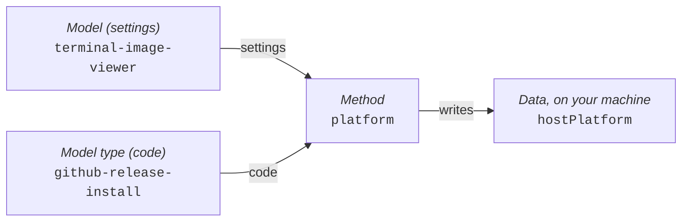
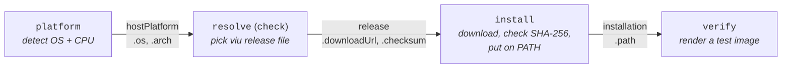
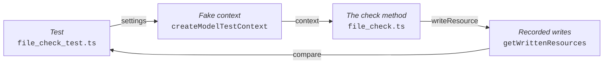
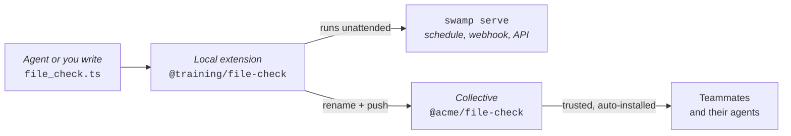

---
# You can also start simply with 'default'
theme: seriph
# random image from a curated Unsplash collection by Anthony
# like them? see https://unsplash.com/collections/94734566/slidev
background: https://cover.sli.dev
# some information about your slides (markdown enabled)
hideInToc: true
title: Swamp Training
author: Mischa Taylor
info: |
  ## Slidev Starter Template
  Presentation slides for developers.
# apply unocss classes to the current slide
class: text-center
# https://sli.dev/features/drawing
drawings:
  persist: false
# enable MDC Syntax: https://sli.dev/features/mdc
mdc: true
# open graph
# seoMeta:
#  ogImage: https://cover.sli.dev
themeConfig:
  paginationX: r
  paginationY: t
  paginationPagesDisabled: [1]
---

# Swamp Training

##### Mischa Taylor | 📧 <taylor@linux.com>

<div @click="$slidev.nav.next" class="mt-12 py-1" hover:bg="white op-10">
  Press Space for next page <carbon-arrow-right />
</div>

<div class="abs-br m-6 text-xl">
  <button @click="$slidev.nav.openInEditor()" title="Open in Editor" class="slidev-icon-btn">
    <carbon-edit />
  </button>
  <a href="https://github.com/slidevjs/slidev" target="_blank" class="slidev-icon-btn">
    <carbon-logo-github />
  </a>
</div>

<!--
The last comment block of each slide will be treated as slide notes. It will be visible and editable in Presenter Mode along with the slide. [Read more in the docs](https://sli.dev/guide/syntax.html#notes)
-->

---
hideInToc: true
routeAlias: toc
---

# Table of Contents

<Toc columns="2"/>

---
layout: section
---

# One Thing, End to End

<!--
Set the contract for the whole session: one task, carried all the way through.
-->

---
hideInToc: true
---

# You're going to automate one thing

- You're going to take one task all the way from “I want this” to a working automation.
- Then you're going to break the automation.
- Then you're going to see why the automation survives the kinds of things that happen in real systems.
- By the end, you'll have learned most of the important parts of Swamp along the way.

---
hideInToc: true
---

# Make Swamp Do Something

Here's the requirement:

> **Make this terminal display a picture.**

That's all you're going to give Swamp to start with.

Just the outcome.

---
hideInToc: true
---

# What Does Success Look Like?

You'll want to start with an ordinary image:

```text
swamp.png
```

And eventually be able to type **one command** against that file and see the image inside the
terminal, on Ubuntu, macOS and Windows.

Which command? You don't know yet, and that's the point:

- You're not going to figure out how to do that.

- You're going to ask Swamp to figure out how to automate it.

---
hideInToc: true
---

# What you need

Two tools: Swamp and a coding agent.

| | What it is | Why you need it |
| --- | --- | --- |
| **Swamp** | The thing that runs, remembers and verifies the automation | It is the subject of the training |
| **A coding agent** | Claude Code, Codex, Gemini CLI, Copilot CLI, Cursor, … | It writes the automation so you don't have to |

**Any of those agents will do.** I'll use Claude Code for the worked example, and I'll call out
the few places where the agent you picked changes what you type.

---
layout: section
---

# Setting Up

<!--
Installation. Keep this brisk; the interesting part is after the repo exists.
-->

---
hideInToc: true
---

# Installing Swamp

Swamp has a 30-day free trial. https://swamp-club.com/pricing

When you install, you will be prompted to create an account on https://swamp-club.com.

Software license: [Software License Agreement - Swamp Club ](https://swamp-club.com/software-license-agreement)

Extension registry: https://swamp-club.com/extension-registry-terms

The install script:
- Downloads the latest binary release from https://github.com/swamp-club/swamp/releases
- Installs the `swamp` binary to `~/.swamp/bin/swamp`
- Symlinks the `swamp` binary to `/usr/local/bin/swamp` if you have permissions

---
hideInToc: true
---

# Installing Swamp - Linux/macOS

```bash
# Install Swamp
curl -fsSL https://swamp-club.com/install.sh | sh

# Verify the Installation
swamp version
```

---
hideInToc: true
---

# Installing Swamp - Windows Powershell

Hit `Windows+R` and run `wt`. You should see a Windows Terminal command line prompt.

Grab the latest release instructions from https://github.com/swamp-club/swamp/releases

```powershell
# Request an elevated shell
Start-Process wt -Verb RunAs
New-Item -ItemType Directory -Path "C:\Program Files\swamp" -Force
Invoke-WebRequest `
  -Uri https://github.com/swamp-club/swamp/releases/download/v20260914.163154.0-sha.0bc3d215/swamp-windows-x86_64.zip `
  -OutFile swamp.zip
Expand-Archive swamp.zip -DestinationPath .; Move-Item swamp.exe 'C:\Program Files\swamp\'
# Add swamp to the Windows system PATH
$path = [Environment]::GetEnvironmentVariable("Path", "Machine")
[Environment]::SetEnvironmentVariable(
  "Path",
  $path + ";C:\Program Files\swamp",
  "Machine"
)
```

Verify the installation:
```powershell
swamp version
```

---
hideInToc: true
---

# Install a coding agent - Linux/macOS

Pick one. The rest of the deck works the same whichever you choose.

```bash
curl -fsSL https://claude.ai/install.sh | bash          # Claude Code
curl -fsSL https://chatgpt.com/codex/install.sh | sh    # Codex CLI
npm install -g @google/gemini-cli                       # Gemini CLI
curl -fsSL https://gh.io/copilot-install | bash         # Copilot CLI
curl https://cursor.com/install -fsS | bash             # Cursor CLI
```

Verify, using the name of the agent you installed:

```bash
claude --version        # or: codex, gemini, copilot, cursor-agent
```

If that command isn't found, add its directory to PATH and try again:

```bash
echo 'export PATH="$HOME/.local/bin:$PATH"' >> ~/.bashrc && source ~/.bashrc
```

<!--
Install commands drift. Point people at the vendor's install page if one fails.
Everything after these two slides is agent-neutral except the slash-command syntax.
-->

---
hideInToc: true
---

# Install a coding agent - Windows

Same five agents, from an ordinary PowerShell prompt:

```powershell
irm https://claude.ai/install.ps1 | iex                 # Claude Code
npm install -g @openai/codex                            # Codex CLI
npm install -g @google/gemini-cli                       # Gemini CLI
npm install -g @github/copilot                          # Copilot CLI
irm 'https://cursor.com/install?win32=true' | iex       # Cursor CLI
```

The `npm` installs need Node.js 22 or later.

Verify, using the name of the agent you installed:

```powershell
claude --version        # or: codex, gemini, copilot, cursor-agent
```

Whichever platform you're on, each agent prompts you to sign in the first time you run it.

---
hideInToc: true
---

# Create a swamp repo

```bash
# Create a directory for your swamp automation
mkdir swamp-thing
cd swamp-thing

# Authorize swamp use on this device with your swamp-club account (one time)
swamp auth login

# Initialize the directory as a swamp repo
swamp repo init
```

A swamp repo is an ordinary git directory. The automation you're about to build lives in this directory as code. 

---
hideInToc: true
---

# What `repo init` gives your agent

`swamp repo init` doesn't just make directories. Swamp also writes files that steer your agent:

| File | What the file does |
| --- | --- |
| `CLAUDE.md` | Eight rules for working in a swamp repo, plus a list of skills to load |
| `.claude/skills/swamp-*` | 15 skills: detailed how-to guides the agent loads on demand |
| `.claude/settings.local.json` | Which swamp commands the agent may run without asking, plus an audit hook |

Other agents get the same rules in the repo's instructions file
(`AGENTS.md` for Codex, Copilot, Cursor and most others; `GEMINI.md` for Gemini CLI).

Whichever agent you use, **your agent already knows what swamp is** before giving a single prompt.

---
hideInToc: true
---

# The rules swamp gives your agent

Swamp manages one section of `CLAUDE.md` and rewrites that section on `repo init`.

| Rule in `CLAUDE.md` | Where the rule shows up |
| --- | --- |
| 1. Search before you build | The agent reuses a community extension |
| 2. Extend, don't be clever | The agent adds methods, not a shell script |
| 3–4. Use the data model, with CEL | Steps read `data.latest(...)` |
| 7. Pin npm versions | Every `import` names a version |
| Always load swamp skills | Tests, publishing, schedules |

Watch for callouts like this one on later slides. Each marks a moment when swamp's instructions steered the agent:

> <ph-robot-duotone class="inline-block align-text-bottom" /> **Swamp told the agent, via `CLAUDE.md` rule 1, "Search before you build":** search the registry before writing new code.

---
hideInToc: true
---

# What the agent may run without asking

`.claude/settings.local.json` lists the swamp commands Claude Code may run without asking you:

| Allowed without asking | Not on the list, so Claude Code asks first |
| --- | --- |
| `swamp model get`, `create`, `edit`, `validate` | `swamp model method run` |
| `swamp workflow get`, `create`, `edit`, `validate` | `swamp workflow run` |
| `swamp data ...`, `swamp vault ...`, `swamp repo ...` | `swamp extension pull`, `push` |

The agent can read and write automation freely. **Running automation still needs your OK.**

---
hideInToc: true
---

# Check what the agent ran with `swamp audit`

The same settings file adds a hook that logs every shell command Claude Code runs.
Read the log with:

```bash
swamp audit
```

```text
Audit timeline (last 24h): 2 swamp, 1 direct
Time         Source   Summary
19:28:29     swamp    swamp model type search github
19:28:30     direct   curl -sL https://github.com/atanunq/viu/releases/latest
19:28:30     swamp    swamp workflow run terminal-image-setup
```

`direct` lines show the agent working **around** swamp. Rule 2 says the agent shouldn't need to.


---
hideInToc: true
---

# What to commit, what to ignore

`swamp repo init` already adds the right-hand column to `.gitignore`, in a section marked
`swamp managed section - DO NOT EDIT`.

| Commit: the automation | Ignore: specific to one machine |
| --- | --- |
| `models/`, `workflows/`, `extensions/`, `vaults/` | `.swamp/`: data, run history, secrets **and their key** |
| `.swamp.yaml`: repo settings | `.swamp-sources.yaml`: paths on your own disk |
| `CLAUDE.md` or `AGENTS.md`: the agent's rules | `.claude/`: skills and settings swamp regenerates |

After cloning, run `swamp repo upgrade` to recreate `.claude/`. Add your own lines **outside** the
managed section, such as `.env` if you keep tokens like `WEBHOOK_SECRET` in a file.
---
layout: section
---

# Who Does What

<!--
Before building, settle the division of labor. This is the slide people remember.
-->

---
hideInToc: true
---

# Swamp Runs the Automation

At its simplest, **Swamp runs automation code that you create.**

You can build that automation yourself...

...or delegate much of the work to your favorite coding agent.

```bash
swamp build me ...
```

---
hideInToc: true
---

<div class="h-full flex flex-col items-center justify-center text-center gap-12">

<div class="text-4xl">
Your coding agent is one way to build with Swamp.
</div>

<div class="text-6xl font-bold">
It isn't what makes Swamp, Swamp.
</div>

</div>

<!--
Swap "Claude" for whichever agent the room is using. The point survives the swap. That is the point.
-->

---
hideInToc: true
---

# So Where Does the Agent Fit?

| **Agent / Human** | **Swamp** |
| --- | --- |
| Reasons, investigates, creates | Executes and remembers |
| Makes judgments | Enforces gates |
| Proposes what to do | Verifies what happened |
| Tells you what it did | Measures what actually ran |

**The agent provides intelligence. Swamp provides structure around it.**
Swap the agent out and the right column doesn't change.

---
hideInToc: true
---

# Intelligence, Kept Honest

<div class="grid grid-cols-2 gap-20 mt-12">

<div>

<div class="flex items-center gap-5 mb-6">
  <ph-robot-duotone class="text-6xl" />
  <div class="text-3xl font-bold border-b-4 border-current pb-2">
    Agent / Human
  </div>
</div>

<div class="text-2xl leading-12 pl-2">

**Think** about the problem  
**Investigate** what is happening  
**Create** a solution  
**Decide** what should happen  
**Propose** actions

</div>

</div>

<div>

<div class="flex items-center gap-5 mb-6">
  
  <div class="text-3xl font-bold border-b-4 border-current pb-2">
    Swamp
  </div>
</div>

<div class="text-2xl leading-12 pl-2">

**Check** every claim against the machine  
**Refuse** the next step when one fails  
**Repeat** the run exactly, every time  
**Record** what happened, not what was claimed  
**Measure** every run, on every machine

</div>

</div>

</div>

<div class="text-center text-2xl mt-12 opacity-80">

**The agent makes things up. Swamp is the part that doesn't take its word.**

</div>

---
layout: section
---

# Create

<!--
Now hand the requirement to the agent and watch structure come out the other side.
-->

---
hideInToc: true
---

# Ask for the outcome, not the steps

Type this into your agent. Claude Code, Codex, Gemini, Copilot, Cursor: it doesn't matter.

```
Build me an automation with swamp that makes this
machine capable of displaying an image directly
in the terminal.
It needs to work on Ubuntu, macOS, and Windows.
```

Notice what isn't in there: no tool name, no package manager, no install path.
You stated the **outcome** and the **constraint**. The agent picks the rest.

> <ph-robot-duotone class="inline-block align-text-bottom" /> **Swamp told the agent, via the Getting Started section of `CLAUDE.md`:** at the start of every conversation the agent runs `swamp model search`. In a repo with no models yet, the agent starts the `swamp-getting-started` tutorial first. Tell the agent to skip the tutorial to go straight to your request.

---
hideInToc: true
---

# Choose your own adventure

What you get back from this prompt will vary.

I asked for automation to show images in the terminal.

My agent picked **viu**: a single-file image viewer with builds for Linux, macOS and Windows.
viu shows real images in terminals that support them and colored text blocks everywhere else.
**You might get `chafa`, `timg`, or something else.** That's fine: the shape of what gets built
is the same. From here on the slides say `viu`; substitute whatever your agent picked.

> <ph-robot-duotone class="inline-block align-text-bottom" /> **Swamp told the agent, via `CLAUDE.md` rule 1, "Search before you build":** the agent runs `swamp model type search` and `swamp extension search` before writing any code, and pulls a **community extension** when one fits.

---
hideInToc: true
---

# Extensions: where swamp code comes from

- **Extension:** a package of code that teaches swamp a new task, such as installing programs from
  GitHub.

- **Extension registry:** the public catalog of shared extensions at swamp-club.com.
  Search the catalog with `swamp extension search <words>`.

- **Community extension:** an extension someone else published to the registry.
  `swamp extension pull <name>` downloads a copy into your repo.

- **Local extension:** an extension you (or your agent) write inside your own repo, in
  `extensions/models/`. A local extension can add methods to a community extension's model type.

> <ph-robot-duotone class="inline-block align-text-bottom" /> **Swamp told the agent, via `CLAUDE.md` rule 2, "Extend, don't be clever":** when a model type covers the job but lacks a method, the agent adds the method with `export const extension`, instead of a shell script, a CLI tool or a multi-step hack.

---
hideInToc: true
routeAlias: what-the-agent-built
---

# What the agent built

The viu project publishes its binaries as GitHub releases. The agent found a **community extension**
built for exactly that: `@svendowideit/github-release-install`, in the **extension registry**.

The community extension's **model type** could already pick the right release file for this machine
and download the file with a checksum check. The model type could not install the file.

The agent wrote a **local extension** that gives the same model type three new **methods**:
- `platform`: detect the OS and CPU without `uname`, so the method works on native Windows
- `install`: put the viu binary in a bin directory and add that directory to PATH
- `verify`: run viu on a test image to prove the install worked

It then put the steps into a swamp **workflow**, `terminal-image-setup`: one command that runs
`platform`, `check`, `install` and `verify` in order, each step using the previous step's result.

---
hideInToc: true
routeAlias: swamp-lingo
---

# Swamp lingo: the code and your settings

Swamp keeps **code** and **settings** in separate places.

| Term | What it is | In my repo |
| --- | --- | --- |
| **Model type** | Code that does one kind of task. A model type lists the settings needed and the actions the code can run. | `@svendowideit/github-release-install`: installs programs published on GitHub |
| **Method** | One action a model type can run. | `check`, `install`, `verify`, … |
| **Model** | A small YAML file that names a model type and fills in the model type's settings. | `terminal-image-viewer`: the GitHub installer set up for viu |

**Why keep them separate?** One model type can serve many models.
The same GitHub installer code could install viu in one model and a different program in another.
Only the settings change.

---
hideInToc: true
---

# Run a method, get data

The general shape of the command:

```text
swamp model method run <model name> <method name>
```

**For example**, from my repo:

```text
swamp model method run  terminal-image-viewer  platform
                        └─── model name ────┘  └method┘
```

- `terminal-image-viewer` is the **model** from <Link to="swamp-lingo" title="Swamp lingo"/>:
  viu's settings for the GitHub installer.
- `platform` is one of the three **methods** the agent added (see <Link to="what-the-agent-built" title="What the agent built"/>).
  `platform` detects the OS and CPU.

You won't usually type this command. Installing viu takes four methods in a row: `platform`,
`check`, `install`, `verify`. So the agent put all four into one **workflow**,
`terminal-image-setup`, and one command runs them in order.
Your agent may have picked different names.

---
hideInToc: true
---

# Where a method's data goes



`platform` writes the answer as data named `hostPlatform`:

```json
{ "os": "darwin", "arch": "arm64", "binDir": "~/.local/bin" }
```

Swamp saves the data as a file **on your machine**, inside the repo. Nothing goes to the cloud:

```text
.swamp/data/@svendowideit/github-release-install/<model id>/hostPlatform/1/raw
```

`.swamp/` stays out of git. <Link to="shared-data" title="One server, one hard drive"/> shows how to share data with a team.

---
hideInToc: true
---

# Reading data back

`check` needs the OS and CPU: `check` reads what `platform` wrote, instead of running `platform` again.

| Who's reading | How |
| --- | --- |
| You, at the terminal | `swamp data get terminal-image-viewer hostPlatform` |
| A step in a workflow | `data.latest("terminal-image-viewer", "hostPlatform")` |

```text
data.latest("terminal-image-viewer", "hostPlatform").attributes.os
            └──── model name ─────┘  └ data name ─┘ └ one field ─┘
```

- `latest`: the highest-numbered version folder (`.../hostPlatform/1/`, `2/`, ...).
- `.attributes`: the JSON the method wrote. `.attributes.os` is `"darwin"`.

That line is a **CEL** expression. The next slides show where the expression goes: inside a workflow step.

---
hideInToc: true
---

# Workflow: chaining methods into one job

- **Workflow:** a YAML file in `workflows/` that lists steps. Each step runs one method on a model.
- **Inputs:** options you pass when running it (`version`, `binDir`, `addToPath`, `force`).
- **dependsOn:** a step runs only after the step it depends on succeeds.
- **`data.latest(...)`:** a step reads the data the previous step just saved. Nothing is hard-coded.

`terminal-image-setup` runs four methods on the `terminal-image-viewer` model:

| Step | Method | Reads | Saves |
| --- | --- | --- | --- |
| `platform` | `platform` | (nothing) | `hostPlatform`: OS, CPU type, bin directory |
| `resolve` | `check` | `hostPlatform` | `release`: download URL and SHA-256 |
| `install` | `install` | `release` | `installation`: installed path |
| `verify` | `verify` | `installation` | `verification`: version and test-image render |

---
hideInToc: true
---

# How the steps hand off data



How one step reads another step's output (from `install`):

```yaml
downloadUrl: ${{ data.latest("terminal-image-viewer", "release").attributes.platform.downloadUrl }}
checksum:    ${{ data.latest("terminal-image-viewer", "release").attributes.checksum }}
```

No OS name, no URL, no version is written into the workflow. Every value is produced by a step.

---
hideInToc: true
---

# CEL: the expressions in workflow YAML

```yaml
checksum: ${{ data.latest("terminal-image-viewer", "release").attributes.checksum }}
```

Everything inside the double braces is a **CEL** expression (Common Expression Language, from
Google). Swamp works out each expression's value when the step runs.

| Piece of the expression | What the piece reads |
| --- | --- |
| `data.latest("terminal-image-viewer", "release")` | The newest saved `release` data |
| `.attributes.checksum` | One field inside that data |
| `inputs.version` | A workflow input, such as `--input version=1.6.1` |

CEL can compare and combine values (`==`, `&&`, `? :`), but CEL can't run commands, read files or
loop. A workflow file can't hide a script inside an expression.

> <ph-robot-duotone class="inline-block align-text-bottom" /> **Swamp told the agent, via `CLAUDE.md` rules 3 and 4:** wire steps together with CEL, read data that already exists instead of fetching the data again, and use `data.latest(...)` rather than the older `model.<name>.resource...` form.

---
hideInToc: true
---

# The payoff: run the whole thing

```bash
swamp workflow run terminal-image-setup
```

```text
✔ platform   darwin/arm64, binDir=~/.local/bin
✔ resolve    viu 1.6.1 → viu-aarch64-apple-darwin  (sha256 9f3c…a21e)
✔ install    ~/.local/bin/viu
✔ verify     viu 1.6.1, test image rendered
```

Then the thing you actually asked for, back at the start, with the tool the agent chose:

```bash
viu swamp.png
```

One requirement, *“make this terminal display a picture”*, is now **one command**, on three
operating systems, with a record of how it got there.

> <ph-robot-duotone class="inline-block align-text-bottom" /> **Swamp told Claude Code, via `settings.local.json`:** `swamp workflow run` isn't on the allowlist, so Claude Code asks you before running the workflow. The agent writes automation freely; running automation needs your OK.

---
hideInToc: true
---

# Look at what happened

The run left evidence behind. Ask swamp about it:

```bash
swamp data list terminal-image-viewer          # what data got produced
swamp workflow get terminal-image-setup        # what the workflow does
swamp model get terminal-image-viewer --json   # what settings I saved
swamp model search --json                      # which models exist
swamp audit                                    # every command the agent ran
```

Or read the code itself:

```text
extensions/models/github_release_binary_install.ts              yours
.swamp/pulled-extensions/@svendowideit/github-release-install/  community
workflows/workflow-terminal-image-setup.yaml                    workflow
```

**`terminal-image-setup` works. Now find out whether the workflow only works once.**

---
layout: section
---

# Breaking the Workflow

<!--
This is the part that separates a demo from an automation. Do these live.
-->

---
hideInToc: true
---

# Break the workflow: delete the viu binary

```bash
rm "$(command -v viu)"   # delete the binary the workflow installed
viu swamp.png
# command not found
```

Now re-run the same command you ran before. No flags, no edits:

```bash
swamp workflow run terminal-image-setup
viu swamp.png
# the picture is back
```

**What that proves:** the workflow is the source of truth, not the state of the machine.
Nothing you did by hand had to be remembered or redone.

And when nothing is broken, re-running is cheap: `install` skips the download whenever the
installed file already matches its checksum.

---
hideInToc: true
---

# Break the workflow: change the machine

| What you change | What happens | Why |
| --- | --- | --- |
| Run the workflow on a different OS | Correct binary installs | `platform` re-detects; nothing is hard-coded |
| Run the workflow on arm64 instead of x86_64 | Correct binary installs | `resolve` picks the file from `hostPlatform` |
| Run the workflow twice in a row | Second run is near-instant | `install` sees a matching checksum and skips |
| Run the workflow on a machine without `uname` | Correct binary installs | `platform` detects the OS without `uname` |

The workflow never names an operating system, a CPU, a URL or a path.
Every one of those is **data a step produced**, not a constant someone typed.

---
hideInToc: true
---

# Break the workflow: ask for a viu version that doesn't exist

```bash
swamp workflow run terminal-image-setup --input version=0.0.0
```

```text
✔ platform   darwin/arm64
✘ resolve    no release asset matches viu 0.0.0
– install    skipped (dependsOn: resolve)
– verify     skipped (dependsOn: resolve)
```

The run **stopped**. Swamp did not download a different file, guess a version, or leave a
half-installed binary on PATH.

`dependsOn` is a gate, not a suggestion. A step that can't trust its input doesn't run.

---
hideInToc: true
---

# Break the workflow: a broken binary that installs fine

Imagine the `install` step succeeds and the viu binary is **broken**: wrong architecture, truncated
download, missing shared library.

Without `verify`, the run is green and the automation is wrong. You find out later, from a human.

```text
✔ install    ~/.local/bin/viu
✘ verify     viu exited 126: cannot execute binary file
```

`verify` is the step that turns **“the install ran”** into **“viu works.”**
`verify` is also the step people skip first, because every run looks fine without a `verify` step.

---
layout: section
---

# Automation That Lasts

---
hideInToc: true
---

# Why `terminal-image-setup` kept working

| Threat | What handled the threat |
| --- | --- |
| Binary deleted or machine rebuilt | The workflow is re-runnable, start to finish |
| Wrong file for this machine | `platform` detects, `resolve` chooses |
| Corrupted or tampered download | SHA-256 checksum compared before install |
| Installed but not working | `verify` renders a real test image |
| Half-finished run | `dependsOn` stops the chain at the first failure |
| “Worked on my machine” | Versioned **data** records every run's inputs and outputs |

Your agent didn't invent any of these safeguards on the fly.
They come from the **structure** swamp gave the agent's code.

---
hideInToc: true
---

# The shape to reuse

Every durable automation you build in swamp has the same four beats:

1. **Detect** what you're actually on. Don't assume.
2. **Resolve** the right artifact from that detection. Don't hard-code.
3. **Act**, guarded by a check you can't fake: checksum, signature, version.
4. **Verify** the outcome the way a user would experience it.

Chain them with `dependsOn` so a failure anywhere stops everything after it.

**Your agent writes the code for these four steps. Swamp is what makes the four steps a thing that
still works next month.**

---
hideInToc: true
---

# What building the workflow taught you

| While building the workflow, you | You learned |
| --- | --- |
| Installed swamp, ran `repo init` | Repos, auth, `CLAUDE.md` rules, skills, allowlist, audit |
| Asked for an outcome in plain English | Agent-driven authoring, search-before-build |
| Reused `@svendowideit/github-release-install` | Extensions and the registry |
| Added three methods in your own repo | Local extensions, extending a model type |
| Saved viu's settings as `terminal-image-viewer` | Model types vs. models |
| Ran `platform` on its own | Methods and versioned data |
| Ran `terminal-image-setup` | Workflows, `dependsOn`, `data.latest(...)` |

---
hideInToc: true
---

# What breaking the workflow taught you

| While breaking the workflow, you | You learned |
| --- | --- |
| Deleted the binary and re-ran | Idempotency |
| Asked for version `0.0.0` | Gates and failure semantics |
| Looked at `verify` | Verification vs. completion |

One picture in a terminal taught you most of swamp.

---
layout: section
---

# Writing a Model by Hand

<!--
So far the agent wrote every line of code. This section opens the hood: we write a small model
type ourselves, and learn just enough TypeScript and Zod to read what the agent writes.
-->

---
hideInToc: true
---

# Why write a model yourself?

Your agent will keep writing most of your swamp code. You still need to:

- **Read** the code the agent wrote, before you trust a workflow that runs the code
- **Fix** a small mistake without starting a whole new conversation with the agent
- **Judge** whether the agent's model type is any good

Every swamp model type is a single TypeScript file that uses a library called **Zod**.
This section teaches enough of both to write one small model type from scratch.

No prior TypeScript needed. If you've written YAML, bash or Python, you have enough to start.

> <ph-robot-duotone class="inline-block align-text-bottom" /> **Swamp told the agent, via the `swamp-extension-model` skill:** when you ask for a model type, the agent loads this skill. The skill dictates the file shape you're about to write by hand: a snake_case file name, `import { z } from "npm:zod@4"`, and `export const model` or `export const extension`.

---
hideInToc: true
---

# TypeScript in one slide

**TypeScript** is JavaScript plus **types**: labels that say what kind of value a variable holds.
Swamp runs TypeScript with **Deno**, which is built into the swamp binary. Nothing to install.

```ts
const name = "viu";              // a string. const: the value never changes
let size = 0;                    // a number. let: the value can change later
size = 3207;

const ok: boolean = size > 0;    // ": boolean" is a type label. Optional when obvious

const tool = {                   // an object: keys and values, like a YAML mapping
  name: "viu",
  version: "1.6.1",
};
tool.name                        // "viu"
```

`//` starts a comment. Semicolons end statements. Curly braces `{ }` group things.

---
hideInToc: true
---

# TypeScript: functions and waiting

```ts
// A function that takes a number and returns a boolean
function isBigEnough(size: number): boolean {
  return size >= 1;
}

// The same function, written as an "arrow function". Swamp code uses this style a lot
const isBigEnough = (size: number) => size >= 1;
```

Some work takes time: reading a file, downloading, running a program.
Functions doing that kind of work are **`async`**, and you **`await`** their results:

```ts
const readSize = async (path: string) => {
  const info = await Deno.stat(path);   // wait for the operating system to answer
  return info.size;
};
```

Forget an `await` and you get a promise of a value instead of the value. That's the most common
beginner bug.

---
hideInToc: true
---

# TypeScript: a reading guide

Five pieces of syntax show up in every swamp model type:

| You see | It means | Python equivalent |
| --- | --- | --- |
| `import { z } from "npm:zod@4";` | Load the `z` helper from version 4 of the zod package | `from zod import z` |
| `export const model = { ... };` | Make `model` visible to swamp | (no equivalent; module-level name) |
| `const { path, minBytes } = obj;` | Copy two fields out of an object into variables | `path, min_bytes = obj["path"], obj["minBytes"]` |
| `` `size is ${size}` `` | A string with a value inserted | `f"size is {size}"` |
| `try { ... } catch { ... }` | Run code; if the code throws an error, run the backup | `try: ... except: ...` |

That table, plus the previous two slides, covers every line of the model type we're about to write.

---
hideInToc: true
---

# The gap types leave

TypeScript checks types **while you write code**. When the code runs, the type labels are gone.

That's a problem for swamp, because the most important values come from **outside** the code:

- settings you type on the command line: `--global-arg minBytes=abc`
- a model's YAML file, edited by hand
- one workflow step's output, read by the next step

TypeScript never sees any of those values. Nothing stops `"abc"` from arriving where a number
should be.

**Zod closes the gap.** A Zod **schema** describes what valid data looks like, and Zod checks real
data against the schema **while the code runs**.

---
hideInToc: true
---

# Zod in one slide

```ts
import { z } from "npm:zod@4";

const Settings = z.object({
  path: z.string(),                          // must be text
  minBytes: z.number().int().min(0),         // whole number, zero or more
  retries: z.number().default(3),            // if missing, use 3
  label: z.string().optional(),              // allowed to be missing
  mode: z.enum(["fast", "safe"]),            // only these two strings
  tags: z.array(z.string()),                 // a list of strings
});

Settings.parse({ path: "swamp.png", minBytes: -5, mode: "safe", tags: [] });
// throws: minBytes: Too small: expected number to be >=0
```

You read a schema top to bottom like a form: each line names a field and the rules for that field.
`.describe("...")` adds help text that swamp shows to people and agents.

---
hideInToc: true
---

# What a model type file declares

A model type file uses Zod schemas to describe three things to swamp:

| Part | Question it answers | Zod schema? |
| --- | --- | --- |
| `globalArguments` | What settings does each model need? | Yes |
| `resources` | What data do methods save? | Yes, one schema per resource |
| `methods` | What actions can the model type run? | Yes, for each method's arguments |

Plus two labels: `type` (the model type's name, `@collective/name`) and `version` (a date-based
version, `YYYY.MM.DD.N`).

Swamp reads these declarations **before running any code**. That's how
`swamp model type describe` can show a model type's settings without running anything.

---
hideInToc: true
---

# What we're building: `@training/file-check`

A tiny model type that answers one question about a file:

> **Does this file exist, and is the file at least `minBytes` big?**

Useful as the first step of `terminal-image-setup`: there's no point installing viu if `swamp.png`
is missing or empty.

| Part | For `@training/file-check` |
| --- | --- |
| Settings | `path` (required), `minBytes` (defaults to 1) |
| Method | `check` |
| Data saved | `report`: path, exists, size in bytes, big enough, when checked |

Create one file: `extensions/models/file_check.ts`.
Swamp loads every `.ts` file in `extensions/models/` automatically.

---
hideInToc: true
---

# Step 1: the schemas

```ts {1|3-6|8-14|all}
import { z } from "npm:zod@4";

const GlobalArgsSchema = z.object({
  path: z.string().describe("File to check"),
  minBytes: z.number().int().min(0).default(1),
});

const ReportSchema = z.object({
  path: z.string(),
  exists: z.boolean(),
  sizeBytes: z.number(),
  bigEnough: z.boolean(),
  checkedAt: z.string(),
});
```

- `GlobalArgsSchema`: the settings every `file-check` model must provide
- `ReportSchema`: the shape of the data the `check` method saves

Neither schema does anything yet. Both are just descriptions, stored in constants for the next step.

---
hideInToc: true
---

# Step 2: describe the model type

```ts {1|2-3|4|5-12|13-15|all}
export const model = {
  type: "@training/file-check",
  version: "2026.10.04.1",
  globalArguments: GlobalArgsSchema,
  resources: {
    report: {
      description: "What we found out about the file",
      schema: ReportSchema,
      lifetime: "infinite",
      garbageCollection: 10,
    },
  },
  methods: {
    check: { /* next slide */ },
  },
};
```

- `export const model`: a **new** model type. The agent's viu code used `export const extension`
  instead, which adds methods to someone else's model type.
- `lifetime: "infinite"`: keep the data forever. `garbageCollection: 10`: keep the last 10 versions.

---
hideInToc: true
---

# Step 3: the `check` method

```ts {2|3|4|5|7-14|16-23|all}{maxHeight:'380px'}
check: {
  description: "Check that the file exists and is big enough",
  arguments: z.object({}),
  execute: async (args, context) => {
    const { path, minBytes } = context.globalArgs;

    let sizeBytes = 0;
    let exists = true;
    try {
      const info = await Deno.stat(path);
      sizeBytes = info.size;
    } catch {
      exists = false;
    }

    const handle = await context.writeResource("report", "report", {
      path,
      exists,
      sizeBytes,
      bigEnough: sizeBytes >= minBytes,
      checkedAt: new Date().toISOString(),
    });
    return { dataHandles: [handle] };
  },
},
```

---
hideInToc: true
---

# Step 3, line by line: reading the file

| Code | What the code does |
| --- | --- |
| `arguments: z.object({})` | `check` takes no extra arguments. An empty schema still has to be there |
| `execute: async (args, context) =>` | The function swamp calls when someone runs `check` |
| `context.globalArgs` | The model's settings, **already checked against `GlobalArgsSchema`** |
| `Deno.stat(path)` | Ask the operating system about the file. Throws an error if the file is missing |

---
hideInToc: true
---

# Step 3, line by line: saving the report

| Code | What the code does |
| --- | --- |
| `try { } catch { }` | A missing file is an answer, not a crash: record `exists = false` |
| `{ path, exists, ... }` | Shorthand for `{ path: path, exists: exists, ... }` |
| `context.writeResource("report", "report", {...})` | Save data. First `"report"` picks the schema; second `"report"` names the data |
| `return { dataHandles: [handle] }` | Tell swamp which data this run produced |

The second name is the one workflows use: `data.latest("swamp-image", "report")`.

---
hideInToc: true
---

# Did swamp load the model type?

```bash
swamp model type describe @training/file-check
```

```text
Type: @training/file-check
Version: 2026.10.04.1

Global Arguments:
  path (string) *required
  minBytes (integer) *required

Methods:
  check - Check that the file exists and is big enough
    Data Outputs:
      report [resource] - What we found out about the file (infinite)
```

Swamp turned the Zod schema into documentation: `.int()` became `(integer)`.
No code ran. Swamp only read the declarations.

If the model type is missing, swamp couldn't load the file: check for a typo with
`swamp model type search`.

---
hideInToc: true
---

# Create a model, run the method

A **model type** is code. A **model** is settings for that code. Create a model:

```bash
swamp model create @training/file-check swamp-image --global-arg path=swamp.png
```

Swamp writes a YAML file under `models/@training/file-check/`:

```yaml
type: '@training/file-check'
typeVersion: 2026.10.04.1
name: swamp-image
globalArguments:
  path: swamp.png
  minBytes: 1          # filled in from .default(1)
```

Then run the method, and look at the data:

```bash
swamp model method run swamp-image check
swamp data get swamp-image report --json
```

---
hideInToc: true
---

# The data the method saved

```json
{
  "name": "report",
  "modelName": "swamp-image",
  "modelType": "@training/file-check",
  "version": 1,
  "content": {
    "path": "swamp.png",
    "exists": true,
    "sizeBytes": 3207,
    "bigEnough": true,
    "checkedAt": "2026-10-04T22:54:27.801Z"
  }
}
```

`content` has exactly the shape `ReportSchema` describes.
Run `check` again and swamp saves `version: 2`. Version 1 stays, so you can compare runs.

---
hideInToc: true
---

# Break the model: bad settings

```bash
swamp model create @training/file-check bad --global-arg path=swamp.png --global-arg minBytes=-5
```

```text
Invalid global arguments for type '@training/file-check':
  minBytes: Too small: expected number to be >=0
```

```bash
swamp model create @training/file-check bad --global-arg minBytes=3
```

```text
Invalid global arguments for type '@training/file-check':
  path: Invalid input: expected string, received undefined
```

You wrote no error-handling code for either case. **The schema is the error handling.**
`.min(0)` and the required `path` were enough to stop bad settings before the method ran.

---
hideInToc: true
---

# Break the model: bad output

Change one line in `check` so the size is saved as text instead of a number:

```ts
sizeBytes: String(sizeBytes),
```

```text
[WRN] Resource 'report' (instance 'report') data does not match schema:
  'Invalid input: expected number, received string at "sizeBytes"'
```

The method still finishes and the data is still saved. Swamp **warns** instead of failing.

| Where the data comes from | What swamp does with a schema mismatch |
| --- | --- |
| Settings and arguments going **into** a method | Refuses to run the method |
| Data a method writes **out** | Saves the data and logs a warning |

Read your warnings. A later workflow step reading `sizeBytes` will get `"3207"`, not `3207`.

---
hideInToc: true
---

# Where do the `_test.ts` files come from?

Ask your agent for a model type and you'll often get two files back:

```text
extensions/models/file_check.ts          the model type
extensions/models/file_check_test.ts     tests for the model type
```

Swamp doesn't have a test command, and swamp doesn't generate the tests itself.

> <ph-robot-duotone class="inline-block align-text-bottom" /> **Swamp told the agent, via the `swamp-extension-model` skill:** the skill tells the agent to write unit tests with `@systeminit/swamp-testing`, review the code adversarially, then smoke-test before publishing:

| Kind | What runs | What a failure catches |
| --- | --- | --- |
| **Unit test** | The method's code, with a fake swamp around it | Logic bugs: wrong comparison, wrong field |
| **Smoke test** | The real method, against the real system | Wrong URL, wrong permissions, an API that changed |

---
hideInToc: true
---

# A unit test calls `execute` directly

A unit test skips swamp entirely. No model YAML, no saved data, no workflow:



`createModelTestContext` comes from swamp's testing library, `@systeminit/swamp-testing`.
The fake context behaves like the real `context`, but `writeResource` only **records** what the
method tried to save, so the test can check the data afterwards.

---
hideInToc: true
---

# A unit test for `check`

```ts {1-3|5-7|9-12|14-17|all}
import { assertEquals } from "jsr:@std/assert@1";
import { createModelTestContext } from "jsr:@systeminit/swamp-testing";
import { model } from "./file_check.ts";

Deno.test("check reports a file that exists", async () => {
  const path = await Deno.makeTempFile();
  await Deno.writeTextFile(path, "hello");          // exactly 5 bytes

  const { context, getWrittenResources } = createModelTestContext({
    globalArgs: { path, minBytes: 5 },
  });
  await model.methods.check.execute({}, context);

  const report = getWrittenResources()[0].data;
  assertEquals(report.exists, true);
  assertEquals(report.sizeBytes, 5);
  assertEquals(report.bigEnough, true);
});
```

---
hideInToc: true
---

# Reading the test: setting up

| Code | What the code does |
| --- | --- |
| `Deno.test("...", async () => { })` | Declares one test. The text is the name printed in the results |
| `Deno.makeTempFile()` | Creates a throwaway file, so the test never depends on `swamp.png` |
| `createModelTestContext({ globalArgs })` | Builds the fake context, with the settings a model would have |

---
hideInToc: true
---

# Reading the test: running and checking

| Code | What the code does |
| --- | --- |
| `model.methods.check.execute({}, context)` | Runs `check`, exactly as swamp would |
| `getWrittenResources()[0].data` | The data `check` tried to save |
| `assertEquals(actual, expected)` | Fails the test when the two values differ |

`minBytes: 5` with a 5-byte file is deliberate: the test sits exactly on the boundary,
where a `>=` versus `>` mistake would show up.

---
hideInToc: true
---

# Run the tests

Swamp keeps its own copy of **Deno** at `~/.swamp/deno/deno`. Use that copy, or install Deno.

```bash
~/.swamp/deno/deno test --allow-read --allow-write extensions/models/
```

```text
running 2 tests from ./extensions/models/file_check_test.ts
check reports a file that exists ... ok (3ms)
check reports a missing file without crashing ... ok (0ms)

ok | 2 passed | 0 failed (6ms)
```

- `deno test` finds every file ending in `_test.ts` and runs every `Deno.test` inside.
- `--allow-read --allow-write`: Deno blocks file access unless you allow file access.
  The test needs both to create the temporary file.
- Milliseconds, not minutes: no network, no real install, nothing to clean up.

---
hideInToc: true
---

# One setup file: `deno.json`

The first `deno test` run fails before any test starts:

```text
TS7006 [ERROR]: Parameter 'args' implicitly has an 'any' type.
      execute: async (args, context) => {
```

Swamp runs model code **without** checking types. `deno test` **does** check types, and objects
to `args` and `context` having no type labels. Add a `deno.json` at the repo root:

```json
{
  "compilerOptions": { "noImplicitAny": false }
}
```

`noImplicitAny: false` tells TypeScript that parameters without labels are fine.
The model file stays exactly as swamp expects, and swamp still loads the model type normally.

---
hideInToc: true
---

# Break the model: a test catches the bug

Change one character in `check`:

```ts
bigEnough: sizeBytes > minBytes,      // was >=
```

```text
check reports a file that exists ... FAILED (4ms)

error: AssertionError: Values are not equal.
    [Diff] Actual / Expected
-   false
+   true
    at file:///.../file_check_test.ts:17:3

FAILED | 1 passed | 1 failed (7ms)
```

Line 17 is `assertEquals(report.bigEnough, true)`. A 5-byte file with `minBytes: 5` should be big
enough, and the changed code says the file isn't.

Without the test, `swamp model method run` would succeed and save a wrong report. Nothing would
look broken.

---
hideInToc: true
---

# Three layers of checking

| Layer | When the layer runs | What the layer proves |
| --- | --- | --- |
| **Unit test** (`_test.ts`) | Before you commit, in milliseconds | The method's logic is right, for inputs you chose |
| **Smoke test** (`swamp model method run`) | Before you publish, against the real system | The method works with real files, APIs and permissions |
| **`verify` step** (in the workflow) | On every run, on every machine | This run, on this machine, actually worked |

Each layer catches what the layer before cannot. Unit tests never touch the real system.
Smoke tests only run when someone remembers to run them. `verify` runs every time, but only
after the work is done.

When your agent hands you a model type, read the test names first. The names list what the
agent thought could go wrong.

---
hideInToc: true
---

# Your turn: extend `@training/file-check`

Extend `@training/file-check`. Write the code yourself first, add a `Deno.test` for each change,
then ask your agent to review both.

1. Add a `maxBytes` setting with `.optional()`, and report `tooBig` when the file exceeds it.
2. Add a method argument instead of a setting: `check` takes `{ path }`, so one model can check
   any file. (Hint: method arguments arrive in `args`, not `context.globalArgs`.)
3. Make `check` **fail** when the file is missing: `throw new Error(...)` **before** calling
   `writeResource`, so no misleading data gets saved.
4. Add a `swamp-image` `check` step to `terminal-image-setup`, and make `platform` depend on
   the new step.

Before publishing your own model type with `swamp extension push`, replace `@training` with your
collective's name: `swamp auth whoami` lists them.

---
layout: section
---

# Running Swamp as a Server

<!--
Everything so far started with a person typing a command. swamp serve removes the person:
workflows run on a clock, on a webhook, or when another program asks.
-->

---
hideInToc: true
---

# Who types the command at 3 a.m.?

Every workflow so far ran because **you** typed `swamp workflow run`. Real automation often has
no person at the keyboard:

- Check every five minutes that `swamp.png` is still there
- Re-run `terminal-image-setup` whenever someone pushes to the GitHub repo
- Let a dashboard or a chat bot start a workflow with a button

`swamp serve` starts a long-running swamp process that runs workflows for you, with no one at the
keyboard.

> <ph-robot-duotone class="inline-block align-text-bottom" /> **Swamp told the agent, via the `swamp-workflow` skill:** ask the agent to *“run image-check every five minutes”* and the skill tells the agent to add `trigger.schedule` to the workflow, and that `swamp serve` must be running for the schedule to fire.

---
hideInToc: true
---

# Three ways to trigger a workflow

`swamp serve` starts workflows in response to three kinds of trigger:

| Trigger | Who starts the workflow | Set up with |
| --- | --- | --- |
| **Schedule** | A clock | `trigger.schedule` in the workflow YAML |
| **Webhook** | Another service, such as GitHub, sending an HTTP request | `--webhook` flag on `swamp serve` |
| **WebSocket API** | Your own program, sending a JSON message | Nothing; always on |

Same workflows, same models, same versioned data. Only the trigger changes.

---
hideInToc: true
---

# The example workflow: `image-check`

A one-step workflow that runs the `check` method from `@training/file-check`:

```bash
swamp workflow create image-check
```

Edit the YAML file that swamp created under `workflows/`:

```yaml
name: image-check
description: Check that swamp.png is still there
trigger:
  schedule: "*/5 * * * *"      # every five minutes
jobs:
  - name: main
    steps:
      - name: check
        task:
          type: model_method
          modelIdOrName: swamp-image
          methodName: check
```

`trigger.schedule` uses **cron** syntax: minute, hour, day of month, month, day of week.
Without `swamp serve` running, `trigger` does nothing. `swamp workflow run image-check` still works.

---
hideInToc: true
---

# Start the server

```bash
swamp serve
```

```text
[INF] serve: Scheduled workflow "image-check" ("*/5 * * * *")
[INF] scheduled-execution: Scheduled execution service started with 1 schedules
[INF] serve: WebSocket API server listening on "127.0.0.1":9090
```

Ask the server what the server is doing:

```bash
curl -s localhost:9090/health
```

```json
{"status":"ok","scheduling":{"enabled":true,"schedules":[{
  "cronExpression":"*/5 * * * *","nextRun":"2026-10-04T23:00:00.000Z","running":false}]}}
```

- Edit or add a schedule while the server runs: the server picks up the change without a restart.
- A run that's still going when the next one is due: the next one is skipped.
- Server down at a scheduled time: that run is skipped. No catch-up on restart.

---
hideInToc: true
---

# Trigger from a webhook

Give the server a route, a workflow and a shared secret:

```bash
export WEBHOOK_SECRET="$(openssl rand -hex 32)"
swamp serve --webhook "/hooks/image:image-check:$WEBHOOK_SECRET"
```

Use **double quotes**. Swamp doesn't expand `$WEBHOOK_SECRET` itself, so with single quotes the
secret becomes the literal text `$WEBHOOK_SECRET`.

Point a GitHub repo's webhook at the route, with the same secret, and every push runs the workflow.

---
hideInToc: true
---

# Send a signed webhook request

The caller signs the request body with the secret, the same way GitHub signs webhooks:

```bash
body='{"ref":"main"}'
sig=$(printf '%s' "$body" | openssl dgst -sha256 -hmac "$WEBHOOK_SECRET" | awk '{print $2}')
curl -X POST localhost:9090/hooks/image -H "X-Hub-Signature-256: sha256=$sig" -d "$body"
```

| Request | Response |
| --- | --- |
| No signature | `401 {"error":"Missing X-Hub-Signature-256 header"}` |
| Wrong signature | `{"error":"Invalid signature"}` |
| Correct signature | `200 {"status":"queued","workflow":"image-check"}` |

---
hideInToc: true
---

# Trigger from your own program: the WebSocket API

Connect to `ws://127.0.0.1:9090` with any WebSocket client and send one JSON message:

```json
{ "type": "workflow.run", "id": "run-1", "payload": { "workflowIdOrName": "image-check" } }
```

The server streams back one event per line as the workflow runs:

```json
{"type":"event","id":"run-1","event":{"kind":"started","workflowName":"image-check", ...}}
{"type":"event","id":"run-1","event":{"kind":"step_started","jobId":"main","stepId":"check"}}
{"type":"event","id":"run-1","event":{"kind":"step_completed","jobId":"main","stepId":"check", ...}}
{"type":"event","id":"run-1","event":{"kind":"completed","run":{"status":"succeeded", ...}}}
```

Three message types: `workflow.run`, `model.method.run` (run one method on one model) and `cancel`.
The `id` is yours to choose; every event for that run carries the same `id`.

Try the API by hand with `npx wscat -c ws://127.0.0.1:9090` and paste the message.

---
hideInToc: true
---

# The API is a Zod schema

Swamp checks every WebSocket message against a Zod schema, written just like the schemas in
`@training/file-check`:

```ts
const WorkflowRunRequestSchema = z.object({
  type: z.literal("workflow.run"),
  id: z.string().min(1),
  payload: z.object({
    workflowIdOrName: z.string(),
    inputs: z.record(z.string(), z.unknown()).optional(),
  }),
});
```

Reading the schema tells you the whole request format:

- `z.literal("workflow.run")`: the `type` must be exactly that string
- `z.string().min(1)`: the `id` can't be empty
- `inputs` is optional: a map of workflow inputs, the same `--input` values as on the command line

**Knowing Zod lets you read swamp's own code, not just your models.**

---
hideInToc: true
---

# Before putting the server on a network

| Fact | What to do about it |
| --- | --- |
| `swamp serve` listens on `127.0.0.1` by default | Only programs on the same machine can connect. Keep the default unless you need more |
| The WebSocket API has no login of its own | Anyone who can reach the port can run any workflow. Don't use `--host 0.0.0.0` on a shared network |
| Webhooks check a signature | Use a long random secret, kept in an environment variable or a vault (see <Link to="keeping-secrets" title="Keeping Secrets"/>), never in git |
| The server runs as the user who started it | Every workflow gets that user's files and credentials |

To accept webhooks from the internet, keep swamp on `127.0.0.1` and put a reverse proxy that
handles TLS in front, forwarding only the `/hooks/...` routes.

---
hideInToc: true
routeAlias: shared-data
---

# One server, one hard drive

Every scheduled run saves data in `.swamp/` on the **server's** disk. Your laptop has its own
`.swamp/`, and never sees the 3 a.m. runs.

```bash
swamp datastore status
```

```text
Datastore Status
  Type:    filesystem
  Path:    /home/you/swamp-thing/.swamp
  Health:  ● healthy (0ms)
  Dirs:    data, outputs, workflow-runs, secrets, audit, telemetry, ...
```

A **datastore** is where swamp keeps runtime data: every data version, run history and audit log.
The default is the local `.swamp/` directory. Point the server, your laptop and CI at one
**shared** datastore, and everyone sees every run.

The models, workflows and extensions themselves stay in git. Only runtime data moves.

---
hideInToc: true
---

# Move the data to S3

```bash
swamp datastore setup extension @swamp/s3-datastore \
  --config '{"bucket":"acme-swamp","prefix":"swamp-thing","region":"us-east-1"}'
```

The setup command:

1. checks that swamp can reach the bucket,
2. copies the existing `.swamp/` data into the bucket, and
3. records the datastore in `.swamp.yaml`. Commit `.swamp.yaml`, and every clone uses the bucket.

After setup, each command pulls from the bucket before running and pushes after. Sync by hand
with `swamp datastore sync`, `--pull` or `--push`.

A shared network drive works the same way:

```bash
swamp datastore setup filesystem --path /mnt/shared/swamp-data
```

---
hideInToc: true
---

# Try a shared datastore without AWS

A directory both repos can reach stands in for the bucket:

```bash
# Laptop: move the data out of .swamp/
swamp datastore setup filesystem --path ~/swamp-shared
```

```text
Datastore Setup Complete
  Type:     filesystem
  Files:    186 copied (908.1KB)
```

```bash
# Second clone of the repo, same datastore: run the workflow there
swamp workflow run image-check

# Back on the laptop: the second clone's run is already here
swamp data get swamp-image report --json     # "version": 10, "workflowName": "image-check"
```

Provenance travels with the data: the record still names the workflow run and the step.

---
hideInToc: true
---

# The server and CI share the same store

Override the datastore with an environment variable, without editing `.swamp.yaml`:

```bash
SWAMP_DATASTORE=s3:acme-swamp/swamp-thing swamp serve
```

```yaml
# GitHub Actions
- name: Install swamp
  run: curl -fsSL https://swamp.club/install.sh | sh
- name: Run workflow
  env:
    SWAMP_DATASTORE: s3:acme-swamp/swamp-thing
    AWS_REGION: us-east-1
  run: swamp workflow run image-check
```

Commands that write (create, edit, delete, run) take a **lock** on the datastore, so two machines
never write at once. A crashed process's lock expires after 30 seconds. Check with
`swamp datastore lock status`.

> <ph-robot-duotone class="inline-block align-text-bottom" /> **Swamp told the agent, via the `swamp-repo` skill:** the only installer is `https://swamp.club/install.sh`, and there is no `setup-swamp` GitHub Action. The skill forbids the agent from inventing either one.

---
hideInToc: true
---

# A shared datastore shares the secrets, too

`swamp datastore setup` copied **everything** in `.swamp/`, including the local vault:

```text
shared/secrets/local_encryption/dev-secrets/.key
shared/secrets/local_encryption/dev-secrets/IMAGE_PATH.enc
```

The `.key` that unlocks the secrets now sits next to them in the shared store. Anyone who can
read the bucket can decrypt every `local_encryption` secret.

| Before sharing a datastore | Why |
| --- | --- |
| Move secrets to `@swamp/1password` or a cloud secret manager (see <Link to="keeping-secrets" title="Keeping Secrets"/>) | The key never lands in the bucket |
| Limit who can read the bucket | The bucket holds every data version, run history and audit log |
| Keep the bucket in your own cloud account | Data still never reaches the swamp team |

---
hideInToc: true
---

# Your turn: put a server behind `image-check`

1. Add `trigger.schedule: "* * * * *"` to `image-check` and start `swamp serve`.
   Watch `swamp data list swamp-image` gain a new `report` version every minute.
2. Delete `swamp.png`. Wait a minute. Read the latest report: `exists` should now be `false`.
3. Restart the server with a webhook route and trigger the route with the signed `curl` command.
4. Send the request again with a different secret, and confirm the server refuses the request.
5. Run `image-check` through the WebSocket API with `npx wscat`, and find the `completed` event.
6. Copy the repo to a second directory, point both at one `filesystem` datastore, run `image-check`
   in one copy, and read the new report version from the other.

---
layout: section
---

# Sharing Through a Collective

<!--
@training/file-check works on one laptop. A collective is how a team shares the model type,
proves who wrote it, and lets swamp install it automatically.
-->

---
hideInToc: true
---

# The `@` in every model type name

Every extension name starts with a **collective**: the part between `@` and the first `/`.
A collective is an account on swamp-club.com, for one person or an organization.
Only a collective's members can publish under the collective's name.

| Name | Whose name |
| --- | --- |
| `@svendowideit/github-release-install` | The person who wrote the GitHub installer |
| `@swamp/...`, `@si/...` | The swamp team. Reserved for the swamp team |
| `@training/file-check` | Nobody. A placeholder that `swamp extension push` rejects |
| `@acme/file-check` | Your team, once your team publishes `file-check` |

> <ph-robot-duotone class="inline-block align-text-bottom" /> **Swamp told the agent, via the `swamp-extension-model` skill:** before naming a new model type, the agent runs `swamp auth whoami` to see your collectives, and **asks you** to choose when there's more than one. The skill also forbids placeholder names like `@local/`.

---
hideInToc: true
---

# Why collectives matter

**Ownership.** `@acme/file-check` can only come from a member of `acme`. Nobody can publish a
look-alike under your name.

**Trust.** Swamp downloads extensions from trusted collectives automatically, the first time a
model or workflow uses one. Everything else needs a deliberate `swamp extension pull`.

**Discovery.** `swamp extension search` finds published extensions. Your agent's
**search-before-build** rule (from `CLAUDE.md` / `AGENTS.md`) then finds your team's code before
writing new code.

Together: **the collective is where a team's automation lives**, the way a GitHub organization
is where a team's repositories live.

---
hideInToc: true
---

# Which collectives does swamp trust?

```bash
swamp extension trust list
```

```text
Auto-trust membership collectives: enabled

Membership:
  (none)

Resolved (effective):
  swamp
  si
```

- **Trusted by default:** `swamp` and `si`
- **Membership:** after `swamp auth login`, every collective you belong to is trusted too
- **Added by hand:** `swamp extension trust add svendowideit`

---
hideInToc: true
---

# Share trust settings through git

`swamp extension trust add` saves the trust list in the repo's `.swamp.yaml`.
Commit `.swamp.yaml`, and everyone who clones the repo trusts the same collectives:

```yaml
trustedCollectives: ["swamp", "si", "svendowideit"]
trustMemberCollectives: true
```

Set `trustMemberCollectives: false` to stop trusting your memberships automatically.
Then swamp trusts only the collectives listed in `trustedCollectives`.

---
hideInToc: true
---

# Join a collective

```bash
swamp auth login     # sign in to swamp-club.com
swamp auth whoami    # shows your username and the collectives you belong to
```

Organization collectives and their members are managed on swamp-club.com. After joining a new
collective, run `swamp auth whoami` again to refresh the membership list swamp keeps.

Then rename the model type to use the collective, in `extensions/models/file_check.ts`:

```ts
export const model = {
  type: "@acme/file-check",       // was "@training/file-check"
  version: "2026.10.04.1",
  // ...
};
```

Renaming the type changes which code existing models point at: update `type:` in each model's
YAML file under `models/` too.

---
hideInToc: true
---

# Publish `@acme/file-check`

A `manifest.yaml` at the repo root lists what to publish:

```yaml
manifestVersion: 1
name: "@acme/file-check"
version: "2026.10.04.1"
description: "Check that a file exists and is big enough"
models:
  - file_check.ts              # relative to extensions/models/
```

```bash
swamp extension version @acme/file-check     # what the next version should be
swamp extension fmt manifest.yaml            # format and lint the code
swamp extension push manifest.yaml --dry-run # check everything, upload nothing
swamp extension push manifest.yaml           # publish to the registry
```

> <ph-robot-duotone class="inline-block align-text-bottom" /> **Swamp told the agent, via the `swamp-extension-publish` skill:** the agent works through eight gates in order (repo, login, manifest, collective, version, format, dry run, push), and the final push needs your explicit approval. `push` itself refuses a collective that isn't yours.

---
hideInToc: true
---

# What your teammates get

On a teammate's machine, in their own swamp repo:

```bash
swamp extension search file-check
swamp model create @acme/file-check team-logo --global-arg path=logo.png
swamp model method run team-logo check
```

- The teammate is a member of `acme`, so `acme` is trusted, so swamp downloads `@acme/file-check`
  on first use. No `swamp extension pull` needed.
- A non-member runs `swamp extension pull @acme/file-check` first, or adds `acme` to the
  trust list.
- The teammate's agent finds `@acme/file-check` when the agent searches before building.

Fix a bug, bump the version, push again: every teammate gets the fix on the next pull.

---
hideInToc: true
---

# The whole path, one more time



One model type, written once: running on a schedule on one machine, and installed on every
teammate's machine from the collective.

---
layout: section
routeAlias: keeping-secrets
---

# Keeping Secrets

<!--
Tokens, passwords and API keys. Where swamp keeps them, how a workflow reads them without the
value landing in git, and how to point swamp at the password manager the team already uses.
-->

---
hideInToc: true
---

# Secrets don't belong in YAML

`models/` and `workflows/` are committed to git. A token passed as a setting lands in the model's
YAML file, and in git history, forever:

```bash
swamp model create ... --global-arg token=ghp_abc123     # don't
```

A **vault** is a named place swamp reads secrets from **when a step runs**. The YAML file holds a
reference to the secret, never the secret:

| Vault type | Where the secrets live | How you get the type |
| --- | --- | --- |
| `local_encryption` | Encrypted files under `.swamp/secrets/` on this machine | Built in |
| `@swamp/1password` | Your team's 1Password | Registry; `@swamp` is trusted, so automatic |
| AWS, Azure and others | Your cloud's secret manager | `swamp extension search vault` |

---
hideInToc: true
---

# Store a secret

```bash
swamp vault create local_encryption dev-secrets
op read "op://Private/GitHub/token" | swamp vault put dev-secrets GITHUB_TOKEN   # piped
swamp vault put dev-secrets GITHUB_TOKEN                                          # prompts, hidden
swamp vault list-keys dev-secrets                                                 # names only
```

Pipe the value or let swamp prompt for the value. `swamp vault put dev-secrets KEY=value` also
works, but leaves the secret in your shell history.

> <ph-robot-duotone class="inline-block align-text-bottom" /> **Swamp told the agent, via the `swamp-vault` skill:** the agent must never ask you to paste a secret into the chat. The agent tells you to run `swamp vault put` in your own terminal, so the value never enters the agent's context.

---
hideInToc: true
---

# Use a secret

Reference the secret with a CEL expression, in single quotes so your shell leaves the `$` alone:

```bash
swamp model create @training/file-check secret-image \
  --global-arg 'path=${{ vault.get(dev-secrets, IMAGE_PATH) }}'
```

The model's YAML file stores the expression, not the value:

```yaml
globalArguments:
  path: '${{ vault.get(dev-secrets, IMAGE_PATH) }}'
```

Swamp reads the vault fresh for **each step**, so a rotated secret takes effect on the next run
with no edits.

> <ph-robot-duotone class="inline-block align-text-bottom" /> **Swamp told the agent, via the `swamp-vault` skill:** never read a secret and paste the value into a setting. A copied value is frozen: rotation and refresh stop working.

---
hideInToc: true
---

# Following the secret

After a run with `vault.get(dev-secrets, IMAGE_PATH)`, here is where the value does and doesn't
appear:

| Place | What's stored | In git? |
| --- | --- | --- |
| `models/.../<id>.yaml` | The expression | Yes |
| `vaults/local_encryption/<id>.yaml` | The vault's settings, no secrets | Yes |
| The run's method summary report | The expression | No |
| `.swamp/secrets/local_encryption/dev-secrets/` | The encrypted value, and the `.key` that unlocks the value | No |
| Data the method saves | **The plain value**, if the method writes the value out | No |

The last row is the leak. A method that copies a secret into the data the method saves stores
the value in plain text under `.swamp/data/`.

---
hideInToc: true
---

# Sensitive output fields

Mark the field sensitive in the model type's Zod schema:

```ts
const ReportSchema = z.object({
  path: z.string().meta({ sensitive: true }),
  // ...
});
```

Run the method again. Swamp moves the value into the vault and saves a reference instead:

```json
{
  "path": "${{ vault.get('dev-secrets', 'training-file-check-ebd3ddec-...-check-path') }}",
  "exists": true,
  "sizeBytes": 3207
}
```

Mark a whole resource with `sensitiveOutput: true`, and pick the vault with `vaultName`.
Versions saved **before** the change still hold the plain value.

---
hideInToc: true
---

# Use 1Password

Set up once per machine:

1. Install the 1Password CLI, `op`.
2. Sign `op` in. On a laptop, turn on **CLI integration** in the 1Password app. For `swamp serve`
   or CI, set `OP_SERVICE_ACCOUNT_TOKEN` for a 1Password service account.

```bash
swamp vault create @swamp/1password team-1p --config '{"op_vault": "Private"}'
```

`@swamp` is a trusted collective, so swamp downloads `@swamp/1password` the first time a vault
uses the type. Every `vault.get(team-1p, ...)` expression now reads from 1Password's `Private` vault.

---
hideInToc: true
---

# Name 1Password items in expressions

| Key in `vault.get(team-1p, ...)` | Reads from 1Password |
| --- | --- |
| `github` | The `password` field of the item `github` |
| `github/token` | The `token` field of the item `github` |
| `op://Private/github/token` | That exact 1Password reference |

Already using `dev-secrets`? Move the secrets to 1Password and keep the vault's name:

```bash
swamp vault migrate dev-secrets --to-type @swamp/1password --config '{"op_vault": "Private"}' --dry-run
```

---
hideInToc: true
---

# Can your agent read your secrets?

**Not through swamp.** No swamp command prints a secret's value:

| Command | Shows |
| --- | --- |
| `swamp vault get dev-secrets` | The vault's settings, never the secrets |
| `swamp vault list-keys dev-secrets` | Secret names only |

So the allowlist entry for `swamp vault` lets Claude Code store and list secrets, not read them.

**Two ways around swamp, and how each one shows up:**

- `local_encryption` keeps the `.key` that unlocks the secrets **next to** the encrypted files.
  Anything that can read the repo directory can decrypt them. 1Password keeps the key off disk.
- `op read` is not a swamp command, so Claude Code asks before running `op`, and `swamp audit`
  logs the command as `direct`.

For anything beyond a laptop experiment, use 1Password or a cloud secret manager.

---
layout: section
---

# Your Data

<!--
Three questions every security or compliance reviewer asks: where did this value come from,
where is it stored, and who else can see it. Swamp has a short answer to each.
-->

---
hideInToc: true
---

# Every piece of data records where the data came from

Run `image-check` as a workflow, then ask for the report:

```bash
swamp data get swamp-image report --json
```

```json
{
  "version": 9,
  "createdAt": "2026-10-04T23:56:55.855Z",
  "checksum": "f40c7059...6c106913",
  "ownerDefinition": {
    "ownerType": "model-method",
    "ownerRef": "28ca8944-31f6-476d-b7d3-154b95c323cd",
    "workflowRunId": "6b292885-58ce-4f12-ab53-54571f242158",
    "workflowName": "image-check",
    "stepName": "check",
    "source": "step-output"
  }
}
```

This record is **provenance**: which model, which workflow run and which step produced the data,
when, and a SHA-256 checksum of the exact content saved.

---
hideInToc: true
---

# Ask provenance questions

Every earlier version is still there:

```bash
swamp data versions swamp-image report      # every version, with time and checksum
```

Provenance fields are searchable with the same CEL you met in workflows:

```bash
swamp data query 'workflowName == "image-check" && stepName == "check"'
```

```text
│ name   │ modelName   │ specName │ dataType │ version │ size │
│ report │ swamp-image │ report   │ resource │ 9       │ 107B │
```

Questions you can now answer from the record instead of from memory:

- Which workflow run produced the checksum `install` trusted?
- Did the 3 a.m. scheduled run or a person produce this report?
- Has this data changed since last week? Compare checksums across versions.

---
hideInToc: true
---

# Where your data lives

Everything swamp stores is on **your** machine, in your repo or your home directory:

| Path | What's there | In git? |
| --- | --- | --- |
| `models/`, `workflows/`, `extensions/` | Your settings and code | Yes |
| `.swamp/data/<type>/<model id>/<name>/<version>/raw` | Every version of every piece of data | No |
| `.swamp/secrets/` | Vault secrets, encrypted with a local key file | No |
| `.swamp/telemetry/` | Usage events, kept locally | No |
| `~/.config/swamp/identity.json` | A random ID for this machine's user | No |

`swamp repo init` adds all of `.swamp/` to `.gitignore`. Data stays on the machine that ran the
workflow, unless you choose a shared **datastore**, such as an S3 bucket you own:

```yaml
# .swamp.yaml
datastore:
  type: "@swamp/s3-datastore"
  config: { bucket: "acme-swamp", prefix: "swamp-thing", region: "us-east-1" }
```

---
hideInToc: true
---

# Can the swamp team see your data?

**No.** Swamp runs on your machines, and your data never goes to the swamp team.

From the swamp team, answering SOC 2 questions:

> We don't receive or store any customer data in Swamp, and since Swamp Club is not a SaaS, we
> believe SOC 2 and similar compliance standards don't apply to our service. In short, we sell a
> software license, not a subscription to a service.

| What leaves your machine | Where to | When |
| --- | --- | --- |
| Usage data (telemetry) | Swamp Club | Every command, unless you opt out |
| Extension searches, pulls and pushes | The extension registry | Only when you run those commands |
| Your login | Swamp Club | `swamp auth login` |

One more path to remember: **your coding agent** sends what the agent reads to the agent's own
model provider. That's between you and your agent's provider, not swamp.

---
hideInToc: true
---

# What usage data contains

Each command writes one event to `.swamp/telemetry/` before sending the event. A real event:

```json
{
  "invocation": {
    "command": "model",
    "subcommand": "create",
    "args": ["@training/file-check", "<REDACTED>"],
    "optionKeys": ["--global-arg"]
  },
  "result": { "status": "success", "exitCode": 0 },
  "durationMs": 24,
  "swampVersion": "20260421.213501.0-sha.0432a31a",
  "platform": "darwin"
}
```

- **Sent:** which command, which flags, success or failure, how long, swamp version, OS.
  Model type names, such as `@training/file-check`, are included.
- **Not sent:** your model names (`<REDACTED>`), flag **values** such as `path=swamp.png`, data,
  secrets or file contents.

See a summary of your own usage data with `swamp telemetry stats`.

---
hideInToc: true
---

# Opt out of usage data

Pick the scope you need:

| Scope | How |
| --- | --- |
| One command | `swamp workflow run image-check --no-telemetry` |
| Everything you run, on this machine | `export SWAMP_NO_TELEMETRY=1` in your shell profile |
| Every user on a Linux machine, or a CI job | `SWAMP_NO_TELEMETRY=1` in `/etc/environment`, or in the CI job's environment |
| Everyone who uses this repo | Add `telemetryDisabled: true` to `.swamp.yaml` and commit the change |

```yaml
# .swamp.yaml
telemetryDisabled: true
```

With any of these set, swamp records nothing in `.swamp/telemetry/` and sends nothing to
Swamp Club. Swamp only collects usage data inside a swamp repo to begin with.

---
layout: section
---

# Appendix

---
hideInToc: true
---

# Updating Swamp

To update swamp, use the built in update command:

```bash
# Check whether or not a newer version exists
swamp update --check
# Download and install the latest version
swamp update
```

For automatic updates:

```bash
# Turn on auto-update
swamp update --setup-auto
# Check whether or not auto-update is enabled
swamp update --setup-auto status
# Disable auto-update
swamp update --setup-auto disable
```

---
hideInToc: true
---

# Uninstalling Swamp

Swamp has no uninstall command. You can remove swamp by deleting the binary.

```bash
# Remove symlink to swamp binary
sudo rm /usr/local/swamp
# Remove the swamp binary
rm -rf ~/.swamp
# Remove swamp config
rm -rf ~/.config/swamp
```

---
hideInToc: true
---

# References

- **Nick (Keeb) Stinemates**, *Building Information Automation with Claude and Swamp*<br>
  https://keeb.dev/2026/02/03/ai-native-infrastructure/

- **Paul Stack**, *6 Learnings from 12,000 Agentic Code Reviews*<br>
  https://blog.watson-labs.co.uk/6-learnings-from-12000-agentic-code-reviews/

- **Sergey (Magistr)**, *The Sight of Systems*<br>
  https://magistr.me/blog/the-sight-of-systems/

- **Flavio Copes**, *Swamp tutorial: make AI agent work repeatable*<br>
  https://flaviocopes.com/swamp/
