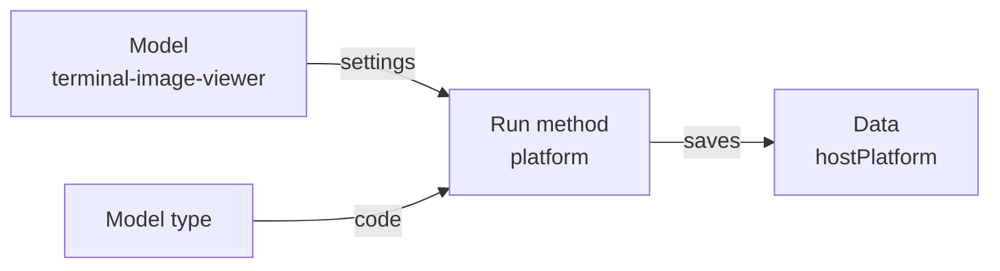
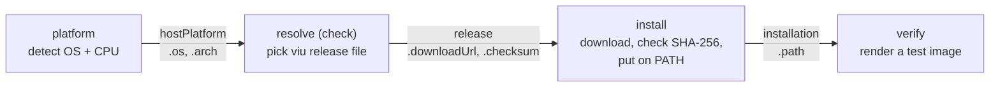

---
# You can also start simply with 'default'
theme: seriph
# random image from a curated Unsplash collection by Anthony
# like them? see https://unsplash.com/collections/94734566/slidev
background: https://cover.sli.dev
# some information about your slides (markdown enabled)
hideInToc: true
title: Swamp Training
author: Mischa Taylor
info: |
  ## Slidev Starter Template
  Presentation slides for developers.
# apply unocss classes to the current slide
class: text-center
# https://sli.dev/features/drawing
drawings:
  persist: false
# enable MDC Syntax: https://sli.dev/features/mdc
mdc: true
# open graph
# seoMeta:
#  ogImage: https://cover.sli.dev
themeConfig:
  paginationX: r
  paginationY: t
  paginationPagesDisabled: [1]
---

# Swamp Training

##### Mischa Taylor | 📧 <taylor@linux.com>

<div @click="$slidev.nav.next" class="mt-12 py-1" hover:bg="white op-10">
  Press Space for next page <carbon:arrow-right />
</div>

<div class="abs-br m-6 text-xl">
  <button @click="$slidev.nav.openInEditor()" title="Open in Editor" class="slidev-icon-btn">
    <carbon:edit />
  </button>
  <a href="https://github.com/slidevjs/slidev" target="_blank" class="slidev-icon-btn">
    <carbon:logo-github />
  </a>
</div>

<!--
The last comment block of each slide will be treated as slide notes. It will be visible and editable in Presenter Mode along with the slide. [Read more in the docs](https://sli.dev/guide/syntax.html#notes)
-->

---
hideInToc: true
routeAlias: toc
---

# Table of Contents

<Toc columns="2"/>

---
layout: section
---

# One Thing, End to End

<!--
Set the contract for the whole session: one task, carried all the way through.
-->

---
hideInToc: true
---

# You're going to automate one thing

- You're going to take it all the way from “I want this” to a working automation.
- Then you're going to break it.
- Then you're going to make it survive the kinds of things that happen in real systems.
- By the end, we'll have accidentally learned most of the important parts of Swamp.

---
hideInToc: true
---

# Make Swamp Do Something

Here's the requirement:

> **Make this terminal display a picture.**

That's all you're going to give Swamp to start with.

Just the outcome.

---
hideInToc: true
---

# What Does Success Look Like?

You'll want to start with an ordinary image:

```text
swamp.png
```

And eventually be able to type **one command** against that file and see the image inside the
terminal, on Ubuntu, macOS and Windows.

Which command? You don't know yet, and that's the point:

- You're not going to figure out how to do that.

- You're going to ask Swamp to figure out how to automate it.

---
hideInToc: true
---

# What you need

Two tools: Swamp and a coding agent.

| | What it is | Why you need it |
| --- | --- | --- |
| **Swamp** | The thing that runs, remembers and verifies the automation | It is the subject of the training |
| **A coding agent** | Claude Code, Codex, Gemini CLI, Copilot CLI, Cursor, … | It writes the automation so you don't have to |

**Any of those agents will do.** I'll use Claude Code for the worked example, and I'll call out
the few places where the agent you picked changes what you type.

---
layout: section
---

# Setting It Up

<!--
Installation. Keep this brisk; the interesting part is after the repo exists.
-->

---
hideInToc: true
---

# Installing Swamp

Swamp has a 30-day free trial. https://swamp-club.com/pricing

When you install, you will be prompted to create an account on https://swamp-club.com.

Software license: [Software License Agreement - Swamp Club ](https://swamp-club.com/software-license-agreement)

Extension registry: https://swamp-club.com/extension-registry-terms

The install script:
- Downloads the latest binary release from https://github.com/swamp-club/swamp/releases
- Installs the `swamp` binary to `~/.swamp/bin/swamp`
- Symlinks the `swamp` binary to `/usr/local/bin/swamp` if you have permissions

---
hideInToc: true
---

# Installing Swamp - Linux/macOS

```bash
# Install Swamp
curl -fsSL https://swamp-club.com/install.sh | sh

# Verify the Installation
swamp version
```

---
hideInToc: true
---

# Installing Swamp - Windows Powershell

Hit `Windows+R` and run `wt`. You should see a Windows Terminal command line prompt.

Grab the latest release instructions from https://github.com/swamp-club/swamp/releases

```powershell
# Request an elevated shell
Start-Process wt -Verb RunAs
New-Item -ItemType Directory -Path "C:\Program Files\swamp" -Force
Invoke-WebRequest `
  -Uri https://github.com/swamp-club/swamp/releases/download/v20260914.163154.0-sha.0bc3d215/swamp-windows-x86_64.zip `
  -OutFile swamp.zip
Expand-Archive swamp.zip -DestinationPath .; Move-Item swamp.exe 'C:\Program Files\swamp\'
# Add swamp to the Windows system PATH
$path = [Environment]::GetEnvironmentVariable("Path", "Machine")
[Environment]::SetEnvironmentVariable(
  "Path",
  $path + ";C:\Program Files\swamp",
  "Machine"
)
```

Verify the installation:
```powershell
swamp version
```

---
hideInToc: true
---

# Install a coding agent - Linux/macOS

Pick one. The rest of the deck works the same whichever you choose.

```bash
curl -fsSL https://claude.ai/install.sh | bash          # Claude Code
curl -fsSL https://chatgpt.com/codex/install.sh | sh    # Codex CLI
npm install -g @google/gemini-cli                       # Gemini CLI
curl -fsSL https://gh.io/copilot-install | bash         # Copilot CLI
curl https://cursor.com/install -fsS | bash             # Cursor CLI
```

Check it worked, using the name of the agent you installed:

```bash
claude --version        # or: codex, gemini, copilot, cursor-agent
```

If that command isn't found, add its directory to PATH and try again:

```bash
echo 'export PATH="$HOME/.local/bin:$PATH"' >> ~/.bashrc && source ~/.bashrc
```

<!--
Install commands drift. Point people at the vendor's install page if one fails.
Everything after these two slides is agent-neutral except the slash-command syntax.
-->

---
hideInToc: true
---

# Install a coding agent - Windows

Same five agents, from an ordinary PowerShell prompt:

```powershell
irm https://claude.ai/install.ps1 | iex                 # Claude Code
npm install -g @openai/codex                            # Codex CLI
npm install -g @google/gemini-cli                       # Gemini CLI
npm install -g @github/copilot                          # Copilot CLI
irm 'https://cursor.com/install?win32=true' | iex       # Cursor CLI
```

The `npm` installs need Node.js 22 or later.

Check it worked, using the name of the agent you installed:

```powershell
claude --version        # or: codex, gemini, copilot, cursor-agent
```

Whichever platform you're on, each agent prompts you to sign in the first time you run it.

---
hideInToc: true
---

# Create a swamp repo

```bash
# Create a directory for your swamp automation
mkdir swamp-thing
cd swamp-thing

# Authorize swamp use on this device with your swamp-club account (one time)
swamp auth login

# Initialize the directory as a swamp repo
swamp repo init
```

A swamp repo is an ordinary git directory. The automation you're about to build lives in it,
in files you can read, diff and review.

---
hideInToc: true
---

# What `repo init` gives your agent

`swamp repo init` doesn't just make directories. It teaches your agent how to use swamp:

- **Agent instructions** land in the repo, so the agent knows swamp's commands, file layout and
  conventions without you explaining them.
- **Claude Code** gets the `/swamp` and `/swamp-getting-started` skills.
- **Other agents** read the same guidance from the repo's instructions file
  (`AGENTS.md` for Codex, Copilot, Cursor and most others; `GEMINI.md` for Gemini CLI).

The upshot is the same whichever agent you picked: **it already knows what swamp is** before you
ask it for anything.

<!--
TODO / verify before presenting: confirm exactly which instruction files `swamp repo init`
writes today (AGENTS.md? GEMINI.md? only the Claude skills?) and correct this slide to match.
-->

---
layout: section
---

# Who Does What

<!--
Before building, settle the division of labor. This is the slide people remember.
-->

---
hideInToc: true
---

# Swamp Runs the Automation

At its simplest, **Swamp runs automation code that you create.**

You can build that automation yourself...

...or delegate much of the work to your favorite coding agent.

```bash
swamp build me ...
```

---
hideInToc: true
---

<div class="h-full flex flex-col items-center justify-center text-center gap-12">

<div class="text-4xl">
Your coding agent is one way to build with Swamp.
</div>

<div class="text-6xl font-bold">
It isn't what makes Swamp, Swamp.
</div>

</div>

<!--
Swap "Claude" for whichever agent the room is using. The point survives the swap. That is the point.
-->

---
hideInToc: true
---

# So Where Does the Agent Fit?

| **Agent / Human** | **Swamp** |
| --- | --- |
| Reasons, investigates, creates | Executes and remembers |
| Makes judgments | Enforces gates |
| Proposes what to do | Verifies what happened |
| Tells you what it did | Measures what actually ran |

**The agent provides intelligence. Swamp provides structure around it.**
Swap the agent out and the right column doesn't change.

---
hideInToc: true
---

# Intelligence, Kept Honest

<div class="grid grid-cols-2 gap-20 mt-12">

<div>

<div class="flex items-center gap-5 mb-6">
  <ph:robot-duotone class="text-6xl" />
  <div class="text-3xl font-bold border-b-4 border-current pb-2">
    Agent / Human
  </div>
</div>

<div class="text-2xl leading-12 pl-2">

**Think** about the problem  
**Investigate** what is happening  
**Create** a solution  
**Decide** what should happen  
**Propose** actions

</div>

</div>

<div>

<div class="flex items-center gap-5 mb-6">
  
  <div class="text-3xl font-bold border-b-4 border-current pb-2">
    Swamp
  </div>
</div>

<div class="text-2xl leading-12 pl-2">

**Check** every claim against the machine  
**Refuse** the next step when one fails  
**Repeat** the run exactly, every time  
**Record** what happened, not what was claimed  
**Measure** every run, on every machine

</div>

</div>

</div>

<div class="text-center text-2xl mt-12 opacity-80">

**The agent makes things up. Swamp is the part that doesn't take its word for it.**

</div>

---
layout: section
---

# Building It

<!--
Now hand the requirement to the agent and watch structure come out the other side.
-->

---
hideInToc: true
---

# Ask for the outcome, not the steps

Type this into your agent. Claude Code, Codex, Gemini, Copilot, Cursor: it doesn't matter.

```
Build me an automation with swamp that makes this
machine capable of displaying an image directly
in the terminal.
It needs to work on Ubuntu, macOS, and Windows.
```

Notice what isn't in there: no tool name, no package manager, no install path.
You stated the **outcome** and the **constraint**. The agent picks the rest.

---
hideInToc: true
---

# Choose your own adventure

What you get back from this prompt will vary.

I asked for automation to show images in the terminal.

My agent picked **viu**: a single-file image viewer with builds for Linux, macOS and Windows.
viu shows real images in terminals that support them and colored text blocks everywhere else.
**You might get `chafa`, `timg`, or something else.** That's fine: the shape of what gets built
is the same. From here on the slides say `viu`; substitute whatever your agent picked.

It didn't decide that on its own. The `CLAUDE.md` that `swamp repo init` wrote into this repo
tells Claude to **search before you build**: reuse a **community extension** if one exists, and
extend that extension rather than start over if something is missing.

Same rule for the other agents. Swamp writes it to `AGENTS.md` for Codex, Copilot and Cursor,
and to `GEMINI.md` for Gemini CLI.

---
hideInToc: true
---

# Extensions: where swamp code comes from

- **Extension:** a package of code that teaches swamp a new task, such as installing programs from
  GitHub.

- **Extension registry:** the public catalog of shared extensions at swamp-club.com.
  Search the catalog with `swamp extension search <words>`.

- **Community extension:** an extension someone else published to the registry.
  `swamp extension pull <name>` downloads a copy into your repo.

- **Local extension:** an extension you (or your agent) write inside your own repo, in
  `extensions/models/`. A local extension can add methods to a community extension's model type.

---
hideInToc: true
---

# What the agent built

The viu project publishes its binaries as GitHub releases. The agent found a **community extension**
built for exactly that: `@svendowideit/github-release-install`, in the **extension registry**.

The community extension's **model type** could already pick the right release file for this machine
and download the file with a checksum check. The model type could not install the file.

The agent wrote a **local extension** that gives the same model type three new **methods**:
- `platform`: detect the OS and CPU without `uname`, so the method works on native Windows
- `install`: put the viu binary in a bin directory and add that directory to PATH
- `verify`: run viu on a test image to prove the install worked

It then put the steps into a swamp **workflow**, `terminal-image-setup`: one command that runs
`platform`, `check`, `install` and `verify` in order, each step using the previous step's result.

---
hideInToc: true
---

# Swamp lingo: the code and your settings

Swamp keeps **code** and **settings** in separate places.

| Term | What it is | In my repo |
| --- | --- | --- |
| **Model type** | Code that does one kind of task. A model type lists the settings needed and the actions the code can run. | `@svendowideit/github-release-install`: installs programs published on GitHub |
| **Method** | One action a model type can run. | `check`, `install`, `verify`, … |
| **Model** | A small YAML file that names a model type and fills in the model type's settings. | `terminal-image-viewer`: the GitHub installer set up for viu |

**Why keep them separate?** One model type can serve many models.
The same GitHub installer code could install viu in one model and a different program in another.
Only the settings change.

---
hideInToc: true
---

# Run a method, get data

To run a method, give swamp a model name and a method name:

```bash
swamp model method run terminal-image-viewer platform
```



Swamp runs the model type's code with the model's settings and saves the result as **data**.
Each run saves a new version, so the most recent one is always there to read:

```js
data.latest("terminal-image-viewer", "hostPlatform")
```

That's one method. The job needs four, in order.

---
hideInToc: true
---

# Workflow: chaining methods into one job

- **Workflow:** a YAML file in `workflows/` that lists steps. Each step runs one method on a model.
- **Inputs:** options you pass when running it (`version`, `binDir`, `addToPath`, `force`).
- **dependsOn:** a step runs only after the step it depends on succeeds.
- **`data.latest(...)`:** a step reads the data the previous step just saved. Nothing is hard-coded.

`terminal-image-setup` runs four methods on the `terminal-image-viewer` model:

| Step | Method | Reads | Saves |
| --- | --- | --- | --- |
| `platform` | `platform` | (nothing) | `hostPlatform`: OS, CPU type, bin directory |
| `resolve` | `check` | `hostPlatform` | `release`: download URL and SHA-256 |
| `install` | `install` | `release` | `installation`: installed path |
| `verify` | `verify` | `installation` | `verification`: version and test-image render |

---
hideInToc: true
---

# How the steps hand off data



How one step reads another step's output (from `install`):

```yaml
downloadUrl: ${{ data.latest("terminal-image-viewer", "release").attributes.platform.downloadUrl }}
checksum:    ${{ data.latest("terminal-image-viewer", "release").attributes.checksum }}
```

No OS name, no URL, no version is written into the workflow. Every value is produced by a step.

---
hideInToc: true
---

# The payoff: run the whole thing

```bash
swamp workflow run terminal-image-setup
```

```text
✔ platform   darwin/arm64, binDir=~/.local/bin
✔ resolve    viu 1.6.1 → viu-aarch64-apple-darwin  (sha256 9f3c…a21e)
✔ install    ~/.local/bin/viu
✔ verify     viu 1.6.1, test image rendered
```

Then the thing you actually asked for, back at the start, with the tool the agent chose:

```bash
viu swamp.png
```

One requirement, *“make this terminal display a picture”*, is now **one command**, on three
operating systems, with a record of how it got there.

---
hideInToc: true
---

# Look at what happened

The run left evidence behind. Ask swamp about it:

```bash
swamp data list terminal-image-viewer          # what data got produced
swamp workflow get terminal-image-setup        # what the workflow does
swamp model get terminal-image-viewer --json   # what settings I saved
swamp model search --json                      # which models exist
```

Or read the code itself:

```text
extensions/models/github_release_binary_install.ts              yours
.swamp/pulled-extensions/@svendowideit/github-release-install/  community
workflows/workflow-terminal-image-setup.yaml                    workflow
```

**It works. Now let's find out whether it only works once.**

---
layout: section
---

# Breaking It

<!--
This is the part that separates a demo from an automation. Do these live.
-->

---
hideInToc: true
---

# Break it: delete the thing you installed

```bash
rm "$(command -v viu)"   # delete the binary the workflow installed
viu swamp.png
# command not found
```

Now re-run the same command you ran before. No flags, no edits:

```bash
swamp workflow run terminal-image-setup
viu swamp.png
# the picture is back
```

**What that proves:** the workflow is the source of truth, not the state of the machine.
Nothing you did by hand had to be remembered or redone.

And when nothing is broken, re-running is cheap: `install` skips the download whenever the
installed file already matches its checksum.

---
hideInToc: true
---

# Break it: move the goalposts

| What you change | What happens | Why |
| --- | --- | --- |
| Run it on a different OS | Correct binary installs | `platform` re-detects; nothing is hard-coded |
| Run it on arm64 instead of x86_64 | Correct binary installs | `resolve` picks the file from `hostPlatform` |
| Run it twice in a row | Second run is near-instant | `install` sees a matching checksum and skips |
| Run it on a machine without `uname` | Still works | that's why the agent wrote `platform` |

The workflow never names an operating system, a CPU, a URL or a path.
Every one of those is **data a step produced**, not a constant someone typed.

---
hideInToc: true
---

# Break it: ask for something impossible

```bash
swamp workflow run terminal-image-setup --input version=0.0.0
```

```text
✔ platform   darwin/arm64
✘ resolve    no release asset matches viu 0.0.0
– install    skipped (dependsOn: resolve)
– verify     skipped (dependsOn: resolve)
```

The run **stopped**. It did not download something else, guess a version, or leave a half-installed
binary on PATH.

`dependsOn` is a gate, not a suggestion. A step that can't trust its input doesn't run.

---
hideInToc: true
---

# Break it: the lie that's hard to catch

Imagine the install step succeeds and the binary is **broken**: wrong architecture, truncated
download, missing shared library.

Without `verify`, the run is green and the automation is wrong. You find out later, from a human.

```text
✔ install    ~/.local/bin/viu
✘ verify     viu exited 126: cannot execute binary file
```

`verify` is the step that turns **“it ran”** into **“it works.”**
It is also the step people skip first, because everything looks fine without it.

---
layout: section
---

# Making It Survive

---
hideInToc: true
---

# What actually made it survive

| Threat | What caught it |
| --- | --- |
| Binary deleted or machine rebuilt | The workflow is re-runnable, start to finish |
| Wrong file for this machine | `platform` detects, `resolve` chooses |
| Corrupted or tampered download | SHA-256 checksum compared before install |
| Installed but not working | `verify` renders a real test image |
| Half-finished run | `dependsOn` stops the chain at the first failure |
| “Worked on my machine” | Versioned **data** records every run's inputs and outputs |

None of these are things your agent thought of in the moment.
They're the **structure** the agent's work was poured into.

---
hideInToc: true
---

# The shape to reuse

Every durable automation you build in swamp has the same four beats:

1. **Detect** what you're actually on. Don't assume.
2. **Resolve** the right artifact from that detection. Don't hard-code.
3. **Act**, guarded by a check you can't fake: checksum, signature, version.
4. **Verify** the outcome the way a user would experience it.

Chain them with `dependsOn` so a failure anywhere stops everything after it.

**Your agent writes the code for these four steps. Swamp is what makes the four steps a thing that
still works next month.**

---
hideInToc: true
---

# What you learned without noticing

| Building it, you did this | You learned |
| --- | --- |
| Installed swamp, ran `repo init` | Repos, auth, agent instructions |
| Asked for an outcome in plain English | Agent-driven authoring, search-before-build |
| Reused `@svendowideit/github-release-install` | Extensions and the registry |
| Added three methods in your own repo | Local extensions, extending a model type |
| Saved viu's settings as `terminal-image-viewer` | Model types vs. models |
| Ran `platform` on its own | Methods and versioned data |
| Ran `terminal-image-setup` | Workflows, `dependsOn`, `data.latest(...)` |

---
hideInToc: true
---

# And then you broke it

| Breaking it, you did this | You learned |
| --- | --- |
| Deleted the binary and re-ran | Idempotency |
| Asked for version `0.0.0` | Gates and failure semantics |
| Looked at `verify` | Verification vs. completion |

One picture in a terminal. Most of Swamp.

---
layout: section
---

# Appendix

---
hideInToc: true
---

# Updating Swamp

To update swamp, use the built in update command:

```bash
# Check whether or not a newer version exists
swamp update --check
# Download and install the latest version
swamp update
```

For automatic updates:

```bash
# Turn on auto-update
swamp update --setup-auto
# Check whether or not auto-update is enabled
swamp update --setup-auto status
# Disable auto-update
swamp update --setup-auto disable
```

---
hideInToc: true
---

# Uninstalling Swamp

Swamp has no uninstall command. You can remove swamp by deleting the binary.

```bash
# Remove symlink to swamp binary
sudo rm /usr/local/swamp
# Remove the swamp binary
rm -rf ~/.swamp
# Remove swamp config
rm -rf ~/.config/swamp
```

---
hideInToc: true
---

# References

- **Nick (Keeb) Stinemates**, *Building Information Automation with Claude and Swamp*<br>
  https://keeb.dev/2026/02/03/ai-native-infrastructure/

- **Paul Stack**, *6 Learnings from 12,000 Agentic Code Reviews*<br>
  https://blog.watson-labs.co.uk/6-learnings-from-12000-agentic-code-reviews/

- **Sergey (Magistr)**, *The Sight of Systems*<br>
  https://magistr.me/blog/the-sight-of-systems/

- **Flavio Copes**, *Swamp tutorial: make AI agent work repeatable*<br>
  https://flaviocopes.com/swamp/
