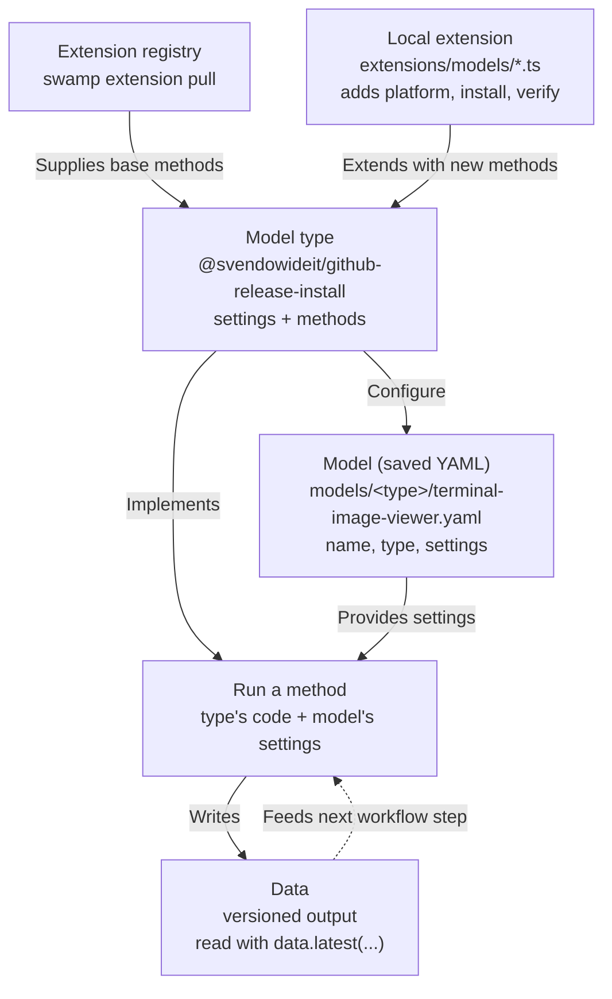
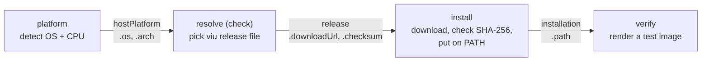

---
# You can also start simply with 'default'
theme: seriph
# random image from a curated Unsplash collection by Anthony
# like them? see https://unsplash.com/collections/94734566/slidev
background: https://cover.sli.dev
# some information about your slides (markdown enabled)
hideInToc: true
title: Swamp Training
author: Mischa Taylor
info: |
  ## Slidev Starter Template
  Presentation slides for developers.
# apply unocss classes to the current slide
class: text-center
# https://sli.dev/features/drawing
drawings:
  persist: false
# enable MDC Syntax: https://sli.dev/features/mdc
mdc: true
# open graph
# seoMeta:
#  ogImage: https://cover.sli.dev
themeConfig:
  paginationX: r
  paginationY: t
  paginationPagesDisabled: [1]
---

# Swamp Training

##### Mischa Taylor | 📧 <taylor@linux.com>

<div @click="$slidev.nav.next" class="mt-12 py-1" hover:bg="white op-10">
  Press Space for next page <carbon:arrow-right />
</div>

<div class="abs-br m-6 text-xl">
  <button @click="$slidev.nav.openInEditor()" title="Open in Editor" class="slidev-icon-btn">
    <carbon:edit />
  </button>
  <a href="https://github.com/slidevjs/slidev" target="_blank" class="slidev-icon-btn">
    <carbon:logo-github />
  </a>
</div>

<!--
The last comment block of each slide will be treated as slide notes. It will be visible and editable in Presenter Mode along with the slide. [Read more in the docs](https://sli.dev/guide/syntax.html#notes)
-->

---
hideInToc: true
routeAlias: toc
---

# Table of Contents

<Toc columns="2"/>

---
hideInToc: true
---

# You're going to automate one thing

- You're going to take it all the way from “I want this” to a working automation.
- Then you're going to break it.
- Then you're going to make it survive the kinds of things that happen in real systems.
- By the end, we'll have accidentally learned most of the important parts of Swamp.

---
hideInToc: true
---

# Make Swamp Do Something

Here's the requirement:

> **Make this terminal display a picture.**

That's all you're going to give Swamp to start with.

---
hideInToc: true
---

# What Does Success Look Like?

You'll want to start with an ordinary image:

```text
swamp.png
```

And eventually be able to do:

```bash
chafa swamp.png
```

and see the image inside the terminal.

- You're not going to figure out how to do that.

- You're going to ask Swamp to figure out how to automate it.

---
hideInToc: true
---

# Installing Swamp

Swamp has a 30-day free trial. https://swamp-club.com/pricing

When you install, you will be prompted to create an account on https://swamp-club.com.

Software license: [Software License Agreement - Swamp Club ](https://swamp-club.com/software-license-agreement)

Extension registry: https://swamp-club.com/extension-registry-terms

The install script:
- Downloads the latest binary release from https://github.com/swamp-club/swamp/releases
- Installs the `swamp` binary to `~/.swamp/bin/swamp`
- Symlinks the `swamp` binary to `/usr/local/bin/swamp` if you have permissions

---
hideInToc: true
---

# Installing Swamp - Linux/macOS

```bash
# Install Swamp
curl -fsSL https://swamp-club.com/install.sh | sh

# Verify the Installation
swamp version
```

---
hideInToc: true
---

# Installing Swamp - Windows Powershell

Hit `Windows+R` and run `wt`. You should see a Windows Terminal command line prompt.

Grab the latest release instructions from https://github.com/swamp-club/swamp/releases

```powershell
# Request an elevated shell
Start-Process wt -Verb RunAs
New-Item -ItemType Directory -Path "C:\Program Files\swamp" -Force
Invoke-WebRequest ^
  -Uri https://github.com/swamp-club/swamp/releases/download/v20260914.163154.0-sha.0bc3d215/swamp-windows-x86_64.zip ^
  -OutFile swamp.zip
Expand-Archive swamp.zip -DestinationPath .; Move-Item swamp.exe 'C:\Program Files\swamp\'
# Add swamp to the Windows system PATH
$path = [Environment]::GetEnvironmentVariable("Path", "Machine")
[Environment]::SetEnvironmentVariable(
  "Path",
  $path + ";C:\Program Files\swamp",
  "Machine"
```

Verify the installation:
```powershell
swamp version
```

---
hideInToc: true
---

# Uninstalling Swamp

Swamp has no uninstall command. You can remove swamp by deleting the binary.

```bash
# Remove symlink to swamp binary
sudo rm /usr/local/swamp
# Remove the swamp binary
rm -rf ~/.swamp
# Remove swamp config
rm -rf ~/.config/swamp
```

---
hideInToc: true
---

# Updating Swamp

To update swamp, use the built in update command:

```bash
# Check whether or not a newer version exists
swamp update --check
# Download and install the latest version
swamp update
```

For automatic updates:

```bash
# Turn on auto-update
swamp update --setup-auto
# Check whether or not auto-update is enabled
swamp update --setup-auto status
# Disable auto-update
swamp update --setup-auto disable
```

---
hideInToc: true
---

# Install Claude

Linux, macOS

```bash
curl -fsSL https://claude.ai/install.sh | bash
# Add ~/.local/bin/claude to PATH
echo 'export PATH="$HOME/.local/bin:$PATH"' >> ~/.bashrc && source ~/.bashrc
```

Windows PowerShell:

```powershell
irm https://claude.ai/install.ps1 | iex
```

Windows CMD:

```
curl -fsSL https://claude.ai/install.cmd -o install.cmd && install.cmd && del install.cmd
```

Verify:

```bash
claude --version
```

---
hideInToc: true
---

# Swamp Runs the Automation

At its simplest, **Swamp runs automation that you create.**

You can build that automation yourself...

...or delegate much of the work to your favorite coding agent.

```bash
swamp build me ...
```

---
hideInToc: true
---

<div class="h-full flex flex-col items-center justify-center text-center gap-12">

<div class="text-4xl">
Claude is one way to build with Swamp.
</div>

<div class="text-6xl font-bold">
It isn't what makes Swamp, Swamp.
</div>

</div>

---
hideInToc: true
---

# So Where Does Claude Fit?

Claude and Swamp have different jobs.

| **Claude / Human** | **Swamp** |
| --- | --- |
| Reasons | Maintains state |
| Investigates | Coordinates |
| Creates | Executes |
| Makes judgments | Enforces gates |
| Proposes what to do | Verifies what happened |

**Claude provides intelligence. Swamp provides structure around it.**

---
hideInToc: true
---

# Intelligence + Structure

<div class="grid grid-cols-2 gap-20 mt-12">

<div>

<div class="flex items-center gap-5 mb-6">
  
  <div class="text-3xl font-bold border-b-4 border-current pb-2">
    Claude / Human
  </div>
</div>

<div class="text-2xl leading-12 pl-2">

**Think** about the problem  
**Investigate** what is happening  
**Create** a solution  
**Decide** what should happen  
**Propose** actions

</div>

</div>

<div>

<div class="flex items-center gap-5 mb-6">
  
  <div class="text-3xl font-bold border-b-4 border-current pb-2">
    Swamp
  </div>
</div>

<div class="text-2xl leading-12 pl-2">

**Remember** state and results  
**Coordinate** the workflow  
**Execute** repeatably  
**Verify** outcomes  
**Record** what happened

</div>

</div>

</div>

<div class="text-center text-2xl mt-12 opacity-80">

**Intelligence decides what to do. Structure makes it repeatable.**

</div>

---
hideInToc: true
---

# Create a swamp repo

```bash
# Create a directory for your swamp automation
mkdir swamp-thing
cd swamp-thing

# Authorize swamp use on this device with your swamp-club account (one time)
swamp auth login

# Initialize the directory as a swamp repo
swamp repo init
```

---
hideInToc: true
---

# Swamp skills

When you run `swap repo init` for the first time, swamp installs the
`/swamp` and `/swap-getting-started` skills.

---
hideInToc: true
---

Claude prompt:

```
Build me an automation with swamp that makes this
machine capable of displaying an image directly
in the terminal.
It needs to work on Ubuntu, macOS, and Windows.
```

---
hideInToc: true
---

# Choose your own adventure

What you get back from this prompt will vary.

I asked for a way to show images in the terminal. Claude picked **viu**: a single-file image
viewer with builds for Linux, macOS and Windows. You might get a different tool.

This repo's `CLAUDE.md` tells Claude to **search before you build**: reuse a community extension
if one exists, and extend it rather than start over if it's missing something.

---
hideInToc: true
---

# What Claude built

viu ships as a GitHub release, and Claude found `@svendowideit/github-release-install` in the
extension registry. Its model type already found the right release file for this machine and
downloaded it with a checksum check. It couldn't install the file.

Claude added a local extension that gives that **model type** three new methods:
- `platform`: detect the OS and CPU without `uname`, so it works on native Windows
- `install`: put the binary in a bin directory and add that directory to PATH
- `verify`: run viu on a test image to prove it works

Claude then put the steps into a swamp **workflow**, `terminal-image-setup`: one command that runs
`platform`, `check`, `install` and `verify` in order, each step using the previous step's result.

---
hideInToc: true
---

# Swamp lingo: the code and your settings

Swamp keeps **code** and **settings** in separate places.

| Term | What it is | In my repo |
| --- | --- | --- |
| **Model type** | Code that does one kind of job. It lists the settings the job needs and the actions it can run. | `@svendowideit/github-release-install`: installs programs published on GitHub |
| **Method** | One action a model type can run. | `check`, `install`, `verify`, … |
| **Extension** | A downloadable package that contains model types, or adds methods to one. | The community package from the registry, plus my local file that adds 3 methods |
| **Model** | A small YAML file that names a model type and fills in its settings. | `terminal-image-viewer`: the GitHub installer set up for viu |

**Why keep them separate?** One model type can serve many models.
The same GitHub installer code could install viu in one model and a different program in another.
Only the settings change.

---
hideInToc: true
---

# Find the code, save your settings, run an action

- **Extension registry:** the public catalog where you find extensions (`swamp extension search`).
- **Method:** an action you run with a saved model's settings, plus its own arguments.
- **Data:** each method run saves versioned output that later steps read with `data.latest(...)`.



---
hideInToc: true
---

# Workflow: chaining methods into one job

- **Workflow:** a YAML file in `workflows/` that lists steps. Each step runs one method on a model.
- **Inputs:** options you pass when running it (`version`, `binDir`, `addToPath`, `force`).
- **dependsOn:** a step runs only after the step it depends on succeeds.
- **`data.latest(...)`:** a step reads the data the previous step just saved. Nothing is hard-coded.

`terminal-image-setup` runs four methods on the `terminal-image-viewer` model:

| Step | Method | Reads | Saves |
| --- | --- | --- | --- |
| `platform` | `platform` | (nothing) | `hostPlatform`: OS, CPU type, bin directory |
| `resolve` | `check` | `hostPlatform` | `release`: download URL and SHA-256 |
| `install` | `install` | `release` | `installation`: installed path |
| `verify` | `verify` | `installation` | `verification`: version and test-image render |

Re-running is safe: `install` skips the download if the installed file already matches its checksum.

---
hideInToc: true
---

# How the steps hand off data



How one step reads another step's output (from `install`):

```yaml
downloadUrl: ${{ data.latest("terminal-image-viewer", "release").attributes.platform.downloadUrl }}
checksum:    ${{ data.latest("terminal-image-viewer", "release").attributes.checksum }}
```

Run it: `swamp workflow run terminal-image-setup` (pin a version with `--input version=1.6.1`)

---
hideInToc: true
---

# How to check this yourself

| Question | Command |
| --- | --- |
| Which model type is it? | `swamp model type search github` |
| What methods and settings does the type have? | `swamp model type describe @svendowideit/github-release-install --json` |
| Which models exist, and what type does each use? | `swamp model search --json` |
| What settings did I save? | `swamp model get terminal-image-viewer --json` |
| What does the workflow do? | `swamp workflow get terminal-image-setup` |
| Run the workflow | `swamp workflow run terminal-image-setup` |
| What data have the methods produced? | `swamp data list terminal-image-viewer` |

Quick method list:

```bash
swamp model type describe @svendowideit/github-release-install --json \
  | jq -r '.methods[] | "\(.name): \(.description)"'
```

Read the code: `extensions/models/github_release_binary_install.ts` (my methods),
`.swamp/pulled-extensions/@svendowideit/github-release-install/` (community methods and README),
`workflows/workflow-terminal-image-setup.yaml` (the workflow)

---
hideInToc: true
---

# References

**Nick (Keeb) Stinemates**
*Building Information Automation with Claude and Swamp*
https://keeb.dev/2026/02/03/ai-native-infrastructure/

**Paul Stack**
*6 Learnings from 12,000 Agentic Code Reviews*
https://blog.watson-labs.co.uk/6-learnings-from-12000-agentic-code-reviews/

**Sergey (Magistr)**
*The Sight of Systems*
https://magistr.me/blog/the-sight-of-systems/

**Flavio Copes**
*Swamp tutorial: make AI agent work repeatable*
https://flaviocopes.com/swamp/
